# 0. SUMMARY

In the theory of real-time scheduling, tasks are described by mathematical variables, which are used in analytical models in order to prove schedulability of the system. On real-time Linux, tasks are computer programs, and Linux developers try to lower the latencies caused by the Linux kernel, trying to achieve faster response for the highest-priority task. Although both seek temporal correctness, they use different abstractions, which end up separating these efforts in two different worlds, making it hard for the Linux practitioners to understand and apply the formally proved models to the Linux kernel and for theoretical researchers to apply the restrictions imposed by Linux for the theoretical models. This paper traces a parallel between the theory of response-time analysis and the abstractions used in the Linux kernel. The contribution of this paper is threefold. We first identify the PREEMPT RT Linux kernel mechanisms that impact the timing of real-time tasks and map these impacts to the main abstractions used by the real-time scheduling theory. Then, we describe a customized trace tool, based on the existing trace infrastructure of the Linux kernel, that allows the measurement of the delays associated with the main abstractions of the real-time scheduling theory. Finally, we use this customized trace tool to characterize the timing lines resulting from the behavior of the PREEMPT RT Linux kernel. Copyright © 2015 John Wiley & Sons, Ltd.

KEY WORDS: real time; response-time analysis; Linux; PREEMPT RT; trace; Ftrace

# 1. INTRODUCTION

In recent years, Linux has gained several characteristics of a real-time operating system, and it has been used as such in both production systems [1](#_bookmark32), [2](#_bookmark33) and research projects [3](#_bookmark34), [4](#_bookmark35). Various realtime features have been added to the Linux kernel by several different groups. Some of them seek greater predictability for the kernel execution, as is the case of the project PREEMPT RT [5](#_bookmark36), which is an initiative of the kernel developers. Others implement real-time scheduling algorithms and mutual exclusion policies in the Linux kernel, as is the case of projects imus$RT$ [3](#_bookmark34) and SCHED_DEADLINE [4](#_bookmark35), which are both initiatives of the academic world. These initiatives were responsible for giving Linux both the ability to meet timing requirements such as tight response times [6](#_bookmark37) and the capacity of scheduling tasks using state-of-the-art algorithms from the real-time scheduling theory [7](#_bookmark38), [8](#_bookmark39).

The goal of the developers from the industry and the researchers from the academia is the same: to transform Linux into a real-time operating system. But there are conceptual differences that end up distancing the developments of academia and industry. These differences are reported both by the developers of Linux [9](#_bookmark40) and by researchers [10](#_bookmark41). These differences arise in part because both communities use different abstractions for the system components and different system validation methods.

In the context of the Linux operating system, tasks are parts of computer programs with timing constraints and properties. The task concept used in the real-time scheduling theory usually corresponds to just a portion of all operating system tasks. Some of these constraints are specified by the application, such as the period of the execution of a certain function, and some properties are estimated, such as the time necessary to finish a certain function. The main objective of developing the PREEMPT RT patch was to start a task with the least possible delay [11](#_bookmark42), which is usually called system latency. The system latency measures the ability of the operating system to give control to the highest-priority task as quickly as possible [10](#_bookmark41). This objective is achieved through reducing the number and size of points where the system remains with interrupts and preemption disabled.

In the real-time scheduling theory, a system is modeled as a set of _n_ tasks _τ_ D ¹*τ$1$, τ$2$, . . . , τ$n$*º, and each task has its timing behavior defined by a set of variables, such as its period _P_ , worstcase execution time _S_ , and relative deadline _D_. These tasks are scheduled on a set of _m_ processors _p_ D ¹*p$1$, p$2$, . . . , p$m$*º, and they may share _q_ resources _ơ_ D ¹*ơ$1$, ơ$2$, . . . , ơ$q$*º, which require mutual exclusion. In this context, the main goal of the analysis is to somehow assign time of processors from _p_ and resources from _ơ_ to tasks from _τ_ in order to finish all tasks from _τ_ while meeting the timing constraints of each task [12](#_bookmark43).

There would be important gains from the better integration between the real-time scheduling theory and the real-time Linux. For example, response-time analysis is a classical method used in the schedulability analysis of fixed-priority real-time systems [13](#_bookmark44), which is the case of Linux with the PREEMPT RT patch. By using the response-time analysis, it would be possible in principle to determine whether a task set is schedulable or not, provided that the worst-case execution times are known. The real-time scheduling theory allows analyses that go far beyond the simple latency measurement usually used as the main concern of the real-time Linux community.

The reason why the real-time scheduling theory is not used in the context of real-time Linux is that the task models used in the scheduling theory are usually too simple, and their set of constraints and task dependencies among tasks does not reproduce the reality of real-time applications running on a Linux kernel. Despite the vast literature on real-time scheduling, few of these results are to be used by the Linux development community [9](#_bookmark40).

In this context, the contribution of this paper is threefold. We first identify PREEMPT RT Linux kernel mechanisms that impact the timing of real-time tasks and map these impacts to the main abstractions used by the real-time scheduling theory. Then, we describe a customized trace tool, based on the existing trace infrastructure of the Linux kernel, that allows the measurement of the delays associated with the main abstractions of the real-time scheduling theory. Finally, we use this customized trace tool to characterize the timing lines resulting from the behavior of the PREEMPT RT Linux kernel. We believe this characterization is an important step in the direction of creating correct task models of the PREEMPT RT Linux and development of analytical methods for its schedulability analysis.

In this paper, we go beyond the simple measurement of latency, which is usually found in papers on real-time Linux. We identify the mechanisms of the PREEMPT RT Linux kernel that affect the timing of the tasks and how the tasks affect each other, through these mechanisms. With this, it is possible to list important aspects of the PREEMPT RT Linux where improvement is possible, regarding the response time of high-priority tasks and not just the latency.

Also, by observing the Linux from the perspective of the real-time scheduling theory, we can better understand the constraints that currently exist in the PREEMPT RT Linux kernel and contribute towards the development of new task models based on these constraints. This is a necessary step to be able to develop appropriate schedulability tests in the future.

The customized trace tool has also been proved very useful for analyzing the timeline of the execution of tasks on Linux. It can be used, for instance, by advanced users of Linux systems that require low latency to discover the source of the largest delays. It can assist them in the setup process, the fine tuning of the system, and the verification of new algorithms implemented in the kernel. It can also be used by researchers to understand the cause of high latency values, which sometimes cannot be explained and are just tagged as outliers.

We believe that a better integration between academia and the developers and users of PREEMPT RT Linux is important because of the vast potential of use of this platform in supporting real-time applications. This integration will help Linux users to find the sources of latencies in their real-time applications, Linux developers to understand the abstractions used in the scheduling theory and identify them within the Linux code, and the theoretical researchers to understand the realities of the PREEMPT RT Linux kernel and create more appropriate task models and schedulability analyses for this context.

Section [2](#_bookmark0) presents the abstractions used in the response-time analysis, followed by the mapping between these abstractions and the Linux kernel abstractions in Section [3](#_bookmark3). Section [4](#_bookmark11) presents the customized trace tool, which is used to characterize Linux timeline in Section [5](#_bookmark12). The characterization of Linux execution is used to measure the timing properties of Linux tasks in Section [6](#_bookmark18), and a study case of the execution of the highest-priority task is shown in Section [7](#_bookmark23). Finally, Section [8](#_bookmark31) has our final comments, along with suggestions of future work.

# 2. ABSTRACTIONS OF RESPONSE-TIME ANALYSIS

The main objective of this section is to introduce the abstractions and mathematical variables used
by the response-time analysis, for subsequent mapping of these abstractions to the functions and
abstractions used in the Linux kernel.

In order to guarantee the timing correctness while executing real-time tasks, one has to know whether a given set of tasks and execution model will complete within their respective deadlines. There are several analytical methods to obtain this guarantee, depending on the execution model of the system. The Linux kernel is based on fixed priority, together with several mutual exclusion protocols. It is possible to verify the schedulability of a system that follows this model using the method of response-time analysis [14](#_bookmark45). Although the response-time method is only valid for uniprocessor systems, the choice to use this method was made for didactic purposes. Moreover it uses the common abstractions of the real-time literature.

According to the response-time analysis method, a system is composed of a set _τ_ of _n_ tasks, which in turn are described by a set of algebraic variables related to its timing behavior. Each variable represents an abstraction used in the method. These variables and the abstractions that they represent are the following:

_C_ : the worst-case execution time;
_P_ : the period of activation;
_D_: the relative deadline;
_J_ : the maximum release jitter;
_B_: the worst-case blocking time;
_I_ : the interference;
_W_ : the busy period; and
_R_: the maximum response time.

The worst-case execution time _S_ is the maximum computation time of the task. The period _P_ is the activation period of a periodic task, and _D_ denotes the relative deadline of the task. The release jitter, denoted by variable _J_ , is the delay at the beginning of the execution of a task, caused by a lower-priority task.

_B_ is the worst-case blocking time. A blocking happens when a higher-priority task has its execution delayed by a lower-priority task, generally because the lower-priority task holds some resources required by the higher-priority task. Generally, these resources are managed through a mutual exclusion mechanism.

Based on these variables, the response-time method is used to define the value of _I_ , _W_ , and _R_, for each task of the system. The interference _I$i$_ of a task _τ$i$_ is the sum of all computation time of tasks in the set _hp(i)_ that was activated during the busy period of task _i_ , where _hp(i)_ is the set of tasks with priorities higher than _τ$i$_ :

`$$`

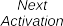
Figure 1. Response-time analysis abstractions.

The busy period _W$i$_ of a task _τ$i$_ corresponds to the sum of its computational time, blocking time, and interference. It is given by Equation ([2](#_bookmark2)).

`$$`

It is important to notice that _W$i$_ appears on both sides of the equation, because of its use on the definition of the interference. This dependence implies in the use of an iterative method to determine _W$i$_ . In this case, the initial value of _W$i$_ is the worst-case execution time _S$i$_ , and Equation ([2](#_bookmark2)) is used iteratively _x_ times, until _W $x_C*1$ D \_W $x$_ or \_W $x_C*1$ > D$i$\_ .

`$$`

A system is said to be schedulable if for every task i , the maximum response time Ri is less than
or equal to its deadline Di .

## 2.1. Graphical representation of response-time analysis abstractions\_

A common way to represent the behavior of a real-time task is using a graphical format. Figure [1](#_bookmark1) shows how each abstraction used in the response-time analysis composes the response time of a real-time task.

# 3. A PARALLEL BETWEEN THE RESPONSE-TIME ANALYSIS AND LINUX

The kernel without the patch PREEMPT RT presents some execution contexts that make it hard to precisely define the abstraction of a task. But with PREEMPT RT, almost all of these contexts were transformed into kernel threads, including some parts of the interrupt handler’s work. On PREEMPT RT, many interrupt handlers are converted to run as kernel threads. For these interrupt handlers, their function is no longer to deal with the hardware but to wake up a kernel thread that will deal with the hardware. Nevertheless there are some exceptions to this rule, for example, to timer interrupt request (IRQ).

Regarding the user space, processes are composed by a memory context and a set of one or more threads. Nowadays, the Linux scheduler deals with threads, scheduling the system on a thread basis. Generally, a thread runs in the process memory context, but when a thread makes a system call or causes an interrupt, for example, with a page fault, it changes its execution context from user space to kernel space, executing the kernel code in kernel space on behalf of the process [15](#_bookmark46). Thus, it is possible to map the abstraction of a task into these two execution contexts that the Linux has: the interrupt handlers, which run only in kernel space, and the threads, which can run both in kernel and user spaces.

Each activation of a task is known as a job. For the interrupt handlers, we assume that each interrupt is a new activation, so it is a job. Nevertheless, it is not easy to map the abstraction of job to threads.

In the theory, a job executes without suspending itself. Thus, each time a job starts to run, it starts a new activation. And each time a job suspends, it finishes an activation. Coincidentally, Linux imposes the same restriction to the interrupt handlers, because an interrupt handler cannot suspend while running. So, each interrupt handler activation is a new job. However, this restriction does not exist for the tasks in the context of threads, as threads can suspend whenever it is running with interrupts and preemption enabled [15](#_bookmark46). A thread always suspends its execution running in kernel context. It does it by changing its state and calling the scheduler. Considering the operation without errors and debugging mechanisms, one thread may suspend for two reasons: by performing a blocking system call, usually leaving the CPU in _S_ state, or blocking in a mutual exclusion method, usually leaving the CPU in _D_ state. This paper considers that real-time threads may suspend at any time by locking mechanisms for mutual exclusion. However, it is assumed that a real-time thread does not suspend for another reason during execution, except to complete the activation. Thus, an unintentional suspension of a task in a locking mechanism is accepted. However, we consider that a job finishes its activation when it suspends outside of a lock mechanism.

## 3.1. Sources of release jitter

The maximum release jitter, represented by variable _J_ , occurs when a higher-priority task is delayed at the beginning of its execution, being the delay caused by a lower-priority task. This may occur for both kinds of Linux tasks: interrupt handlers and threads.

### 3.1.1 _Interrupt handlers._

The activation of interrupt handlers happens with the occurrence of interrupts. There is only one way a hardware interrupt is signaled, and it does not immediately stop the execution of a task: the system disabled that interrupt. An example of this delay is when processor interrupts are disabled, and soon after, there is the occurrence of a hardware interrupt. Because interrupts are disabled, the interrupt handling will be delayed until interrupts are enabled again, and its interrupt handler can finally execute.

The possibility of disabling interrupts is required mainly to ensure synchronization. Disabled interrupts ensure that an interrupt handler will not cause preemption of a section of code.

The Linux kernel includes functions to disable all maskable interrupts of a processor or to disable an interrupt on all processors. There are two ways to disable interrupts in the current processor: unconditionally or conditionally. The first is through the functions _local_irq_disable()_ and _local_irq_enable()_. The second is through the functions _local_irq_save()_ and _local_irq_restore()_; these functions (actually macros) save the processor flags only to be restored lately, which allow nesting calls to disable/enable interrupts [16](#_bookmark47).

Besides being possible to disable all interrupts of a processor, in some cases, it is desirable to disable a specific interrupt on all processors. For example, you may need to disable the delivery of an interrupt before handling its state. The Linux kernel provides four functions for this task. The first function is _disable_irq(irq)_, which disables the interrupt passed as argument on all processors. If the interrupt handler is running, the function will block until the handler terminates. The function _disable_irq_nosync(irq)_ also disables the interrupt on all processors, however, without waiting for the interrupt handler that may be running [15](#_bookmark46). The function _synchronize_irq(irq)_ will wait for the interrupt handler of a specific IRQ before returning. Finally, the function _enable_irq(irq)_ enables the interrupt [16](#_bookmark47).

### 3.1.2 _Preemption._

There is another source of release jitter when considering threads. Threads are activated by events that change their state in the scheduler, from sleeping to ready to execute. When a higher-priority thread is awakened by a lower-priority thread, the scheduler is called and starts execution of the thread of higher priority, unless preemption is disabled.[$‡$](#_bookmark5) When preemption is disabled, the lower-priority thread runs until preemption is enabled again and the scheduler can decide to run the thread of higher priority. The preemption of a processor can be disabled with the function _preempt_disable()_ and then enabled again with the function _preempt_enable()_. For each _preempt_disable()_, there should be a call to _preempt_enable()_. These calls can be nested; the number of nesting can be retrieved with the function _preempt_count()_ [15](#_bookmark46).

The function _preempt_enable()_, when called, checks whether the preemption counter will be 0, that is, whether the preemption system will be active again. Because it is possible that a higherpriority task is ready to run, when enabling preemption, the scheduling routine is called. In cases where one does not want to check for threads that are able to run, it is possible to use the function _preempt_enable_no_resched()_, which enables preemption again without checking if a new higherpriority task is able to run.

## 3.2 _Sources of blocking_

Blocking happens when a lower-priority task retains a lock requested by a higher-priority task. The Linux kernel has several mechanisms for mutual exclusion. There are two reasons for these several different mechanisms. The first comes from the fact that the Linux kernel presents two execution contexts: interruptions and threads, which have different constraints. In the context of interrupt handlers, the code cannot use methods that put the interrupt handler to sleep, because interrupts do not have a context that the scheduler can control, therefore mutual exclusion mechanisms must use busy waiting in case of contention. In the context of threads, the threads can sleep, allowing other threads to execute, while the blocked task waits for the resource.

In addition to the restrictions imposed by the execution contexts of the Linux kernel, the methods of mutual exclusion are optimized for certain cases, some with the purpose of improving performance, others seeking determinism. Several methods of generating mutual exclusion that causes blocking in the Linux kernel are described in the following. As some of these methods are exclusive to the PREEMPT RT patch, each method is described whether it is part of the Linux kernel without PREEMPT RT, which is commonly called vanilla kernel, or it is part of the kernel PREEMPT RT.

### 3.2.1 _Spinlock._

In a section protected by a spinlock, only one task is allowed access to a specific critical region. If a task tries to acquire a spinlock that is not held by any other task, the lock is acquired. If a task attempts to acquire a spinlock that has already been acquired by another task, the task is blocked. In the vanilla kernel, a task blocked on a spinlock is held at busy waiting while trying to acquire the spinlock, thus consuming CPU until another task releases the spinlock. An important detail is that before attempting to acquire a spinlock, the current task disables the preemption of the processor, enabling it again only after releasing the lock. When a task attempts to acquire a spinlock and stays in busy waiting, the task is said to be in contention [16](#_bookmark47).

Despite the fact that busy waiting for the lock consumes CPU time in vain, this avoids a more complex control to change the status of the task from ready to sleeping, to call the scheduler routines, to context switch to another task, and when the lock is available, to change the context to the task that awaits the lock. Thus, the busy-waiting kernel spinlock is beneficial when you have small critical sections [16](#_bookmark47). Several references such as [16](#_bookmark47) and [15](#_bookmark46) classify critical sections as small or large. However, there is not a threshold that defines the size of a small or large critical section, leaving it to the developer to judge the characteristic of the critical section. The spinlock is used especially in parts of the kernel where a task cannot sleep, as in interrupt handlers.

In the kernel with PREEMPT RT, spinlocks are converted to RT Mutexes. The reason for this change is described in Section [3.2.5](#_bookmark8).

In order to use a spinlock to protect a critical section, it is necessary to acquire the spinlock, execute the critical section, and release the spinlock. For this, it uses the functions _spin_lock()_ and _spin_unlock()_. Also, by disabling the preemption during a critical section, the spinlocks affect the release jitter.

In addition to the standard functions, the API of the spinlocks also implements versions that disable interrupts and the processing of softirqs; these functions are necessary to prevent deadlocks. An example for this is the following: a spinlock was acquired by a thread, then the execution of

the critical section is interrupted by an interrupt, which tries to acquire the same spinlock, that will never be released because the previous thread is blocked by the interrupt handler. Thus, by turning off interrupts, spinlocks may also contribute to the release jitter of interrupt handlers.

### 3.2.2 _Read–write spinlocks._

In some cases, critical sections are accessed multiple times for data reads and sometimes for the update. To improve the throughput of the system, exclusive access to these data is needed only when writing the data. There may be concurrent accesses to read the data. In this case, there is contention only when a task waits to write or tasks wait for a data being written [16](#_bookmark47). To acquire the rw*lock for reading, one uses functions \_read_lock()* and _read_unlock()_. For writing, one uses functions _write_lock()_ and _write_unlock()_. The kernel vanilla uses spinlocks to protect the write access. Thus, the read–write spinlocks disable preemption, contributing, while on a writing section, to the release jitter of higher-priority threads. In the kernel with PREEMPT RT, control access to critical sections is made with the RT Mutex. The read–write spinlocks also have versions that disable interrupts and softirqs. It is not possible to upgrade the _read_lock()_ to a _write_lock()_, as this causes a deadlock.

An important detail is that the readers always take precedence over the writers. While there is a reader in the critical section, the writer cannot run. Because readers can obtain the lock concurrently, even if a writer is waiting for the lock, new readers may acquire the lock and thus postpone indefinitely the acquiring of the lock by the writer.

### 3.2.3 _Semaphores._

Unlike spinlocks, semaphores do not use busy waiting. When a task tries to acquire a semaphore and this is unavailable, the semaphore puts the task on a waiting list and changes the state of the task to sleeping, and the task leaves the processor. When the semaphore becomes available, one of the tasks in the queue is awakened, and it acquires the semaphore, continuing its execution. As the kernel has some restrictions on where a piece of code can sleep, semaphores cannot be used in the context of interrupts [15](#_bookmark46). Semaphores accept various tasks in their critical section. This is controlled by a counter, which is set at its creation. Although it is possible to implement mutual exclusion using a semaphore with counter set to one, this is not the best practice, being the Mutex as the correct choice. Mutexes are presented in Section [3.2.4](#_bookmark7). Two basic functions can be used to acquire a semaphore: _down()_ and _down_interruptible()_. The difference between the two modes is the way that the task is put to sleep: state interruptible or uninterruptible.

If a signal is sent to a task in interruptible state, the task is awakened immediately and the signal delivered to the task. On the other hand, a task in state uninterruptible is not waked up, thus delivering of the signal is delayed until the task is awake and acquires the semaphore. Of these two, it is more common to use the so-called _down_interruptible()_. Function _up()_ releases the semaphore.

When compared with spinlocks, semaphores have an advantage: semaphores do not disable preemption throughout critical section, which helps in decreasing the release jitter.

However, semaphores cause greater overhead because they put the task to sleep and then wake it up after sometime. In cases of small critical sections, this overhead can be greater than the critical section itself, so it is advised only for large critical sections.

Another side effect is that by making the task to sleep, it is possible for a high-priority task to suffer unlimited priority inversion. This is the case when a high-priority task is blocked by a low-priority task, which in turn cannot run because a medium-priority task holds the processor.

_Read–write semaphores._ As with spinlocks, semaphores also have a version for read–write. Read– write semaphores do not have counters; the rule is the same as read–write spinlocks: a writer requires mutual exclusion, but several concurrent readers are possible. The precedence of the readers over the writers is the same as with the read–write spinlocks, so it is possible for the writers to be blocked indefinitely.

The function to acquire the semaphore for reading is _down_read()_. For writing, it used the function _down_write()_. With read–write semaphores, it is possible to downgrade the state writer to the state reader. This is carried out with the function _downgrade_write()_.

### 3.2.4 _Mutex._

The mutex option was implemented as simple mutual exclusion to put tasks on contention to sleep, mainly to replace semaphores initialized with a count of 1. Despite having a behavior similar to a semaphore with a count of 1, the mutex has a simpler interface, better performance, and more use restrictions, which facilitates system debugging [16](#_bookmark47). To acquire a mutex, it used the function _mutex_lock()_. If the mutex is not available, the task is put to sleep. To release a mutex, the function used is _mutex_unlock()_. In comparison with spinlocks, mutexes have the same benefits and problems of counting semaphores initialized to one.

### 3.2.5 _RT mutex._

The RT mutexes extend the semantics of mutexes with the priority inheritance protocol. In an RT mutex, when a low-priority task holds an RT mutex and this RT mutex is blocking a task of higher priority, the low-priority task inherits the higher-priority task. If the task that inherited the priority blocks on another RT Mutex, this propagates the priority to another task until the task that holds the RT Mutex releases the mutex that blocked the highest-priority task. This approach helps to reduce the blocking time of high-priority tasks, avoiding unbounded priority inversion [17](#_bookmark48).

_RT mutex and PREEMPT RT._ In the Linux kernel with the patch PREEMPT RT, spinlocks and mutexes are converted to RT mutexes. Spinlocks are converted to RT spinlocks, using the RT Mutex to implement mutual exclusion. This is possible because in the PREEMPT RT, many sections of the kernel, which were originally in interrupt context, were converted to threads running in the address space of the kernel, so the spinlocks used in these sections can be converted to RT Mutex. In parts of the kernel that cannot sleep even with the PREEMPT RT, the original spinlocks are used, with the prefix `raw_`, for example, `raw_spin_lock()`.

A major benefit of transforming spinlocks in RT Mutexes comes from the fact that the RT Mutexes do not disable preemption. With this, the release jitter of threads tends to be smaller. In fact, the use of RT Mutexes instead of spinlocks and the execution of device interrupt handlers and softirqs in the context of threads are the two major causes for the decrease of latency in PREEMPT RT, when compared with the vanilla kernel.

### 3.2.6 _Read–copy–update._

The read–copy–update (RCU) is a synchronization mechanism. However, because it uses some features of the architectures of current processors such as the atomicity of operations with pointers aligned in memory, the RCU allows a writer and multiple readers in a critical section, concurrently. It thus achieves better performance when compared with the read–write spinlocks [18](#_bookmark49), [19](#_bookmark50). Figure [2](#_bookmark9) makes a comparison between the read–write spinlocks and the RCU.

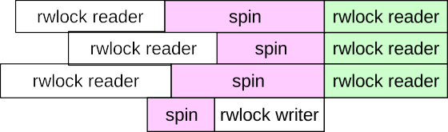

<Figure 2. Comparison between read–write (rw) spinlock and read–copy–update (RCU) [20](#_bookmark51). >

When updating an existing data, the task of the writers is divided into two parts. First, it updates the data, and this is carried out without blocking. If it wants to free the old data, the updater needs to wait until all the readers who have access to the old version of the data complete their read-side critical section, to then be able to free the old data.

Readers never block. The RCU ensures that accessed data will always be consistent. However, the data may or may not be current. The RCU API has several calls. However, its use can be illustrated with some basic functions.

Functions _rcu_read_lock()_ and _rcu_read_unlock()_ are used by readers, to signal the entry and exit of the critical section for reading. A thread is not allowed to sleep between these two calls. These operations can be nested.

Function _synchronize_rcu()_ is used by the writer. This will mark the end of its operation by defining a partition between old readers, which may have access to the removed data, and new readers that cannot access the newly removed data. This function blocks the writer until all readers with the old reference have left the critical section. It is possible to implement this operation without blocking, by using function _call_rcu()_. This function registers a callback that will be called after all readers finished their critical sections. Besides the basic functions exemplified here, there are other functions that have the same role but with restrictions and different application areas. A table with the complete API is available in [21](#_bookmark52).

Compared with read–write spinlocks, RCU has the benefit of not indefinitely delaying the writers. Even in the presence of readers, RCU allows writers to update the data. RCU is being increasingly used in the Linux kernel.

## 3.3 _Kernel mechanisms and the response-time analysis_

This section presents the mapping of the Linux kernel mechanisms, listed in Sections [3.1](#_bookmark4) and [3.2](#_bookmark6), to the abstractions used in the response-time analysis, described in Section [2](#_bookmark0). This mapping is described in Table [I](#_bookmark10). It can be seen that several synchronization mechanisms are used within the kernel; each of them may generate blocking. The release jitter happens because of the control mechanisms of interruption and preemption.

In addition to the points of interest mapped in this section, because of some restrictions of the response-time model, we added other points of interest that assist in understanding the constraints imposed by Linux.

### 3.3.1 _Task migration._

The response-time method is valid only for mono-processed systems, which does not represent the majority of current real-time Linux research and usage. An important issue for multicore systems is how the system allocates the tasks on the CPUs.

Table I. Mapping between mechanisms of the Linux kernel and abstractions of the response-time analysis.

> ===

According to Davis and Burns [13], multicore systems can be classified into three categories:

1. No migration: each task is allocated to a processor, and no migration is permitted.
2. Task-level migration: the jobs of a task may execute on different processors; however, each job can only execute on a single processor.
3. Job-level migration: a single job can migrate to and execute on different processors; however, parallel execution of a job is not permitted.

Using the mapping between tasks and Linux execution mechanisms, it is possible to categorize Linux’s interrupt handlers and threads. According to [22](#_bookmark53), it is possible to classify the interrupts as global or local. Local interrupts are those that run on a fixed processor, and global are those that can run on any processor. Local interrupts can be classified as no migration, as they always run on the same processor. On the other hand, global interrupts can be classified as task-level migration, as they can be migrated from one processor to another. But once an interrupt started an activation, it cannot be migrated.

For threads, this classification depends on a set of system configurations. A thread may be configured to run on one of _m_ processors, where _m_ is the number of processing units, which may be a core or thread (regarding hyper-threading), here denoted only as processor. Considering the case in which a task is associated with only one processor, it can be classified as no migration. For other cases, where a task can migrate between two or more processors, it is possible to classify the task as job-level migration, because a task can migrate at any time during its activation, except when preemption or migration are disabled or when an interrupt is interfering with the execution of this thread.

Regarding the processors, it is interesting to know in which CPU each task is running. For threads that can migrate, it is also interesting to know when these tasks were migrated and to which processor. To ensure the consistency of some operations, it is possible to temporarily disable the migration of threads on Linux. This is carried out using the _migrate_disable()_ and _migrate_enable()_ functions, in order to disable and enable the migration capability of a thread.

### 3.3.2 _Scheduling overhead._

Another restriction of the response-time analysis model is the scheduling overhead. In most theoretical studies, the scheduling overhead is usually considered negligible, or it is assumed that the overhead can be added to the computation time of the tasks.

Regarding empirical studies, it is quite common to observe measurements of scheduling overhead. It is usually measured the overhead associated with selecting the next task to be scheduled or the context switching overhead. These overheads are measured primarily to determine an upper bound or to compare different implementations of schedulers [7](#_bookmark38), [23](#_bookmark54).

In Linux, both functions are performed inside the _schedule()_ function and other functions relevant to the scheduling of tasks. In order to demonstrate when the scheduler functions are called and how these functions influence the execution of threads, we added the tracing of the functions that perform the scheduling, including all the overhead involved in its implementation.

# 4. TRACE TIMEFLOW: A NEW TRACE TOOL

Trace tools are frequently used in the analysis of real-time Linux implementations [24](#_bookmark55)–[27](#_bookmark57). The main motivations for the utilization of trace, rather than alternatives such as logging and debugging, come from the fact that trace tools have as an objective low overhead and the ability of massively collecting and storing data during execution [26](#_bookmark56). Many trace tools have been developed and the most used are Feather-tracer, Ftrace and LTTng [27](#_bookmark57).

Feather-trace is an event trace tool designed to be used with imus$RT$ [28](#_bookmark58). imus$RT$ is a project composed by a _patch_ to the Linux kernel, a set of libraries, and tools that provide support to the development of real-time multiprocessor schedulers on Linux [3](#_bookmark34). Feather-trace enables the trace of events, being used mainly in articles that describe imus$RT$ ’s implementations. For this reason, it covers only the points of interest of imus$RT$ , not covering all aspects of the Linux execution, such as locking mechanisms. Thus, it is not currently possible to trace all the Linux execution using only the Feather-tracer.

Ftrace is the standard trace tool for the Linux kernel. It enables the trace of events, with _tracepoints_ [29](#_bookmark59), and functions, with the _function tracer_ [30](#_bookmark60). Ftrace also implements trace plugins. These plugins are used to make measurements and analyses of the Linux kernel. For example, the `function_graph` plugin traces the function’s call and return and gives the execution time of each function. The `irqsoff` plugin measures the longest IRQ-disabled section, reporting the trace of the functions that were executed in this section.

However, these tools are strongly related to the current form of real-time Linux analyses. It is necessary a new trace plugin in order to provide a new view over the Linux execution, based on the abstractions of the real-time scheduling theory.

The LTTng is another trace tool used in real-time experiments [31](#_bookmark61). With regard to the tracing of the Linux kernel, LTTng uses the same trace forms of Ftrace. The difference is in the way that LTTng manages the trace sections, making possible concurrent trace sections, in the interface that it uses to communicate with the user space, in the trace format, and in the tools available to analyze the trace output.

As the LTTng and Ftrace share the same trace forms, this work will use the Ftrace as the initial interface, but it is also possible to integrate the new trace plugin with LTTng. In the next section, we first review Ftrace; we then present the new trace tool proposed in this paper, called Trace Timeflow.

## 4.1 _Introduction to Ftrace_

The Ftrace’s user interface was built on top of _debugfs_, which is a debug filesystem of the Linux kernel. With _debugfs_, the trace’s configuration and data collection can be carried out with the commands _echo_ and _cat_. This interface exempts the use of more complex tools [30](#_bookmark60) because all data processing and formatting are carried out in the kernel itself.

Ftrace supports these three kinds of trace:

- Static using _tracepoints_ [29](#_bookmark59);
- Static on the call and return functions using _function_ and _function graph_ tracer [32](#_bookmark62);
- Dynamic using _kprobe_ [33](#_bookmark63).

This article uses two of these three trace methods: the tracepoints and _function graph_ tracer.

The tracepoints are points of trace that can be added at any place of the kernel. It was created to replace the various existing forms of debug of Linux. The main characteristics of tracepoints are as follows:

- Can be used at any point in the kernel;
- Low overhead in the decision to run or not run the trace, especially in the second case;
- Efficient storage of data;
- Conversion of raw data into intuitive information.

A set of macros was developed to facilitate the use and adoption of tracepoints. These macros emulate automatic code generation, automating the process of creating new trace points.

The other form of trace is the function tracer. The function tracer relies on the way the GNU C Compiler (GCC) and the Gprof profiling tool interact with applications in user space. When an application is compiled with option -pg of GCC, a call to the function _mcount_ is added in the beginning of each function. After a function is executed, it calls the function _mcount()_.

The function _mcount()_ receives two arguments: the address of the function that called _mcount()_ and the return address of the function that called _mcount()_. For example, the function _foo()_ called the function _bar()_, which called _mcount()_. The first argument of _mcount()_ is the address of the function _bar()_, and the second argument is the return address of function _bar()_, which is in the function _foo()_.

Using this technique, Ftrace changes the _mcount()_ function to its own trace function, which aims at saving the addresses of functions in its buffer, along with other system information such as the status of interrupts and preemption. When Ftrace reads its buffer, it translates the address of the functions to the name of functions, thus showing the trace of all functions the kernel executed. In a simple example, the function tracer displays the following output:

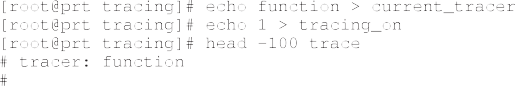

In addition to the function trace, there are other trace plugins, with emphasis on the function graph. The function graph traces the call and return of a function. To improve the understanding of the stack of functions, the output shows the indentation of the functions according to its position in the stack.

This is an example of the execution of the function graph:

An advantage of the function graph is the ability to determine the execution time of a particular function. It also makes the trace easy to follow, because of the indentation of functions. Ftrace allows the combined use of trace plugins and tracepoints.

The tracer proposed in this article, denominated Trace Timeflow, was created based on the function graph tracer, in order to trace the relevant functions. It also uses tracepoints to trace important changes in the system state.

## 4.2 _Trace timeflow_

Initially, the new plugin was built as a copy of function graph. From this clone, changes were made to meet our needs. The first change was the fields to be displayed in the trace.

### 4.2.1 _Trace format._

The format of the trace consists of six fields, as in the following example:

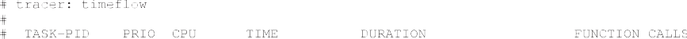

The field _TASK-PID_ identifies the task running, it displays the name of the process and its PID.

The field _PRIO_ displays the priority. Currently, Linux has 140 priorities, where priority 0 is the highest and 139 is the lowest. The real-time tasks use priorities from 0 to 99, with priorities from 100 to 139 used as time-sharing priorities.

The field _CPU_ displays the CPU where the task is running.

The field _TIME_ displays the absolute instant of time in which the event occurred.

The field _DURATION_ displays two types of information. The first is the execution time of functions, which is displayed in the return of the function, in nanoseconds. Secondly, this field is used to notify the entry points in the kernel.

The field _FUNCTION CALLS_ displays the functions performed and tracepoint information.

### 4.2.2 _Filter of functions._

Currently, Ftrace enables the filter functions to be displayed. To do so, it uses a linear search in a vector where the addresses of the desired functions are registered. The problem of this method is its complexity _O(n)_. In order to reduce the overhead in the selection of functions that must be tracked, it was used a technique already used by Ftrace, not for selecting functions but to determine whether or not particular function is an interrupt handler. To identify an interrupt handler, these functions were grouped in a section of text of the kernel binary. Thus, knowing the address of the beginning and end of this section, it is possible to determine whether or not a function is an IRQ handler. By using this same technique, the method of selection of functions becomes _O(l)_. The same technique was used to group the functions that implement mutual exclusion, scheduling, and system calls.

### 4.2.3 _Kernel entry points._

The activation of the kernel code can be carried out either by hardware or by a process in user space. The hardware asynchronously activate the hardware interrupt routines in the kernel. This activation is made through a device interrupt, non-maskable interrupt (NMI), _traps_, and so on. In the user context, processes can run kernel routines synchronously with system calls or asynchronously with interrupts, for example, in a _page fault_.

In order to facilitate the identification of entry points, the entry and exit of IRQ handlers are, respectively, signaled by flags ==========>_ and <========= in the \_DURATION_ field. For the system calls, the flags ———–>\_ and <——– are displayed in the call and return of the function that implements them.

### 4.2.4 _Preemption._

Because it is possible to nest the call of the functions that control the preemption, tracepoints were added in order to display only when there is a change in the state of preemption. These tracepoints receive as argument the address of the function that enabled or disabled preemption. In the following, it is shown an example of the output of these tracepoints.

### 4.2.5 _IRQ control._

In a way that is similar to preemption control, it is possible to nest calls to disable and enable IRQs. However, what matters for the analysis is the time when there is a change in the state of interrupts, from enabled to disabled or disabled to enabled. Thus, we added two tracepoints, which display when there is a change in the state of interrupts. An example of using these tracepoints is displayed as follows:

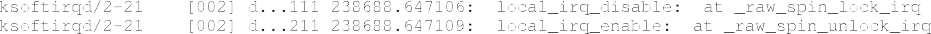

We also added tracepoints that show when a particular interrupt is disabled and enabled on all CPUs. Because it is not possible to nest these calls, it was only necessary to add points of trace to the functions that enable and disable the interrupt.

### 4.2.6 _Blocking._

For the functions that implement the blocking mechanisms listed in Section [3.2](#_bookmark6), it was used both the trace of functions and tracepoints. In order to identify which type of block that is being used, and their behavior, the functions that implement these methods are displayed in the trace. Furthermore, it was used the following _tracepoints_ to inform the acquisition, blocking, and release of lock variables:

- lock_acquire: indicates that the task wants to acquire the lock;
- lock_acquired: indicates that the task acquired the lock;
- lock_contended: indicates that the task was blocked in a lock;
- lock_release: indicates that the task released the lock.

### 4.2.7 _Scheduling overhead._

It was used the trace of functions and tracepoints for scheduling operations. The scheduling functions are displayed to show the time when the task stops running application code and starts to execute the code of the scheduler.

To display the scheduling decisions of the system, it was used the following existing tracepoints:

- sched_wakeup: notifies when a task changes its state from sleeping to ready to run;
- sched_wakeup_new: notifies when a new task state changes its state from sleeping to ready to run;
- sched_switch: notifies a context switch of tasks, also shows when a task has changed its state from ready to sleeping;
- sched_migrate_task: notifies the migration of a task from one processor to another;
- sched_pi_setprio: notifies a change in the priority of a process, caused by the priority inheritance protocol.

### 4.2.8 _Task migration._

Process migration is disabled and enabled by the functions _migrate_disable()_ and _migrate_enable()_. These calls can be nested. Thus, these tracepoints were added to show only when the system changes the migration state from enabled to disabled and vice versa. An example of the output of these tracepoints is the following:

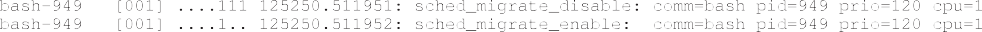

# 5. CHARACTERIZATION OF THE LINUX PREEMPT RT TIMELINE

This section describes the creation of an experimental environment to use the trace tool and the characterization of the execution of real-time tasks on Linux, using the abstractions of the real-time systems theory.

A computer with an eight-core Intel Xeon E5260 processor and 4 GB of RAM was used for the experiments. On this system, the Fedora Linux distribution was installed, along with the 3.6 kernel, compiled with the PREEMPT RT patch and the new trace tool.

In order to simulate the behavior of real-time tasks, two pieces of software were created. They are a periodic task that runs as a thread in user space and a module that runs in the Linux kernel. This task is identified as _pi_.

At each periodic activation, the user space thread activates the kernel module via a character device interface. The activation is carried out by reading or writing the module’s interface. When writing the module, the user space thread configures the duration of the busy wait that will be performed inside the kernel, during the _read()_ operations.

While reading the module, the task will try to acquire a lock, when there may be contention. After acquiring the lock, the task will perform a busy waiting, by the amount of time set through the _write()_ operation. After finishing the busy waiting, the lock is released and the thread execution returns to user space.

This task executes without voluntary suspending its execution, neither in the kernel nor in user space. To force the usage of locking mechanisms, two _pi_ tasks are executed in parallel, making concurrent _read()_ operations, causing contention in the dispute of the lock. Different mutual exclusion mechanisms can be used in the module. In the following examples, both spinlock and RT Mutex were used.

The IRQ handlers of the experimental system were also used for the characterization of this kind of tasks.

## 5.1 _Characterization of the interrupt handlers timeline_

The following trace shows the execution of a local timer interrupt. To make the trace output clear, the trace entries that did not affect the timing characteristic of the task have been replaced by _. . . _.

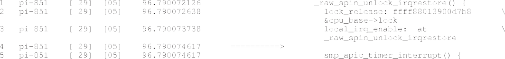

During its execution, task _pi_ calls the function _raw_spinlock_irqsave()_, disabling interrupts. The interrupts are then enabled in the unlock operation, performed by function _raw_spin_unlock_irqrestore()_. In the earlier trace, while releasing the _raw_spinlock()_ at line 1, interrupts are enabled at line 3, and the processor starts executing the _timer_ interrupt handler, which is carried out by the function _smp_apic_timer_interrupt()_, at line 5.

In this case, it is possible to affirm that the interrupt handler was delayed. However, the interrupt may have occurred at any time during the interrupt-disabled section. Thus, it is not possible to exactly determine the release jitter. Nevertheless, it is safe to assume the worst case: that the interrupt occurred shortly after task _pi_ disabled interrupts.

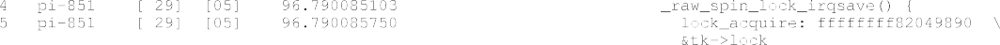

Continuing the execution, the interrupt handler executes _\_raw_spin_lock_irqsave()_ at line 4, which would disable interrupts. However, because interrupts are disabled by the processor itself when calling an interrupt handler, the trace identifies that interrupts are already disabled and does not print the line reporting the state change of interrupts.

The interrupt handler wakes up the _timer softirq_ at line 8 and finishes its execution returning control to the previous task.

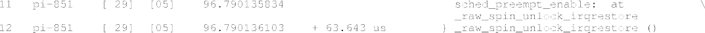

Finally, control is returned to the task _pi_, which continues the releasing of the _raw_spinlock()_, enabling preemptions, and then returning.

In general, it can be said that an interrupt handler may be delayed whenever interrupts are disabled. It is noteworthy that in addition to the interrupt control carried out by the operating system, the processor architecture also defines its rules for masking interrupts. The points at which the processor disables interrupts are beyond the control of the operating system. For this reason, it is not possible to trace these points. Thus, for each hardware architecture, we must identify the points at which the hardware disables interrupts itself.

Regarding the ability of interrupts to interfere with the execution of other interrupts, we consider that a maskable interrupt can be interrupted by an NMI and that an NMI blocks other NMIs [34](#_bookmark64).

### 5.1.1 _Interrupt handlers timeline._

From the analysis of the trace of several executions, and based on the mapping of abstractions from Section [2](#_bookmark0), it was possible to characterize the execution of interrupt handlers. However, because of the different restrictions imposed to maskable and NMIs, it was necessary to characterize the interrupts for these two different modes.

An NMI can be enabled at any time and therefore must obey a set of very strict rules. For example, an NMI handler cannot use mutual exclusion mechanisms, except when it is used only in this context, for synchronization with other NMIs running on another CPU. The code of NMI handlers cannot be reentrant; that is, a second NMI will not be handled during the execution of an NMI [34](#_bookmark64).

From these restrictions and the trace of interrupts, it is possible to characterize the execution of NMIs as in Figure [3](#_bookmark13).

For NMIs, the response time _R$i$_ is given by the delay between the IRQ activation and the return of the NMI handler. The release jitter _J$i$_ will occur if the system is already handling an NMI. In this case, it is safe to assume the worst case: that the second NMI was activated right after the first NMI was activated.

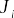
Figure 3. Non-maskable interruption timeline. IRQ, interrupt request.

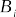
Figure 4. Maskable interruption timeline. IRQ, interrupt request.

The busy window _W$i$_ is defined as the time that the NMI held the CPU during its execution, being determined by the time interval between the call and the return of the IRQ handler. The blocking represented by variable _B$i$_ must be implemented as busy waiting, which should occur only for synchronization between NMIs. Finally, the runtime _S$i$_ is determined by the busy window, discounting the time that the NMI may have been blocked by another NMI.

Nevertheless, there is one exception to this rule, which occurs because of the execution of the instruction _iret_ during the execution of an NMI handler, usually called by the code of another interrupt handler inside the NMI, that is, the page-fault handler. This exception is known as _iret flaw_ [34](#_bookmark64) and allows the nesting of this class of interrupt handlers. For NMI handlers subject to this exception, the characterization of its execution is the same of maskable interrupt handlers.

On the other hand, the maskable interrupt may suffer interference from NMI; hence, its characterization differs from the NMI. As the NMIs handlers may execute at any time, it is assumed here that they have a higher priority than the maskable interrupt handlers. The same applies for the NMI handlers subject to _iret flaw_.

The characterization of the maskable interrupt handlers is shown in Figure [4](#_bookmark14).

For maskable interrupts, the response time _R$i$_ is determined by the time interval between the activation and the return of the interrupt handler. The release jitter _J$i$_ can happen if the system has interrupts disabled, either by an action of the operating system or by action of the processor itself, for example, if it is already handling an interrupt. In this case, it is safe to assume that in the worst case, activation took place immediately after the disabling of interrupts.

Differently from NMIs, maskable interrupts can suffer interference _I$i$_ , caused by the occurrence of an NMI. The busy window _W$i$_ is defined as the time that the interruption held the CPU during its execution, being determined by the time interval from start to finish of the interrupt handler. Blocking _B$i$_ is always implemented as busy waiting. Lastly, the runtime _S$i$_ is determined by the busy window discounting blocking and interference from other interrupt handlers.

## 5.2. _Characterization of the threads timeline_

In order to characterize the execution of a real-time thread, we used task _pi_. The C code of its main execution loop is shown as follows:

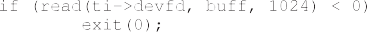

Inside the infinite loop created with _for_, the function _pause()_ suspends the task execution, waiting for a new activation. A periodic timer signal wakes up the task, starting a new activation. Returning to execution, the job executes the system call _read()_, activating the module into the kernel, which will run the busy waiting protected by a mutex variable. After return from _read()_, the task finishes its activation by suspending itself and waiting for a new activation.

### 5.2.1 _Trace of a thread execution._

The following trace shows an activation of the _pi_ task, in which it runs without suffering blocking or interference.

The timer _softirq_ that will activate task _pi_, before activating it at line 2, migrates it to CPU 0 at line 1. CPU 0 is on _idle_ state, which disables preemption. When CPU 0 receives the event that a task has been activated, it leaves the _idle_ state and then enables preemption. After enabling preemption, the scheduler is called and performs a context switch to task _pi_.

Once activated, the scheduler that puts the task to sleep resumes its execution at line 12, returning the execution of system call _pause()_ at line 13. On the return of _pause()_ to user space, the functions that handle the timer signal are called; these functions are _do_notify_resume()_ and _sys_rt_sigreturn()_, between lines 16 and 27. Despite not appearing in the task’s code, these functions are performed by the C library, as part of the implementation of signal handling.

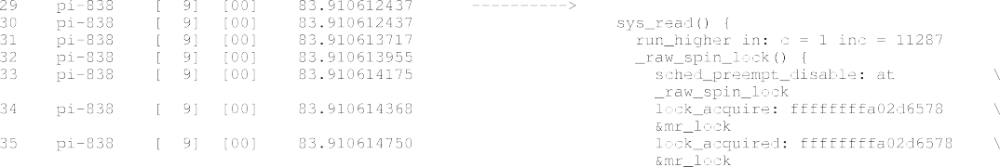

Figure 5. Real-time thread.

At line 30, the function _read()_ is performed. It obtains access to the critical section at line 35, and does some busy waiting. After finishing the busy waiting, it releases the _raw_spinlock()_ at line 38, returning to user space at line 43.

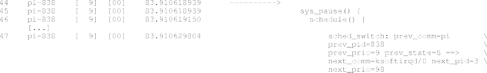

After returning, task _pi_ calls function _pause()_ at line 45, finishing the activation while leaving the CPU at state _S_ (line 47).

### 5.2.2 _Characterization of the threads timeline._

The characterization of real-time threads is more complex than that of the interrupt handlers. Therefore, it was made in parts. Firstly, we considered an activation without blocking and interference. Then, we identified the different forms of blocking and interference, showing how they can affect the real-time threads timing behavior. Figure [5](#_bookmark15) describes the execution of a real-time thread without interference or blocking.

For threads, the response time _R$i$_ is the time between the thread activation by the event sched*wakeup and the context switch when the thread leaves the processor, suspending its execution in state \_S*. The busy window _W$i$_ is the time interval between the first context switch after the task’s activation and the context switch in which the task leaves the processor to sleep, finishing its execution. The release jitter _J$i$_ can be associated with two reasons: preemption or interrupts being disabled by a process of lower priority and by a scheduler execution that removes the current task. Both must happen at the processor on which the task was activated.

After a task starts its execution, the scheduling routine that had suspended that task runs until it returns to the application code. Unlike most response-time analyses, where the scheduling overhead is considered negligible, with Linux, this overhead is important and should be measured. It was necessary to create a new abstraction to accommodate this overhead, which was denominated as scheduling overhead. This abstraction is associated with the variable _SS$i$_ , comprising the exitscheduling overhead, that is, the time between the calling of function _schedule()_ and the context switch; and the entry-scheduling overhead, that is, the time between the context switch and the return of function _schedule()_.

Finally, the computation time _S$i$_ is the time that the thread has executed its own code, which can be either in user space or kernel space, excluding scheduling overhead, blocking, and interference.

Regarding the interference _I$i$_ , Figure [6](#_bookmark16) describes the two forms of interference that a task can suffer: interference from an interrupt handler and interference from a thread.

Because the interrupt handlers are activated by the hardware, they do not need to be scheduled. The interference of an interrupt handler is given by the busy window _W$i$_ of the interrupt handler.

Differently from the interference of interrupt handlers, the interference caused by threads adds scheduling overhead to the current running task. This overhead increases the task’s own scheduling overhead. The interference of a high-priority thread is given by the time interval between the context switch that removes the current thread from the processor and the context switch that gives back the processor to the thread. It is possible to identify whether a thread is suffering interference by the state that it is leaving the processor. When a real-time thread leaves the processor in _R_ state, it is suffering interference.

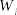

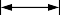
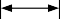
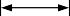

Figure 6. Forms of thread interference.

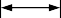
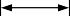

Figure 7. Forms of thread blocking.

Regarding locks, one thread can experience two forms of blocking: implemented as busy waiting or implemented by suspending the execution of the thread. Figure [7](#_bookmark17) demonstrates both cases.

The first example of _B$i$_ is a busy-waiting lock, where the task keeps running on its context, until the lock is released by another thread. In the trace, it is possible to identify this blocking by the tracepoint _lock_contended_. After acquiring access to the critical section, tracepoint _lock_acquired_ is shown. Thus, the blocking time is given by the time interval between these two tracepoints.

The second example is the type of blocking that suspends the thread’s execution until it acquires the critical section. In this case, as the scheduling overhead happens because of the mutual exclusion mechanism, it is considered that this time is part of the task’s blocking time, and the measurement is made in a manner analogous to the mechanisms that do not suspend execution: the time interval between tracepoints _lock_contended_ and _lock_acquired_.

# 6. USING TIMEFLOW TO MEASURE TIMING PROPERTIES

Based upon the characterization of the execution of real-time tasks on Linux, the following sections show examples of trace and their interpretation, that is, how the value of each real-time abstraction can be collected and evaluated. It is noteworthy that it is not one objective of this article to determine the worst case of any of the real-time abstractions presented. But only to identify the variables and to define how to compute them. Empirical determination of maximum execution times requires many billions of runs. For instance, the Open Source Automation Development Lab [35](#_bookmark65) carries out multi-year latency testing on a number of versions of the PREEMPT RT Linux kernel on a variety of hardware.

The value for the abstractions presented in the next sections is defined for the described activation and does not represents the worst-case values, for both task and system. We start with an example of activation without blocking and interference, which is followed by an example of activation with the occurrence of blocking.

## 6.1 _Activation without concurrence_

The first example is an execution without blocking and interference from higher-priority threads. The trace output is the following.

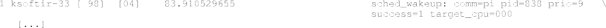

Line 1 shows the instant of time when task _pi_-838 is awakened on CPU 0, which was in the _idle_ state. Preemption is enabled at line 2, followed by the scheduler execution at line 3. Line 4 shows the event of context switch to task _pi-838_. With these trace points, it is possible to state that the release of this job was delayed by the preemption and scheduling routine. Considering the release jitter as the time between the activation and the context switch, _J$pi$_$—_838_$ equals to 21.864 *K*s.

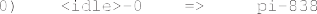

After the context switch, the scheduling routine returns at line 5, thus starting the execution of application code. Considering the scheduling overhead as the time interval between the context switch and the return of the _schedule()_ function, the schedule overhead _SS$pi$_$—_838_$ is 4.124 *K*s.

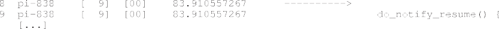
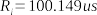

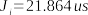

Figure 8. Timeline of a job without concurrence.

Table II. Real-time tasks setup.

Throughout the execution, the task has not suffered blocking or interference. At line 36, it can be seen that the thread left the CPU in the _S_ state. So it is possible to affirm that the task finished its activation.

The scheduling overhead of removing the thread from the processor is the time interval between the call to _schedule()_ at line 35 and the context switch at line 36, and it was 10.654 *K*s. By summing the scheduler overhead at the starting and the finishing of the execution, the scheduler overhead contributed with 14.778 *K*s to the response time.

The context switch at line 36 is also used to calculate the response time, which is the time difference between this line and the activation of the task at line 1. The response time _R$pi$_$—_838_$ is 100.149 *K*s.

Furthermore, it is possible to define the busy period as the time interval between both context switches at lines 4 and 36, so _W$pi$_$—_838_$ is 78.285 *K*s.

Finally, the execution time _S$pi$_$—_838_$ of this activation is defined as the response time _R$pi$_$—_838_$ minus the release jitter _J$pi$_$—_838_$ and the sum of the scheduler overhead _SS$pi$_$—_838_$. Thus, _S$pi$_$—_838_$ = _l00.l49_ — _2l.864_ — _l4.778_ = *63.507 K*s

With the definition of these variables, it is possible to show the timeline of this job graphically, similar to that used in the real-time systems literature. Figure [8](#_bookmark19) shows this timeline.

## 6.2 _Concurrent activation_

The next example shows the execution of two _pi_ tasks. These tasks have the configuration described in Table [II](#_bookmark20). Task _pi-839_ is the high-priority task, and _pi-838_ is the low-priority task.

These two tasks will compete for the critical section protected by a Mutex RT. The events in the trace will be described in the same order they appear.

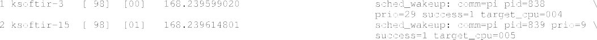

Lines 1 and 2 show the activation of the low-priority and high-priority tasks, respectively.

After enabling preemption, CPU 4 exits from _idle_ and calls the scheduler, changing the context to task _pi-838_, which has low priority. By considering the time interval between context switch and the sched wakeup events at lines 3 and 1, it is possible to define the release jitter _J$pi$_$—_838_$ as 63.586 *K*s.

After the context switch, the scheduler returns the execution control to the lowpriority task. The schedule overhead is defined by the time interval between the return of the scheduling routine and the context switch at lines 9 and 5, respectively. The scheduling overhead _SS$pi$_$—_838_$ is 6.565 *K*s.

Once task execution is resumed, the low-priority task starts the processing of the signals responsible for its activation.

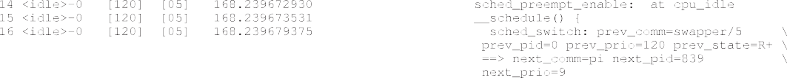

The behavior of the high-priority task is similar to that of the low-priority task. Preemption is enabled on CPU 5 exiting from _idle_, then the scheduler is called to perform the context switch to the high-priority task _pi-839_. Thus, it is possible to define the release jitter _J$pi$_$—_839_$ as 64.574 *K*s.

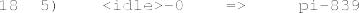

Once it acquired the processor, the high-priority task returns from the scheduler and starts its execution. On this activation, the job suffered 6.068 *K*s of scheduling overhead, which is the time interval between the events at lines 20 and 16.

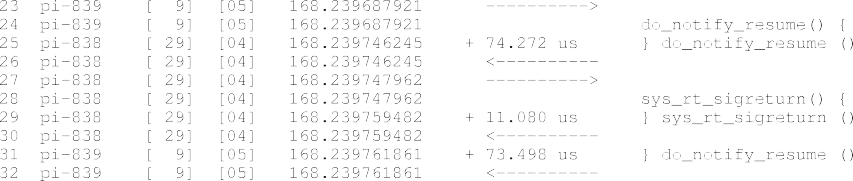

At this point, both tasks are running the handlers of the signals that activated them.

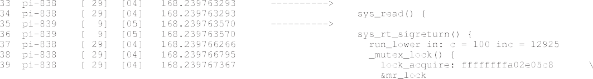

While the low-priority task executes the _write()_ system call at line 34, the high-priority task is still handling a signal at line 36. At line 38, the low-priority task calls function _mutex_lock()_ for the RT mutex. This task then acquires the lock without contention, returning to execution at line 42.

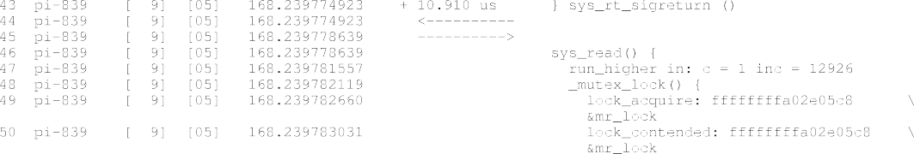

At line 46, the high-priority task executes the _write()_ system call and then tries to acquire the mutex. However, as the low-priority task is in its critical section, the high-priority task suffers contention at line 50, starting a blocking interval.

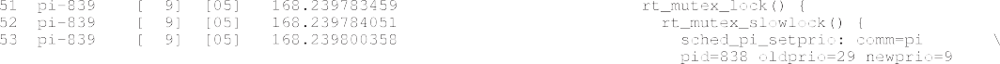

At line 53, the high-priority task activates the mechanism of priority inheritance, assigning its priority to the low-priority task.

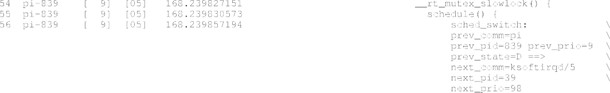

After finishing the execution of the priority inheritance protocol, the high-priority task changes its state to sleeping on uninterruptible mode (_D state_) and then calls the scheduler causing the context switch at lines 55 and 56.

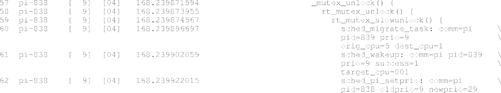

After finishing the execution of its critical section, the low-priority task calls the function that releases the mutex at line 57. It is worth noticing that the low-priority task is still running with high priority at this moment. While releasing the mutex, the high-priority task is awakened at line 61. Finally, the low-priority task returns to its original priority at line 62.

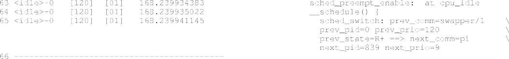

Exiting from idle, CPU 1 enables preemptions at line 63. Furthermore, it calls the scheduler at line 64, executing the context switch at line 65.

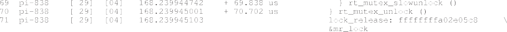

After finishing the release of the mutex, the low-priority task resumes its execution. It is worth noticing that the lock release of the RT mutex added 73.306 *K*s of overhead to the low-priority task, which is a relatively large time, considering that this task should complete in just over 100 *K*s if no RT Mutex release was required. This overhead is the reason for the common suggestion to use spinlocks in short critical sections [15](#_bookmark46).

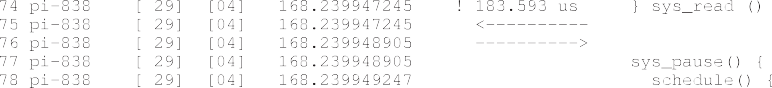

After releasing the mutex, the low-priority task returns to user space. All in all, the system call _read()_ took 183.593 *K*s. Much of this time has come from the release of the mutex. At this point, the low-priority task calls the scheduler at line 78.

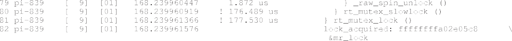

The high-priority task, after being scheduled, returns to the acquisition of RT Mutex. Its blocking time is the time interval between the event that signals the acquisition of the mutex at line 82 and the task trying to acquire the mutex at line 49. There is a blocking time _B$pi$_$—_839_$ of 178.545 *K*s.

After finishing the critical section, the high-priority task initiates the release of the mutex.

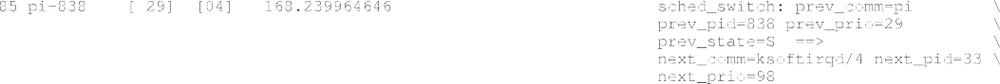

The low-priority task, after calling the scheduler at line 78, completes the process of leaving the CPU by running the context switch. Once we came to the end of the execution, it is possible to set the value for the other variables, starting with the scheduling overhead.

The overhead of the scheduling operation that removed the task from the CPU is the time interval between the scheduler being activated at line 78 and the context switch at line 84. This time interval was 15,399 *K*s. The trace shows then a total scheduling overhead of 21.964 *K*s

The busy window _W$pi$_$—_838_$ of this task activation is the time interval between the task starting and finishing its execution. This value can be computed as the time interval between the context switches at lines 5 and 84, respectively, resulting in a _W$pi$_$—_838_$ of 302.040 *K*s.

The response time of this activation of _R$pi$_$—_838_$ is 365.626 *K*s. It is given by the time interval between the event that activated the task at line 1 and the event that finished the activation of the task at line 84.

This activation of the task showed no blocking or interferences. One can estimate its execution time from its response time minus the activation delay and scheduling overheads: _S$pi$_$—_838_$ = _365.626_ — _63.586_ — _2l.964_ = *280.076 K*s

This value for the execution time is very interesting. At first, by considering the time expended in the critical section, one could assume that the execution time would be a value close to 100 *K*s, but the execution was shown to take nearly three times that value.

By analyzing the trace output, it is possible to see that in addition to the critical section, the execution time was influenced by the timer routines, by the execution of the system call _do_notify_resume()_ that added *74.272 K*s, and by the execution of the function _sys_rt_sigreturn()_ that added more 11.080 *K*s. Moreover, the execution of `mutex_unlock()` added more 73.306 *K*s to the execution time. These operations added 158.658 *K*s to the execution time of the activation of this task.

Once these values are defined, it is possible to explain the timing behavior of this task activation drawing the timeline of Figure [9](#_bookmark21).

We now continue the trace of the high-priority task.

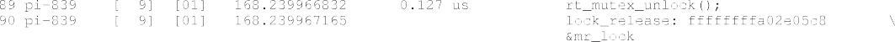
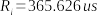

Figure 9. Timeline of task pi-838.
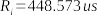
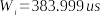

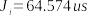
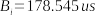

Figure 10. Timeline of task pi-839.

The execution time of the system call _read()_ was 191.341 *K*s, which is much greater than 5.609 *K*s, which was its execution time in the absence of blocking, in the previous example.

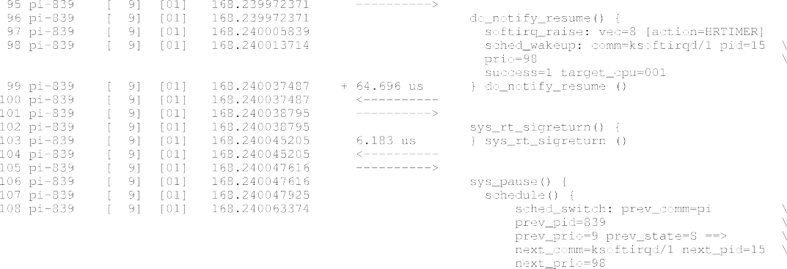

After returning to user space, the function that handles the timer signals is executed again. That is because the task ran over its period, and a new signal was delivered in order to start a new task activation.

After handling the signal, the task suspends its execution. It happened because the task was not implemented to deal with a deadline miss. In this case, the use of our trace tool assisted in the discovery of the problem and what factors influenced in this missed deadline.

After the context switch that completes the task execution at line 108, it is possible to determine the response time _R$pi$_$—_839_$, defined as the time interval between this event and the event that woke the task at line 2. This activation has shown the response time _R$pi$_$—_839_$ of 448.573 *K*s.

The exit-scheduling overhead is the time interval between the call of _schedule()_ and the context switch to state _S_ at lines 107 and 108, respectively. It was 15.449 *K*s. This overhead, when added to the entry-scheduling overhead, gives a total of 21.517 *K*s of scheduler overhead.

The busy window of this activation is the time interval between the start and the end of the task execution, indicated by the context switch at line 16 and the context switch at line 108. It resulted in a _W$pi$_$—_839_$ of 383.999 *K*s.

Considering the already-computed _B$pi$_$—_839_$ and the absence of interference, it is possible to estimate the execution time as the response time, minus the blocking, release jitter and scheduler overhead, which results in _S$pi$_$—_839_$ = _448.573_ — _64.574_ — _l78.545_ — _2l.5l7_ = *l83.937 K*s.

Once these values are defined, it is possible to draw the activation timeline, shown in Figure [10](#_bookmark22).

By looking at the timeline, we obtain the reason for the deadline miss that is now clear. The blocking time added to the task _pi_ — _838_. We can conclude that the initial setup defined in Table [II](#_bookmark20) is unfeasible.

# 7. RESULTS FROM THE CASE STUDY

By applying the rules for the interpretation of the trace and the determination of the values of the several timing properties, we performed a complete analysis of a section of the trace.

Figure 11. Response time.

In order to facilitate the analysis, we have chosen the trace that uses _raw spinlocks_ for mutual exclusion. The analysis was performed only for the highest-priority task, which does not suffer interference from other processes, only from interrupts. The data gathering was carried out by using a shell script that filtered the data and calculated the times in nanoseconds. An example of the output of our script is shown as follows:

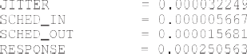

From a trace of 2 s we discarded the first 600 ms to remove the interference from the scripts controlling the experiment. From this new trace, we evaluated the 5259 task arrivals. The output of this script was used to generate the charts discussed in the following subsections.

## 7.1 _Response time_

The chart of Figure [11](#_bookmark24) shows the response time of task activations.

Regarding response times, the shortest response time was observed when the task was neither blocked nor preempted. In this case, its response time is the sum of the release jitter, the entryscheduling overhead, its execution time, and the exit-scheduling overhead. The greatest response time was 620.147 *K*s, and it has the following characteristics:

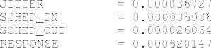

The cause of the high response time was blocking. By analyzing the trace for this activation, we have seen that the task was blocked four times in three mutual exclusion variables during its execution. Two of these variables were RT Mutex: at _sighand-&gt;siglock_, the task was blocked twice for 94.421 and 94.243 *K*s and at _new_timer-&gt;it_lock_ by 94.385 *K*s, and one variable was a raw spinlock, associated with the read function of the module, which blocked the task for 101.908 *K*s.

The task was blocked long enough for two more activations of the timer, so the execution time of the task was also penalized, because of the execution of a second signal handler.

## 7.2 _Release jitter_

Figure [12](#_bookmark26) shows the release jitter:

The release jitter stays below 50 *K*s most of the time, with peaks of 31, 32, and 33 *K*s. This pattern is caused by the fact that, as there are only two tasks beyond those responsible for system housekeeping, most activations are directed to idle processors. Only in three cases the task arrives at a processor that is really executing some tasks.

Figure 12. Release jitter.
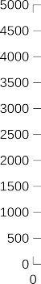

Figure 13. Scheduling execution time.

## 7.3 _Scheduling_

The execution time of the routines of entry-scheduling overhead and exit-scheduling overhead is shown in Figure [13](#_bookmark27).

Regarding the entry-scheduling overhead, only in two executions it took more than 10 *K*s to complete. All other executions last less than 8 *K*s each one. Although these two longer executions seem to be strange at first, by examining the full traces, it is possible to explain what happened regarding the execution flow, which were indeed different in these two runs.

During the exit-scheduling overhead, we can see a good example of the difference between _realtime_ and _real-fast_. Despite the execution time of the exit-scheduling overhead, in most cases, being greater than the execution time of the entry-scheduling overhead, the worst execution time of the exit-scheduling overhead is smaller than the worst execution time of the entry-scheduling overhead, for these activations.

## 7.4 _Blocking_

Figure [14](#_bookmark28) shows the sum of blocking time of each activation of _pi_ task.

Most blocking scenarios lasted about *l00 K*s. Many of these times are the times of blocking caused by the shared lock within the read function of the module. However, because the two threads _pi_ also access at the same time functions of the system, they end up sharing other locks, as in the blocking example showed in Section [7.1](#_bookmark25).

Interestingly, locks _sighand-&gt;siglock_ and _new_timer-&gt;it_lock_, which are RT spinlocks, cause a contention of about 90 *K*s, which gives the graph its characteristic of showing various events between 0 and just over 100 *K*s, where we find the blocking from the shared locking in the module and one blocking of one of these locks. When there are two blockings, the measurements are close to 180 *K*s. When there are three blockings, they are close to 260 *K*s and close to 340 *K*s with four blockings. This feature is so mainly because the two tasks eventually synchronize because of their competition for the same mutual exclusion variables and exhibit the same behavior suffering more blockings.

Figure 14. Blocking.
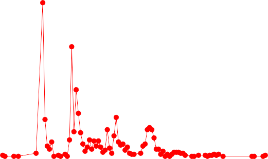

Figure 15. Interference.

## 7.5 _Interference_

Figure [15](#_bookmark29) shows the busy period of interrupts that caused interference on the high-priority task.

There were a total of 1080 interrupts. Only one was not from the timer but an NMI, in which handler lasted for 8 *K*s. Despite the execution time peaks at 38 and 25 *K*s, the duration of the execution window of the timer interrupts tends to be larger for a reason: they occur simultaneously in different processors, causing blocking. For example, the trace in the following is from the time when the interrupt that caused the greatest interference was activated:

In this example, four interrupts occurred simultaneously in four different processors, which competed for access to the same critical sections. In this case, the handler that interrupted the highest-priority task waited for *44.253 K*s for the _raw_spinlock() xtime_lock()_.

## 7.6 _Execution time_

Finally, Figure [16](#_bookmark30) shows the execution time of each activation. The lowest execution time was 64 *K*s. Most execution times, 79.72 % (4193 of 5259), were in the range of *93*I *98 K*s. The difference between these times and the lowest is because, in most cases, the function _do_notify_resume()_ performs maintenance time functions for the kernel, which sometimes does not happen, as when we have the lowest execution time.

Figure 16. Execution time.

The longest execution times, over 110 *K*s, are caused when, because of blocking, interference, or delay, the system misses the deadline and has to handle the signals that would wake up the next activation before suspension.

# 8. CONCLUSION

There is great interest from both developers and researchers in transforming Linux in a realtime operating system. But cooperation is limited by the fact that these two communities use different abstractions to model system components and different methods of system validation. Task models used in the scheduling theory are usually too simple. They do not capture the constraints and task dependencies that appear when real-time applications run on a Linux kernel. Despite the vast literature on real-time scheduling, few of these results are to be used by the Linux development community.

Although the main objective of the PREEMPT RT patch is to reduce system latency, it also simplifies the control flow inside the Linux kernel, which makes it more amenable to modeling. Priority inversion is mostly avoided by reducing the code sections where the system remains with interrupts and preemption disabled. Notwithstanding, the actual behavior of the PREEMPT RT Linux is far from the simple models used in the real-time scheduling theory.

In this paper, we make three contributions in the direction of applying the real-time scheduling theory to real systems based on the PREEMPT RT Linux:

- PREEMPT RT Linux kernel mechanisms that impact the timing of real-time tasks were identified and mapped to abstractions used by the real-time scheduling theory;
- A customized trace tool was created, such that it allows the measurement of the delays associated with the main abstractions of the real-time scheduling theory;
- This customized trace tool was used to characterize the timelines of the PREEMPT RT Linux kernel.

The mapping between Linux kernel and real-time abstractions, facilitated by the response-time analysis, creates a new point of view over the Linux execution. This mapping was possible because of the modifications of the Linux kernel; many of them are part of the PREEMPT RT patch or were implemented first on PREEMPT RT and then ported to the mainstream kernel. This was the case with the fully preemptible mode and the handling of IRQs by kernel threads.

Nevertheless, only the mapping would not be enough to observe the kernel execution from this new point of view. Ftrace proved its power and usability in the creation of a new view format, mainly using the already-implemented methods. The timing characterization of the Linux kernel was then possible as a consequence of the abstraction mapping and the new trace tool.

The main contribution of this paper is the description of the Linux kernel timeline based on realtime scheduling abstractions. The development and evaluation of new algorithms, both to kernel and user space, can be made using these abstractions. We believe this characterization is an important step in the direction of creating correct task models of the PREEMPT RT Linux and developing analytical methods for its schedulability analysis. It will also help in the sharing of information, making new implementations easy to understand by the researchers, and the advantages of new algorithms implemented by researchers being clearly understood by practitioners.

As future work, the automation of the trace analysis will help on the evaluation of new algorithms. Furthermore, as the trace tool generates a huge amount of data, the ability to make this evaluation on the fly by a long period is another challenge. An interesting challenge would be the evaluation of the deadline scheduler [4](#_bookmark35) that uses a different method to choose the priority of tasks, in such way that the higher-priority task depends on the deadline of the task and not on a fixed priority.

# REFERENCES

1. Red Hat, Inc. Red Hat Enterprise MRG. Available at: [http://www.redhat.com/f/pdf/MRG_Datasheet.pdf](http://www.redhat.com/f/pdf/MRG_Datasheet.pdf) last accessed 17 September 2014.
2. MontaVista. Real-time. Available at: [http://www.mvista.com/solution-real-time.html](http://www.mvista.com/solution-real-time.html) > last accessed 17 September 2014.
3. imus$RT$ : Linux testbed for multiprocessor scheduling in real-time systems. Available at: [http://www.litmus-rt.org/](http://www.litmus-rt.org/) last accessed 17 September 2014.
4. Lelli J, Lipari G, Faggioli D, Cucinotta T. An efficient and scalable implementation of global EDF in Linux. _Proceedings of the 7th Annual Workshop on Operating Systems Platforms for Embedded Real-Time applications (OSPERT 2011)_, Porto, Portugal, 2011; 6–15.
5. Real-time Linux wiki. Available at: [https://rt.wiki.kernel.org/](https://rt.wiki.kernel.org/) last accessed 17 September 2014.
6. Corbet J. Linux at NASDAQ OMX*. Linux Weekly News*, October 2010. Available at: [http://lwn.net/Articles/411064/](http://lwn.net/Articles/411064/) last accessed 17 September 2014.
7. Bastoni A., Brandenburg B, Anderson J. An empirical comparison of global, partitioned, and clustered multiprocessor EDF schedulers. _2010 IEEE 31st Real-Time Systems Symposium (RTSS)_, San Diego, California, 2010; 14–24. DOI: 10.1109/RTSS.2010.23.
8. Lelli J, Faggioli D, Cucinotta T, Lipari G. An experimental comparison of different real-time schedulers on multicore systems. _Journal of Systems and Software_ 2012; **85**(10):2405–2416.
9. Gleixner T. Realtime Linux: academia v. reality. _Linux Weekly News_ July 2010. Available at: [http://lwn.net/Articles/](http://lwn.net/Articles/471973/) > [471973/](http://lwn.net/Articles/471973/) last accessed 17 September 2014.
10. Brandenbug B, Anderson J. Joint opportunities for real-time Linux and real-time system research. _Proceedings of the 11th Real-Time Linux Workshop (RTLWS 2009)_, Dresden, Germany, 2009; 19–30.
11. Hart DV, Rostedt S. Internals of the RT patch. _Ottawa Linux Symposium_, Ottawa, Ontario, 2007; 161–172.
12. Buttazzo G. _Hard Real-time Computing Systems: Predictable Scheduling Algorithms and Applications_ (2nd edn). Springer: Santa Clara, California, 2005.
13. Davis RI, Burns A. A survey of hard real-time scheduling for multiprocessor systems. _ACM Computing Surveys_ October 2011; **43**(4):35:1–35:44. DOI: 10.1145/1978802.1978814.
14. Joseph M, Pandya PK. Finding response times in a real-time system. _Computer Journal_ 1986; **29**(5):390–395.
15. Corbet J, Rubini A, Kroah-Hartman G. _Linux Device Driver_ (3rd edn). O’Reilly Media: Sebastopol, California, 2005.
16. Love R. _Linux Kernel Development_ (3rd edn). Addison-Wesley: Crawfordsville, Indiana, 2010.
17. Rostedt S. RT-mutex subsystem with PI support. Available at: [https://www.kernel.org/doc/Documentation/](https://www.kernel.org/doc/Documentation/rt-mutex-design.txt) [rt-mutex-design.txt](https://www.kernel.org/doc/Documentation/rt-mutex-design.txt) last accessed 17 September 2014.
18. Guniguntala D, McKenney PE, Triplett J, Walpole J. The read-copy-update mechanism for supporting real-time applications on shared-memory multiprocessor systems with Linux. _IBM Systems Journal_ 2008; **47**(2):221–236.
19. McKenney P. What is RCU, fundamentally? _Linux Weekly News_, December 2007. Available at: [http://lwn.net/](http://lwn.net/Articles/262464/) [Articles/262464/](http://lwn.net/Articles/262464/) last accessed 17 September 2014.
20. McKenney P. What is RCU? Part 2: Usage. _Linux Weekly News_ December 2007. Available at: [http://lwn.net/Articles/](http://lwn.net/Articles/263130/) [263130/](http://lwn.net/Articles/263130/) last accessed 17 September 2014.
21. McKenney P. The RCU API, 2014 Edition _Linux Weekly News_ September 2014. Available at: [http://lwn.net/Articles/](http://lwn.net/Articles/609904/) [609904/](http://lwn.net/Articles/609904/) last accessed 11 April 2015.
22. Brandenburg B, Leontyev H, Anderson J. Accounting for interrupts in multiprocessor real-time systems. _15th IEEE International Conference on Embedded and Real-Time Computing Systems and Applications, 2009. RTCSA ’09_, Beijing, China, August 2009; 273–283. DOI: 10.1109/RTCSA.2009.37.
23. Kenna C, Herman J, Brandenburg B, Mills A, Anderson J. Soft real-time on multiprocessors: are analysis-based schedulers really worth it? _Real-Time Systems Symposium (RTSS), 2011 IEEE 32nd_, Vienna, Austria, 2011; 93–103. DOI: 10.1109/RTSS.2011.16.
24. Brandenburg B. A fully preemptive multiprocessor semaphore protocol for latency-sensitive real-time applications. _2013 25th Euromicro Conference on Real-Time Systems (ECRTS)_, Paris, France, 2013; 292–302. DOI: 10.1109/ECRTS.2013.38.
25. Bastoni A, Brandenburg B, Anderson J. Is semi-partitioned scheduling practical? _2011 23rd Euromicro Conference on Real-Time Systems (ECRTS)_, Porto, Portugal, 2011; 125–135. DOI: 10.1109/ECRTS.2011.20.
26. Spear A, Levy M, Desnoyers M. Using tracing to solve the multicore system debug problem. _Computer_ 2012; **45**(12):60–64.
27. Toupin D. Using tracing to diagnose or monitor systems. _Software, IEEE_ 2011; **28**(1):87–91.
28. Brandenburg B, Anderson J. Feather-trace: a light-weight event tracing toolkit. _Proceedings of the Third International Workshop on Operating Systems Platforms for Embedded Real-Time Applications (OSPERT)_, Pisa, Italy, 2007; 19–28.
29. Rostedt S. Using the TRACE*EVENT() macro (Part 1)*. Linux Weekly News\_, March 2010. Available at: [http://lwn.](http://lwn.net/Articles/379903/) [net/Articles/379903/](http://lwn.net/Articles/379903/) last accessed 17 September 2014.
30. Rostedt Steven. Debugging the kernel using Ftrace—part 1*. Linux Weekly News*, December 2009. Available at: [http://](http://lwn.net/Articles/365835/) [lwn.net/Articles/365835/](http://lwn.net/Articles/365835/) last accessed 17 September 2014.
31. Lttng project. Available at: [http://lttng.org/](http://lttng.org/) last accessed 17 September 2014.
32. Rostedt S. Secrets of the Ftrace function tracer*. Linux Weekly News*, January 2010. Available at: [http://lwn.net/](http://lwn.net/Articles/370423/) [Articles/370423/](http://lwn.net/Articles/370423/) last accessed 17 September 2014.
33. Corbet J. Dynamic probes with ftrace*. Linux Weekly News*, July 2009. Available at: [http://lwn.net/Articles/343766/](http://lwn.net/Articles/343766/) last accessed 17 September 2014.
34. Rostedt Steven. The x86 NMI iret problem*. Linux Weekly News*, March 2012. Available at: [http://lwn.net/Articles/](http://lwn.net/Articles/484932/) [484932/](http://lwn.net/Articles/484932/) last accessed 17 September 2014.
35. OSADL. OSADL project: realtime Linux. Available at: https://[www.osadl.org/Realtime-Linux.projects-realtime-](http://www.osadl.org/Realtime-Linux.projects-realtime-) linux.0.html last accessed 15 April 2014.
