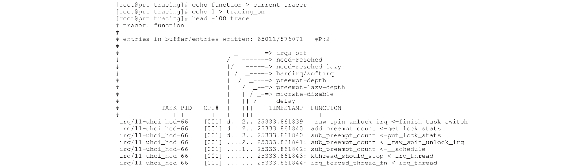

# 0. SUMMARY

In the theory of real-time scheduling, tasks are described by mathematical variables, which are used in analytical models in order to prove schedulability of the system. On real-time Linux, tasks are computer programs, and Linux developers try to lower the latencies caused by the Linux kernel, trying to achieve faster response for the highest-priority task. Although both seek temporal correctness, they use different abstractions, which end up separating these efforts in two different worlds, making it hard for the Linux practitioners to understand and apply the formally proved models to the Linux kernel and for theoretical researchers to apply the restrictions imposed by Linux for the theoretical models. This paper traces a parallel between the theory of response-time analysis and the abstractions used in the Linux kernel. The contribution of this paper is threefold. We first identify the PREEMPT RT Linux kernel mechanisms that impact the timing of real-time tasks and map these impacts to the main abstractions used by the real-time scheduling theory. Then, we describe a customized trace tool, based on the existing trace infrastructure of the Linux kernel, that allows the measurement of the delays associated with the main abstractions of the real-time scheduling theory. Finally, we use this customized trace tool to characterize the timing lines resulting from the behavior of the PREEMPT RT Linux kernel.

> **在 "实时调度理论" 中，任务由数学变量描述，这些变量用于分析模型，以证明系统的调度性。**在 "Real-Time Linux" 上，任务是计算机程序，**Linux 开发人员试图降低由 Linux 内核引起的延迟，以实现最高优先级任务的更快响应**。尽管两者都寻求时间正确，但他们使用不同的抽象，最终将这些努力分开在两个不同的世界中，这使 Linux 从业者很难理解并将正式证明的模型应用于 Linux 内核，并使理论研究人员适用于实施的限制。由 Linux 用于理论模型。本文追踪**“响应时间分析”理论和 Linux 内核中使用的抽象之间的相似之处**。
> 本文的贡献分为 3 部分：
>
> - 首先确定影响实时任务时机的 RT Linux 内核机制，并将这些影响映射到 "实时调度理论" 所使用的主要抽象。
> - 然后，根据 Linux 内核的现有跟踪基础架构来描述一种定制的 Trace 工具，该工具允许测量与 "实时调度理论" 的主要抽象相关的延迟。
> - 最后，使用此自定义的 Trace 工具来表征由 RT Linux 内核行为产生的定时线。

KEY WORDS: real time; response-time analysis; Linux; PREEMPT RT; trace; Ftrace

# 1. introduction

> [!note] Linux 中实现实时的两种方式
> 这里给出两种方式，在 Linux 中实现实时的效果，一种是进一步预测内核的行为，一种是通过某种调度算法和互斥策略实现；
> 也给出了两种典型的实现示例，前者是 PREEMPT RT，后者是 Limus RT 以及 `SCHED_DEADLINE`。

In recent years, Linux has gained several characteristics of a real-time operating system, and it has been used as such in both production systems [1](#_bookmark32), [2](#_bookmark33) and research projects [3](#_bookmark34), [4](#_bookmark35). Various realtime features have been added to the Linux kernel by several different groups. Some of them seek greater predictability for the kernel execution, as is the case of the project PREEMPT RT [5](#_bookmark36), which is an initiative of the kernel developers. Others implement real-time scheduling algorithms and mutual exclusion policies in the Linux kernel, as is the case of projects $Limus^{RT}$ [3](#_bookmark34) and `SCHED_DEADLINE` [4](#_bookmark35), which are both initiatives of the academic world. These initiatives were responsible for giving Linux both the ability to meet timing requirements such as tight response times [6](#_bookmark37) and the capacity of scheduling tasks using state-of-the-art algorithms from the real-time scheduling theory [7](#_bookmark38), [8](#_bookmark39).

> 近年来，Linux 已获得了实时操作系统的几个特征，并且在生产环境[1, 2]和研究项目[3, 4]中都已使用。几个不同的组已将各种实时功能添加到 Linux 内核中。
> 他们中的一些人**对内核执行寻求更大的可预测性**，就像项目 PREEMPT RT [5](#_bookmark36)的情况一样，这是内核开发人员的倡议。其他人则在 Linux 内核中**实施实时调度算法和相互排除策略**，就像项目 $Limus^{RT}$ [3](#_bookmark34)和 `SCHED_DEADLINE` [4](#_bookmark35)一样世界。
> 这些举措负责赋予 Linux 满足时间要求的能力，例如紧密响应时间[6](#_bookmark37)，以及使用 "实时调度理论" 中最先进的算法进行调度任务的能力[7](#_bookmark38)，[8](#_bookmark39)。

The goal of the developers from the industry and the researchers from the academia is the same: to transform Linux into a real-time operating system. But there are conceptual differences that end up distancing the developments of academia and industry. These differences are reported both by the developers of Linux [9](#_bookmark40) and by researchers [10](#_bookmark41). These differences arise in part because both communities use different abstractions for the system components and different system validation methods.

> 该行业的开发人员和学术界的研究人员的目标是相同的：**将 Linux 转变为实时操作系统**。但是，概念上的差异最终使学术界和行业的发展疏远了。Linux [9](#_bookmark40)的开发人员和研究人员[10](#_bookmark41)报告了这些差异。这些差异之所以出现，**部分是因为两个社区对系统组件和不同的系统验证方法都使用不同的抽象**。

In the context of the Linux operating system, tasks are parts of computer programs with timing constraints and properties. The task concept used in the real-time scheduling theory usually corresponds to just a portion of all operating system tasks. Some of these constraints are specified by the application, such as the period of the execution of a certain function, and some properties are estimated, such as the time necessary to finish a certain function. The main objective of developing the PREEMPT RT patch was to start a task with the least possible delay [11](#_bookmark42), which is usually called system latency. The system latency measures the ability of the operating system to give control to the highest-priority task as quickly as possible [10](#_bookmark41). This objective is achieved through reducing the number and size of points where the system remains with interrupts and preemption disabled.

> 在 Linux 操作系统的上下文中，**任务是具有正时约束和属性的**计算机程序的一部分。** "实时调度理论" 中使用的任务概念通常仅对应于所有操作系统任务的一部分**。这些约束中的一些是由应用程序指定的，例如执行某个函数的周期，并估算了某些属性，例如完成特定功能所需的时间。
> **开发 PREEMPT RT 补丁的主要目标是以最小可能的延迟[11](#_bookmark42)启动任务，该任务通常称为系统延迟。系统延迟衡量操作系统尽快控制最高优先级任务的能力[10](#_bookmark41)。通过减少系统中断和预先抢占的点的点数和大小来实现此目标。**

In the real-time scheduling theory, a system is modeled as a set of $n$ tasks $\tau = {\tau_{1}, \tau_{2}, ..., \tau_{n}}$, and each task has its timing behavior defined by a set of variables, such as its period $P$, worst-case execution time $C$, and relative deadline $D$. These tasks are scheduled on a set of $m$ processors $\rho = {\rho_{1}, \rho_{2}, ..., \rho_{m}}$, and they may share $q$ resources $\sigma = {\sigma_{1}, \sigma_{2}, ..., \sigma_{q}}$, which require mutual exclusion. In this context, the main goal of the analysis is to somehow assign time of processors from $\rho$ and resources from $\sigma$ to tasks from $\tau$ in order to finish all tasks from $\tau$ while meeting the timing constraints of each task [12](#_bookmark43).

> 在 "实时调度理论" 中，系统被建模为一组 $n$ 个任务 $\tau = {\tau_{1}, \tau_{2}, ..., \tau_{n}}$，并且每个任务都有由一组变量定义的计时行为，例如其**周期 $P$、最坏情况执行时间 $C$ 和相对截止日期 $D$**。这些任务被安排在一组 $m$ 个处理器 $\rho = {\rho_{1}, \rho_{2}, ..., \rho_{m}}$ 的机器上，它们可能共享 $q$ 资源 $\sigma = {\sigma_{1}, \sigma_{2}, ..., \sigma_{q}}$，需要互斥。在这种情况下，分析的**主要目标是以某种方式将 $\rho$ 的处理器时间和 $\sigma$ 的资源分配给 $\tau$ 的任务，以便在满足 $\tau$ 的同时完成所有任务，每个任务的时间限制[12](#_bookmark43)**。

> [!note] " "实时调度理论" " 和 " "Real-Time Linux""
> 这篇论文中可以看到，需要区分 " "实时调度理论" " 与 " "Real-Time Linux""，两者需要结合，可以达到更好的 "实时" 效果。
> 这个结合似乎就更像是控制理论了，" "实时调度理论" " 像是控制律，" "Real-Time Linux"" 像是执行器与传感器的角色...
> 其中 PREEMPT PT 补丁可以用来分析任务执行的 "响应时间"

There would be important gains from the better integration between the real-time scheduling theory and the real-time Linux. For example, response-time analysis is a classical method used in the schedulability analysis of fixed-priority real-time systems [13](#_bookmark44), which is the case of Linux with the PREEMPT RT patch. By using the response-time analysis, it would be possible in principle to determine whether a task set is schedulable or not, provided that the worst-case execution times are known. The real-time scheduling theory allows analyses that go far beyond the simple latency measurement usually used as the main concern of the real-time Linux community.

> ** "实时调度理论" **和** "Real-Time Linux"** 之间的更好整合将带来重要的收益。例如，"响应时间"(response-time)分析是一种经典方法，用于固定优先实时系统的调度性分析[13](#_bookmark44)，这就是 Linux 带有 PREMENT RT 补丁的情况。通过使用“响应时间分析”，只要知道最坏的执行时间，就可以原则上确定任务集是否可计划。"实时调度理论" 允许进行分析，这些分析远远超出了通常用作 "Real-Time Linux" 社区的主要关注点的简单延迟测量。

The reason why the real-time scheduling theory is not used in the context of real-time Linux is that the task models used in the scheduling theory are usually too simple, and their set of constraints and task dependencies among tasks does not reproduce the reality of real-time applications running on a Linux kernel. Despite the vast literature on real-time scheduling, few of these results are to be used by the Linux development community [9](#_bookmark40).

> **在 "Real-Time Linux" 的上下文中不使用 "实时调度理论"** 的原因是，调度理论中使用的任务模型通常太简单了，并且任务之间的一系列约束和任务依赖性集也不会重现现实在 Linux 内核上运行的实时应用程序。尽管有关于**实时时间表**的大量文献，但 Linux 开发社区[9](#_bookmark40)很少使用这些结果。

In this context, the contribution of this paper is threefold. We first identify PREEMPT RT Linux kernel mechanisms that impact the timing of real-time tasks and map these impacts to the main abstractions used by the real-time scheduling theory. Then, we describe a customized trace tool, based on the existing trace infrastructure of the Linux kernel, that allows the measurement of the delays associated with the main abstractions of the real-time scheduling theory. Finally, we use this customized trace tool to characterize the timing lines resulting from the behavior of the PREEMPT RT Linux kernel. We believe this characterization is an important step in the direction of creating correct task models of the PREEMPT RT Linux and development of analytical methods for its schedulability analysis.

> 在这种情况下，本文的贡献可以分成 3 个方面。
>
> - 首先确定了影响实时任务时机的 PREEMPT RT Linux 内核机制，并将这些影响映射到 "实时调度理论" 所使用的主要抽象。、
> - 然后，根据 Linux 内核的现有跟踪基础架构来描述一种定制的 Trace 工具，该工具允许测量与 "实时调度理论" 的主要抽象相关的延迟。
> - 最后，使用此自定义的 Trace 工具来表征由 RT Linux 内核行为产生的定时线。我们认为，这种表征是在创建 Preement RT Linux 的正确任务模型的方向上的重要一步，并开发了分析方法以进行计划分析。

In this paper, we go beyond the simple measurement of latency, which is usually found in papers on real-time Linux. We identify the mechanisms of the PREEMPT RT Linux kernel that affect the timing of the tasks and how the tasks affect each other, through these mechanisms. With this, it is possible to list important aspects of the PREEMPT RT Linux where improvement is possible, regarding the response time of high-priority tasks and not just the latency.

> 在本文中，我们超越了通常在 Real-Time Linux 论文中发现的简单的延迟测量。我们确定了**影响任务时间的 PREEMPT RT Linux 内核机制**以及**任务如何通过这些机制相互影响**。有了这个，就可以列出 PREEMPT RT Linux 可以改进的重要方面，关于**高优先级任务的响应时间**，而不仅仅是延迟。

> [!caution]
> 对这句话有些疑问，这里说通过实时调度理论反观 RT Linux 内核中的实时约束条件，进而完善任务模型
> 那，意思是说这里的任务模型的建立的约束条件并不充分吗？
> 这是因为 RT Linux 内核以及 Linux 内核过于复杂的原因吗？

Also, by observing the Linux from the perspective of the real-time scheduling theory, we can better understand the constraints that currently exist in the PREEMPT RT Linux kernel and contribute towards the development of new task models based on these constraints. This is a necessary step to be able to develop appropriate schedulability tests in the future.

> 同样，通过从 "实时调度理论" 的角度观察 Linux，我们可以更好地理解当前在 RT Linux 内核中存在的约束，并根据这些约束来开发新任务模型。这是能够在将来开发适当的可计划测试的必要步骤。

The customized trace tool has also been proved very useful for analyzing the timeline of the execution of tasks on Linux. It can be used, for instance, by advanced users of Linux systems that require low latency to discover the source of the largest delays. It can assist them in the setup process, the fine tuning of the system, and the verification of new algorithms implemented in the kernel. It can also be used by researchers to understand the cause of high latency values, which sometimes cannot be explained and are just tagged as outliers.

> 也已证明自定义的 Trace 工具对于分析 Linux 上执行任务的时间表非常有用。例如，Linux 系统的高级用户可以使用它，这些系统**需要低延迟才能发现最大延迟的来源**。它可以帮助他们进行设置过程，系统的微调以及内核中实现的新算法的验证。研究人员也可以使用它来理解高延迟值的原因，有时无法解释，仅将其标记为离群值。

We believe that a better integration between academia and the developers and users of PREEMPT RT Linux is important because of the vast potential of use of this platform in supporting real-time applications. This integration will help Linux users to find the sources of latencies in their real-time applications, Linux developers to understand the abstractions used in the scheduling theory and identify them within the Linux code, and the theoretical researchers to understand the realities of the PREEMPT RT Linux kernel and create more appropriate task models and schedulability analyses for this context.

> 我们认为，学术界与 PREEMPT RT Linux 的开发人员和用户之间的更好集成非常重要，因为使用该平台在支持实时应用程序中具有巨大的潜力。该集成将帮助 Linux 用户在其实时应用程序中找到延迟的来源，Linux 开发人员了解计划理论中使用的抽象并在 Linux 代码中识别它们，以及理论研究人员了解 PREEMPT RT 的现实性 Linux 内核并为此上下文创建更合适的任务模型和计划分析。

Section [2](#_bookmark0) presents the abstractions used in the response-time analysis, followed by the mapping between these abstractions and the Linux kernel abstractions in Section [3](#_bookmark3). Section [4](#_bookmark11) presents the customized trace tool, which is used to characterize Linux timeline in Section [5](#_bookmark12). The characterization of Linux execution is used to measure the timing properties of Linux tasks in Section [6](#_bookmark18), and a study case of the execution of the highest-priority task is shown in Section [7](#_bookmark23). Finally, Section [8](#_bookmark31) has our final comments, along with suggestions of future work.

> - [2]节介绍了**“响应时间分析”中使用的抽象**，然后在
> - [3]中进行这些抽象和 Linux 内核**抽象之间的映射**。
> - [4]节介绍了定制的**Trace 工具**，该工具用于表征
> - [5]中的 **Linux 时间轴**。Linux 执行的表征用于测量
> - [6]中 Linux 任务的**定时属性**，并且在
> - [7]节中显示了执行最高优先级任务的**研究案例**。最后，
> - [8]节有我们的最终评论，以及未来工作的建议。

# 2. abstractions of response-time analysis(“响应时间分析”的抽象)

> [!note] 可调度系统
> 这一节中对系统的定量、定义的分析方式就很有控制系统的味道了
> 这里给出的是 "可调度系统" 的较为宽泛的概念，是否可以与控制系统中 "能控性" 的系统进行对应
> 进一步的，如果一个系统是可以控制的(调度)，使用一些控制方法，对现有模型进行分析，就可以得到相应的控制律(调度算法)
> 完全可以从这个思路分析下去！！！

The main objective of this section is to introduce the abstractions and mathematical variables used by the response-time analysis, for subsequent mapping of these abstractions to the functions and abstractions used in the Linux kernel.

> 本节的主要目的是**介绍所使用的抽象和数学变量，通过“响应时间分析”，将这些抽象映射到功能和 Linux 内核中使用的抽象**。

> [!note]
> 这里插一句，通过看这两篇关于 RT Linux 的文章，已经有一些关于将控制理论引入计算机工程的一些想法了
> 下面这段内容提及到 "是否会在截止日期内完成"，这句话如果放在控制理论中，颇有一种 "使用传感器来检测执行器是否按照指定的控制指令执行命令" 的味道！
> 这里提到的 Trace 工具就像是 "传感器" 一样。

In order to guarantee the timing correctness while executing real-time tasks, one has to know whether a given set of tasks and execution model will complete within their respective deadlines. There are several analytical methods to obtain this guarantee, depending on the execution model of the system. The Linux kernel is based on fixed priority, together with several mutual exclusion protocols. It is possible to verify the schedulability of a system that follows this model using the method of response-time analysis [14]. Although the response-time method is only valid for uniprocessor systems, the choice to use this method was made for didactic purposes. Moreover it uses the common abstractions of the real-time literature.

> 为了确保执行实时任务时的**时序正确性**，必须知道给定的一组任务和执行模型**是否会在其各自的截止日期内完成**。根据系统的执行模型，有几种获得此保证的分析方法。Linux 内核基于固定优先级，以及几个相互排除方案。可以使用 ““响应时间分析”方法” [14]验证遵循此模型的系统的计划性。尽管 ““响应时间分析”方法” 仅适用于单处理器系统(uniprocessor systems)，但选择使用此方法的选择是为教学目的。此外，它使用了实时文献的共同抽象。

According to the response-time analysis method, a system is composed of a set $\tau$ of $n$ tasks, which in turn are described by a set of algebraic variables related to its timing behavior. Each variable represents an abstraction used in the method. These variables and the abstractions that they represent are the following:

> 根据 ““响应时间分析”方法”，一个系统由 $n$ 任务的集合 $\tau$ 组成，而该系统又由一组与其正时行为相关的代数变量来描述。每个变量代表该方法中使用的抽象。这些变量及其代表的抽象如下：

- $C$: the worst-case execution time(最差的执行时间);
- $P$: the period of activation(激活期);
- $D$: the relative deadline(相对截止日期);
- $J$: the maximum release jitter(最大释放抖动);
- $B$: the worst-case blocking time(最差的阻塞时间);
- $I$: the interference(干扰);
- $W$: the busy period(繁忙的时期); and
- $R$: the maximum response time(最大响应时间).

The worst-case execution time $S$ is the maximum computation time of the task. The period $P$ is the activation period of a periodic task, and $D$ denotes the relative deadline of the task. The release jitter, denoted by variable $J$ , is the delay at the beginning of the execution of a task, caused by a lower-priority task.

$B$ is the worst-case blocking time. A blocking happens when a higher-priority task has its execution delayed by a lower-priority task, generally because the lower-priority task holds some resources required by the higher-priority task. Generally, these resources are managed through a mutual exclusion mechanism.

> 最差的执行时间 $S$ 是任务的最大计算时间；
> 变量 $P$ 期间是定期任务的激活期；
> 变量 $D$ 表示任务的相对截止日期；
> 变量 $J$ 表示的发行**抖动是由较低优先级任务引起的任务执行开始时的延迟**。
> 变量 $B$ 是最糟糕的阻塞时间。当较高优先级任务的执行**被较低优先级任务延迟时，就会发生阻碍**，这通常是因为较低优先级任务保留了较高优先级任务所需的一些资源。通常，这些**资源是通过相互排除机制来管理的**。

Based on these variables, the response-time method is used to define the value of $I$, $W$, and $R$, for each task of the system. The interference $I_{i}$ of a task $\tau_{i}$ is the sum of all computation time of tasks in the set $hp(i)$ that was activated during the busy period of task $i$, where $hp(i)$ is the set of tasks with priorities higher than $\tau_{i}$:

> 基于这些变量，"“响应时间分析”方法" 用于为系统的每个任务定义$I$、$W$ 和$R$ 的值。任务 $\tau_{i}$ 的干扰 $I_{i}$ 是任务 $i$ 繁忙期间激活的集合 $hp(i)$ 中所有任务计算时间的总和，其中 $hp(i)$ 是优先级高于 $\tau_{i}$ 的任务集：

$$
I_i = \sum_{j \in h p(i)} \left[\frac{W_i+J_j}{P_j}\right] \cdot C_j
$$

The busy period $W_{i}$ of a task $\tau_{i}$ corresponds to the sum of its computational time, blocking time, and interference. It is given by Equation ([2](#_bookmark2)).

> 任务 $\tau_{i}$ 的繁忙期 $W_{i}$ 对应于其计算时间、阻塞时间和干扰的总和。它由等式 ([2](#_bookmark2)) 给出。

$$
W_i = C_i + B_i + \sum_{j \in h p(i)} \left[\frac{W_i+J_j}{P_j}\right] C_j
$$

> [!note]
> 这里也会定义 “干扰”，就与控制理论中特别相像
> 那是否也可以与其走相同的思路，对干扰进行 “滤波” 得到更 “干净” 的数据？！
> 尤其是像 Kalman Filter 一样的思虑？！

It is important to notice that $W_{i}$ appears on both sides of the equation, because of its use on the definition of the interference. This dependence implies in the use of an iterative method to determine $W_{i}$. In this case, the initial value of $W_{i}$ is the worst-case execution time $C_{i}$, and Equation ([2]) is used iteratively $x$ times, until $W_{i}^{x+1} = W_{i}^{x}$ or $W_{i}^{x+1} > D_{i}$.

> 重要的是要注意 $W_{i}$ 出现在等式的两边，因为它用于干扰的定义。这种依赖意味着使用迭代方法来确定 $W_{i}$。在这种情况下，$W_{i}$ 的初始值是最坏情况下的执行时间 $C_{i}$，方程([2])被迭代 $x$ 次，直到 $W_{i}^{x+1} = W_{i}^{x}$ 或 $W_{i}^{x+1} > D_{i}$。

$$
R_{i} = W_{i} + J_{i}
$$

A system is said to **be schedulable** if for every task $\tau_{i}$, the maximum response time $R_{i}$ is less than or equal to its deadline $D_{i}$.

> 如果对于每个任务 $\tau_{i}$，最大响应时间 $R_{i}$ 小于或等于其截止日期 $D_{i}$，则称系统是**可调度的**。

## 2.1. Graphical representation of response-time analysis abstractions(“响应时间分析”的图形表示抽象)

> 
> Figure 1. Response-time analysis abstractions.

A common way to represent the behavior of a real-time task is using a graphical format. Figure [1](#_bookmark1) shows how each abstraction used in the response-time analysis composes the response time of a real-time task.

> 表示实时任务行为的一种常见方法是使用图形格式。图[1](#_bookmark1)显示了“响应时间分析”中使用的每个抽象如何构成实时任务的响应时间。

# 3. a parallel between the response-time analysis and linux(“响应时间分析”和 Linux 之间的平行)

> [!note]
> 这里提到的 “内核线程”，应该就是一直提及的 “中断线程化” 吧
> “On PREEMPT RT, many interrupt handlers are converted to run as kernel threads.”
> 区别之一在于，之前是处理硬件，现在是唤醒线程

The kernel without the patch PREEMPT RT presents some execution contexts that make it hard to precisely define the abstraction of a task. But with PREEMPT RT, almost all of these contexts were transformed into kernel threads, including some parts of the interrupt handler’s work. On PREEMPT RT, many interrupt handlers are converted to run as kernel threads. For these interrupt handlers, their function is no longer to deal with the hardware but to wake up a kernel thread that will deal with the hardware. Nevertheless there are some exceptions to this rule, for example, to timer interrupt request (IRQ).

> 没有补丁的内核 RT 呈现出一些执行上下文，使得难以精确定义任务的抽象。但是有了 PREEMPT RT，几乎所有这些**上下文都转变为内核线程**，包括中断处理程序的某些部分。**在 PREEMPT RT 上，许多中断处理程序被转换为内核线程。**对于这些中断处理程序，它们的功能不再处理硬件，而是要唤醒将处理硬件的内核线程。但是，该规则有一些例外，例如，**计时器中断请求(IRQ)**。

Regarding the user space, processes are composed by a memory context and a set of one or more threads. Nowadays, the Linux scheduler deals with threads, scheduling the system on a thread basis. Generally, a thread runs in the process memory context, but when a thread makes a system call or causes an interrupt, for example, with a page fault, it changes its execution context from user space to kernel space, executing the kernel code in kernel space on behalf of the process [15](#_bookmark46). Thus, it is possible to map the abstraction of a task into these two execution contexts that the Linux has: the interrupt handlers, which run only in kernel space, and the threads, which can run both in kernel and user spaces.

> 关于用户空间，过程由内存上下文和一组或多个线程组成。如今，Linux 调度程序处理线程，以线程为基础安排系统。通常，线程在过程内存上下文中运行，但是当线程进行系统调用或引起中断时，例如，使用“页面故障”时，它将其执行上下文从用户空间更改为内核空间，然后在内核中执行内核代码代表该过程[15](#_bookmark46)空间。因此，可以将任务的抽象映射到 Linux 具有的这两个执行上下文中：**仅在内核空间中运行的中断处理程序以及可以在内核和用户空间中运行的线程**。

**Each activation of a task is known as a job.** For the interrupt handlers, we assume that each interrupt is a new activation, so it is a job. Nevertheless, it is not easy to map the abstraction of job to threads.

> **任务的每个激活都称为工作。**对于中断处理程序，我们**假设每个中断都是新的激活**，因此这是一项工作。然而，将作业的抽象映射到线程并不容易。

In the theory, a job executes without suspending itself. Thus, each time a job starts to run, it starts a new activation. And each time a job suspends, it finishes an activation. Coincidentally, Linux imposes the same restriction to the interrupt handlers, because an interrupt handler cannot suspend while running. So, each interrupt handler activation is a new job. However, this restriction does not exist for the tasks in the context of threads, as threads can suspend whenever it is running with interrupts and preemption enabled [15](#_bookmark46). A thread always suspends its execution running in kernel context. It does it by changing its state and calling the scheduler. Considering the operation without errors and debugging mechanisms, one thread may suspend for two reasons: by performing a blocking system call, usually leaving the CPU in $S$ state, or blocking in a mutual exclusion method, usually leaving the CPU in $D$ state. This paper considers that real-time threads may suspend at any time by locking mechanisms for mutual exclusion. However, it is assumed that a real-time thread does not suspend for another reason during execution, except to complete the activation. Thus, an unintentional suspension of a task in a locking mechanism is accepted. However, we consider that a job finishes its activation when it suspends outside of a lock mechanism.

> 从理论上讲，工作执行而不会暂停自己。因此，每次作业开始运行时，都会开始新的激活。每次工作暂停，都可以完成激活。巧合的是，Linux 对中断处理程序施加了相同的限制，**因为中断处理程序在运行时无法暂停。因此，每个中断处理程序激活都是一项新工作。但是，在线程上下文中，任务不存在此限制，因为线程可以在启用中断并启用前抢占运行时暂停[15](#_bookmark46)**。线程总是暂停其在内核上下文中运行的执行。它通过更改状态并调用调度程序来做到这一点。考虑到没有错误和调试机制的操作，一个线程可能有两个原因：通过执行阻塞系统调用，通常将 CPU 留在 $S$ 状态下，或以相互排除方法阻塞，通常将 CPU 留在 $D$ 状态下。本文认为，** “实时线程” 可能随时通过锁定相互排除的机制暂停**。但是，假定一个 “实时线程” 在执行过程中没有其他原因暂停，除了完成激活。因此，接受了锁定机制中任务的无意暂停。但是，我们认为，当工作悬挂在锁定机制之外时，工作就完成了激活。

## 3.1. Sources of release jitter(释放抖动的来源)

> [!note]
> 下面描述的这种现象是 “优先级反转” 吗？

The maximum release jitter, represented by variable $J$, occurs when a higher-priority task is delayed at the beginning of its execution, being the delay caused by a lower-priority task. This may occur for both kinds of Linux tasks: interrupt handlers and threads.

> 由变量 $J$ 表示的最大释放抖动是在执行开始时延迟较高优先级任务的情况，这是由较低优先级任务造成的延迟。这两种 Linux 任务可能会发生这种情况：**中断处理程序和线程**。

### 3.1.1 _Interrupt handlers._

The activation of interrupt handlers happens with the occurrence of interrupts. There is only one way a hardware interrupt is signaled, and it does not immediately stop the execution of a task: the system disabled that interrupt. An example of this delay is when processor interrupts are disabled, and soon after, there is the occurrence of a hardware interrupt. Because interrupts are disabled, the interrupt handling will be delayed until interrupts are enabled again, and its interrupt handler can finally execute.

> 中断处理程序的激活随着中断的发生而发生。只有一种方式发出了硬件中断的方式，并且不会立即停止执行任务：禁用该中断的系统。此延迟的一个例子是，当处理器中断被禁用时，不久之后，就会发生硬件中断。由于中断是禁用的，因此中断处理将被延迟，直到再次启用中断为止，其中断处理程序最终可以执行。

The possibility of disabling interrupts is required mainly to ensure synchronization. Disabled interrupts ensure that an interrupt handler will not cause preemption of a section of code.

> 主要**需要禁用中断的可能性以确保同步**。禁用中断可确保中断处理程序不会导致一部分代码的抢占。

The Linux kernel includes functions to disable all maskable interrupts of a processor or to disable an interrupt on all processors. There are two ways to disable interrupts in the current processor: unconditionally or conditionally. The first is through the functions `local_irq_disable()` and `local_irq_enable()`. The second is through the functions `local_irq_save()` and `local_irq_restore()`; these functions (actually macros) save the processor flags only to be restored lately, which allow nesting calls to disable/enable interrupts [16](#_bookmark47).

> Linux 内核包含**禁用处理器的所有可屏蔽中断或禁用所有处理器上的中断的功能**。当前处理器有两种禁用中断的方法：**无条件或有条件**。
> 第一种是通过函数 `local_irq_disable()` 和 `local_irq_enable()`；
> 第二种是通过函数 `local_irq_save()` 和 `local_irq_restore()`；
> 这些函数(实际上是宏)保存处理器标志，只在最近恢复，这允许嵌套调用来禁用/启用中断 [16](#_bookmark47)。

Besides being possible to disable all interrupts of a processor, in some cases, it is desirable to disable a specific interrupt on all processors. For example, you may need to disable the delivery of an interrupt before handling its state. The Linux kernel provides four functions for this task. The first function is `disable_irq(irq)`, which disables the interrupt passed as argument on all processors. If the interrupt handler is running, the function will block until the handler terminates. The function `disable_irq_nosync(irq)` also disables the interrupt on all processors, however, without waiting for the interrupt handler that may be running [15](#_bookmark46). The function `synchronize_irq(irq)` will wait for the interrupt handler of a specific IRQ before returning. Finally, the function `enable_irq(irq)` enables the interrupt [16](#_bookmark47).

> 除了可以禁用处理器的所有中断外，在某些情况下，还需要**禁用所有处理器上的特定中断**。例如，您可能需要在处理中断状态之前禁用中断的传递。Linux 内核为此任务提供了四个函数。
> 第一个函数是 `disable_irq(irq)`，它禁用作为参数传递给所有处理器的中断。如果中断处理程序正在运行，函数将阻塞直到处理程序终止。
> 函数 `disable_irq_nosync(irq)` 也禁用所有处理器上的中断，但是，无需等待可能正在运行的中断处理程序 [15](#_bookmark46)。
> 函数 `synchronize_irq(irq)` 将在返回之前等待特定 IRQ 的中断处理程序。
> 最后，函数 `enable_irq(irq)` 启用中断 [16](#_bookmark47)。

### 3.1.2 _Preemption._

There is another source of release jitter when considering threads. Threads are activated by events that change their state in the scheduler, from sleeping to ready to execute. When a higher-priority thread is awakened by a lower-priority thread, the scheduler is called and starts execution of the thread of higher priority, unless preemption is disabled. When preemption is disabled, the lower-priority thread runs until preemption is enabled again and the scheduler can decide to run the thread of higher priority. The preemption of a processor can be disabled with the function `preempt_disable()` and then enabled again with the function `preempt_enable()`. For each `preempt_disable()`, there should be a call to `preempt_enable()`. These calls can be nested; the number of nesting can be retrieved with the function `preempt_count()`[15](#_bookmark46).

> 考虑线程时，还有另一个释放抖动的来源。线程由在调度程序中改变其状态的事件激活，从休眠到准备执行。当优先级较高的线程被优先级较低的线程唤醒时，调度程序将被调用并开始执行优先级较高的线程，除非禁用抢占。当禁用抢占时，优先级较低的线程会一直运行，直到再次启用抢占，并且调度程序可以决定运行优先级较高的线程。可以使用函数 `preempt_disable()` 禁用处理器的抢占，然后使用函数 `preempt_enable()` 再次启用。对于每个 `preempt_disable()`，都应该调用 `preempt_enable()`。这些调用可以嵌套；可以使用函数 `preempt_count()`[15](#_bookmark46) 检索嵌套数。

The function `preempt_enable()`, when called, checks whether the preemption counter will be 0, that is, whether the preemption system will be active again. Because it is possible that a higherpriority task is ready to run, when enabling preemption, the scheduling routine is called. In cases where one does not want to check for threads that are able to run, it is possible to use the function `preempt_enable_no_resched()`, which enables preemption again without checking if a new higherpriority task is able to run.

> 函数`preempt_enable()`在调用时检查抢占计数器是否为 0，即抢占系统是否会再次激活。因为有可能更高优先级的任务准备好运行，所以当启用抢占时，调用调度例程。在不想检查能够运行的线程的情况下，可以使用函数 `preempt_enable_no_resched()`，它可以在不检查新的更高优先级任务是否能够运行的情况下再次启用抢占。

## 3.2 _Sources of blocking_

Blocking happens when a lower-priority task retains a lock requested by a higher-priority task. The Linux kernel has several mechanisms for mutual exclusion. There are two reasons for these several different mechanisms. The first comes from the fact that the Linux kernel presents two execution contexts: interruptions and threads, which have different constraints. In the context of interrupt handlers, the code cannot use methods that put the interrupt handler to sleep, because interrupts do not have a context that the scheduler can control, therefore mutual exclusion mechanisms must use busy waiting in case of contention. In the context of threads, the threads can sleep, allowing other threads to execute, while the blocked task waits for the resource.

> **当较低优先级任务保留较高优先级任务要求的锁定时，就会发生阻塞。**Linux 内核具有多种互斥机制。这些不同的机制有两个原因。第一个来自 Linux 内核呈现两个执行上下文的事实：**中断和线程**，它们具有不同的约束。在中断处理程序的上下文中，代码不能使用使中断处理程序休眠的方法，因为中断没有调度程序可以控制的上下文，因此相互排除机制必须使用忙碌的等待在争论中。在线程的上下文中，线程可以休眠，允许其他线程执行，而被阻塞的任务等待资源。

In addition to the restrictions imposed by the execution contexts of the Linux kernel, the methods of mutual exclusion are optimized for certain cases, some with the purpose of improving performance, others seeking determinism. Several methods of generating mutual exclusion that causes blocking in the Linux kernel are described in the following. As some of these methods are exclusive to the PREEMPT RT patch, each method is described whether it is part of the Linux kernel without PREEMPT RT, which is commonly called vanilla kernel, or it is part of the kernel PREEMPT RT.

> 除了 Linux 内核的执行环境所施加的限制外，相互排斥的方法还针对某些情况进行了优化，有些是旨在提高绩效的目的，而另一些则寻求确定性。下面描述了几种引起 Linux 内核中阻塞的相互排斥的方法。由于这些方法中的某些方法是 PREEMPT RT 补丁的独有，因此每种方法**是否是 Linux 内核的一部分，而无需 PREEMPT RT，通常称为 Vanilla 内核**，还是它是内核 PREMENT RT 的一部分。

### 3.2.1 _Spinlock._

In a section protected by a spinlock, only one task is allowed access to a specific critical region. If a task tries to acquire a “spinlock” that is not held by any other task, the lock is acquired. If a task attempts to acquire a “spinlock” that has already been acquired by another task, the task is blocked. In the vanilla kernel, a task blocked on a “spinlock” is held at busy waiting while trying to acquire the spinlock, thus consuming CPU until another task releases the spinlock. An important detail is that before attempting to acquire a spinlock, the current task disables the preemption of the processor, enabling it again only after releasing the lock. When a task attempts to acquire a “spinlock” and stays in busy waiting, the task is said to be in contention [16](#_bookmark47).

> 在由 “Spinlock” 保护的部分中，只有一个任务可以访问特定的关键区域。如果一个任务试图获取任何其他任务没有持有的旋转锁，则将获取锁。如果一个任务试图获取另一个任务已经获取的单锁，则该任务被阻塞。在 Vanilla 内核中，在试图获取 “Spinlock” 的同时忙于等待，在忙碌的情况下，一项任务被阻塞了，从而消耗了 CPU，直到另一个任务释放出 “Spinlock” 为止。一个重要的细节是，在尝试获取 “Spinlock” 之前，当前任务会禁用处理器的先发制位，仅在发布锁后才能再次实现。当任务尝试获取单锁并留在忙碌等待中时，该任务被认为是竞争的[16](#_bookmark47)。

Despite the fact that busy waiting for the lock consumes CPU time in vain, this avoids a more complex control to change the status of the task from ready to sleeping, to call the scheduler routines, to context switch to another task, and when the lock is available, to change the context to the task that awaits the lock. Thus, the busy-waiting kernel “spinlock” is beneficial when you have small critical sections [16](#_bookmark47). Several references such as [16](#_bookmark47) and [15](#_bookmark46) classify critical sections as small or large. However, there is not a threshold that defines the size of a small or large critical section, leaving it to the developer to judge the characteristic of the critical section. The “spinlock” is used especially in parts of the kernel where a task cannot sleep, as in interrupt handlers.

> 尽管忙于**等待锁会徒劳地消耗 CPU 时间，但这避免了更复杂的控制**，以将任务的状态从准备就绪，调用调度程序例程，到上下文切换到另一个任务，以及锁定可用，将上下文更改为等待锁的任务。因此，当您有少量关键部分时，忙碌的核心 “SpinLock” [16](#_bookmark47)是有益的。几个参考文献，例如[16](#_bookmark47)和[15](#_bookmark46)将关键部分分类为小或大。但是，没有一个阈值定义一个小或大关键部分的大小，而将其留给开发人员来判断关键部分的特征。 “SpinLock” 尤其是在任务无法休眠的一部分中使用的，就像中断处理程序一样。

In the kernel with PREEMPT RT, spinlocks are converted to RT MUTEXes. The reason for this change is described in Section [3.2.5](#_bookmark8).

> 在具有 PREEMPT RT 的内核中，Spinlocks 转换为 RT MUTEXes。此更改的原因在第[3.2.5](#_Bookmark8)中描述。

In order to use a “spinlock” to protect a critical section, it is necessary to acquire the spinlock, execute the critical section, and release the spinlock. For this, it uses the functions `spin_lock()` and `spin_unlock()`. Also, by disabling the preemption during a critical section, the spinlocks affect the release jitter.

> 为了使用 “SpinLock” 保护临界区，需要获取 “SpinLock”，执行临界区，释放 “SpinLock” 。为此，它使用函数 `spin_lock()` 和 `spin_unlock()`。此外，通过在关键部分禁用抢占，“SpinLock” 会影响释放抖动。

> [!note]
> 文章中一直提到 “关闭中断”，下文中算是这个机制的一个出发点吗？！减少抖动

In addition to the standard functions, the API of the spinlocks also implements versions that disable interrupts and the processing of softirqs; these functions are necessary to prevent deadlocks. An example for this is the following: a “spinlock” was acquired by a thread, then the execution of the critical section is interrupted by an interrupt, which tries to acquire the same spinlock, that will never be released because the previous thread is blocked by the interrupt handler. Thus, by turning off interrupts, spinlocks may also contribute to the release jitter of interrupt handlers.

> 除了标准功能外，“SpinLock” 的 API 还实现了”禁用中断“和”软中断“处理的版本；这些功能是防止死锁所必需的。一个例子如下：一个线程获得了一个 “SpinLock”，然后临界区的执行被一个中断打断，它试图获得相同的 “SpinLock”，但永远不会被释放，因为前一个线程被 中断处理程序。因此，**通过关闭中断，“SpinLock” 也可能有助于中断处理程序的释放抖动**。

### 3.2.2 _Read–write spinlocks._

In some cases, critical sections are accessed multiple times for data reads and sometimes for the update. To improve the throughput of the system, exclusive access to these data is needed only when writing the data. There may be concurrent accesses to read the data. In this case, there is contention only when a task waits to write or tasks wait for a data being written [16](#_bookmark47). To acquire the `rw_lock` for reading, one uses functions `read_lock()` and `read_unlock()`. For writing, one uses functions `write_lock()` and `write_unlock()`. The kernel vanilla uses spinlocks to protect the write access. Thus, the read–write spinlocks disable preemption, contributing, while on a writing section, to the release jitter of higher-priority threads. In the kernel with PREEMPT RT, control access to critical sections is made with the RT MUTEX. The read–write spinlocks also have versions that disable interrupts and softirqs. It is not possible to upgrade the `read_lock()` to a `write_lock()`, as this causes a deadlock.

> 在某些情况下，临界区会被多次访问以进行数据读取，有时还会进行更新。为了提高系统的吞吐量，只有在写入数据时才需要独占访问这些数据。可能存在**读取数据的并发访问**。在这种情况下，只有当任务等待写入或任务等待写入数据时才会发生抢占 [16](#_bookmark47)。
> 要获取用于读取的 `rw_lock`，可以使用函数 `read_lock()` 和 `read_unlock()`。
> 对于写入，可以使用函数 `write_lock()` 和 `write_unlock()`。
> Vanilla 内核使用 “SpinLock” 来保护写访问。因此，读写 “SpinLock” 禁用抢占，在写入部分有助于释放更高优先级线程的抖动。
> 在具有 PREEMPT RT 的内核中，对关键部分的控制访问是通过 RT MUTEX 实现的。读写 “SpinLock” 也有禁用中断和软中断的版本。无法将 `read_lock()` 升级为 `write_lock()`，因为这会**导致死锁**。

An important detail is that the readers always take precedence over the writers. While there is a reader in the critical section, the writer cannot run. Because readers can obtain the lock concurrently, even if a writer is waiting for the lock, new readers may acquire the lock and thus postpone indefinitely the acquiring of the lock by the writer.

> 一个重要的细节是**读总是优先于写**。虽然关键部分中有读，但写无法运行。因为读可以同时获得锁，即使写正在等待锁，新读也可以获取锁，因此无限期地推迟写获取锁。

### 3.2.3 _Semaphores._

> [!note]
> 更具体的需要了解 “Spinlock” 与 “Semaphore” 的机制，及其相关的指令集
> 此外，还提及到了 “计数器”，这个应该是硬件上的，与在另一篇文章中了解到的 “中断线程化” 有相关的联系
> 好像是，再将中断进行线程化，对于这个计数器好像也不能动，在解耦硬件和软件的过程中，这个是应该要保留的。

Unlike spinlocks, semaphores do not use busy waiting. When a task tries to acquire a semaphore and this is unavailable, the semaphore puts the task on a waiting list and changes the state of the task to sleeping, and the task leaves the processor. When the semaphore becomes available, one of the tasks in the queue is awakened, and it acquires the semaphore, continuing its execution. As the kernel has some restrictions on where a piece of code can sleep, semaphores cannot be used in the context of interrupts [15](#_bookmark46). Semaphores accept various tasks in their critical section. This is controlled by a counter, which is set at its creation. Although it is possible to implement mutual exclusion using a semaphore with counter set to one, this is not the best practice, being the Mutex as the correct choice. Mutexes are presented in Section [3.2.4](#_bookmark7). Two basic functions can be used to acquire a semaphore: `down()` and `down_interruptible()`. The difference between the two modes is the way that the task is put to sleep: state interruptible or uninterruptible.

> 与 “Spinlock” 不同，“Semaphore” 不会使用忙碌等待。当任务试图获取 “Semaphore” 并且不可用时，“Semaphore” 将任务放在等待列表上，并将任务状态更改为休眠，并且任务将处理器留下。当 “Semaphore” 可用时，队列中的一项任务被唤醒，并获取了 “Semaphore” ，继续执行。由于内核对一块代码可以在哪里休眠有一些限制，因此在中断的情况下不能使用 “Semaphore” [15](#_bookmark46)。 “Semaphore” 在其关键部分中接受各种任务。**这是由计数器控制的**，该计数器是在创建时设置的。尽管可以使用 Counter 设置的 “Semaphore” 实现相互排除，但这不是最佳实践，而是 MUTEX 作为正确的选择。Mutexes 在第[3.2.4](#_bookmark7)节中介绍。可以使用两个基本功能来获取信号：`down()` 与 `down_interruptible()`。两种模式之间的**区别在于任务的睡眠方式：状态可中断或不间断**。

If a signal is sent to a task in interruptible state, the task is awakened immediately and the signal delivered to the task. On the other hand, a task in state uninterruptible is not waked up, thus delivering of the signal is delayed until the task is awake and acquires the semaphore. Of these two, it is more common to use the so-called `down_interruptible()`. Function `up()` releases the semaphore.

> 如果将信号发送到可中断状态的任务，则立即将任务唤醒，并将信号传递给任务。另一方面，状态不间断的任务不会唤醒，因此信号的传递延迟了，直到任务唤醒并获取 “Semaphore” 为止。在这两个中，使用所谓的 `down_interruptible()` 更常见。函数 `up()` 释放 “Semaphore” 。

When compared with spinlocks, semaphores have an advantage: semaphores do not disable preemption throughout critical section, which helps in decreasing the release jitter.

> 与 “Spinlock” 相比，“Semaphore” 具有优势： **“Semaphore” 不会在整个临界部分中禁用抢占，这有助于减少释放抖动**。

However, semaphores cause greater overhead because they put the task to sleep and then wake it up after sometime. In cases of small critical sections, this overhead can be greater than the critical section itself, so it is advised only for large critical sections.

> 但是，**“Semaphore” 会导致更大的开销，因为它们使任务休眠，然后在一段时间后唤醒**。在较小的关键部分的情况下，该开销可能大于关键部分本身，因此**仅建议大型关键部分**。

Another side effect is that by making the task to sleep, it is possible for a high-priority task to suffer unlimited priority inversion. This is the case when a high-priority task is blocked by a low-priority task, which in turn cannot run because a medium-priority task holds the processor.

> 另一个副作用是，**通过使任务休眠，高优先级任务可能会遭受无限的优先级反转**。当低优先级任务阻塞高优先级任务时，这种情况又无法运行，因为中等优先级的任务会保留处理器。

### _Read–write semaphores._

As with spinlocks, semaphores also have a version for read–write. Read–write semaphores do not have counters; the rule is the same as read–write spinlocks: a writer requires mutual exclusion, but several concurrent readers are possible. The precedence of the readers over the writers is the same as with the read–write spinlocks, so it is possible for the writers to be blocked indefinitely.

> 与 Spinlocks 一样，“Semaphore” 也有一个用于读取的版本。“读-写 信号” 没有计数器；该规则与 “读-写 锁” 相同：写需要相互排除，但是几个**并发的读是可能的**。读比写的优先级与读写 “SpinLock” 相同，因此写可以**无限期地阻塞写**。

The function to acquire the semaphore for reading is `down_read()`. For writing, it used the function `down_write()`. With read–write semaphores, it is possible to downgrade the state writer to the state reader. This is carried out with the function `downgrade_write()`.

> 获取读取 “Semaphore” 的函数是`down_read()`。对于写入，它使用函数 `down_write()`。使用读写 “Semaphore” ，可以将状态写入器降级为状态读取器。这是通过函数 `downgrade_write()` 执行的。

### 3.2.4 _Mutex._

The mutex option was implemented as simple mutual exclusion to put tasks on contention to sleep, mainly to replace semaphores initialized with a count of 1. Despite having a behavior similar to a semaphore with a count of 1, the mutex has a simpler interface, better performance, and more use restrictions, which facilitates system debugging [16](#_bookmark47). To acquire a mutex, it used the function `mutex_lock()`. If the mutex is not available, the task is put to sleep. To release a mutex, the function used is `mutex_unlock()`. In comparison with spinlocks, mutexes have the same benefits and problems of counting semaphores initialized to one.

> MUTEX 选项被用作简单的相互排斥，以将任务放在参与性的睡眠中，主要是用 1 次数量的 “Semaphore” 替换 1.尽管具有类似于 “Semaphore” 的行为，但 MUTEX 具有更简单的界面，更好的界面，更好性能和更多使用限制，可促进系统调试[16](#_bookmark47)。要获取 Mutex，它使用了函数`mutex_lock()`。如果 Mutexes 不可用，则将任务休眠。要释放 Mutex，使用的功能是 `mutex_unlock()`。与 “Spinlock” 相比，Mutexes 具有相同的好处和计数定位 “Semaphore” 的问题。

### 3.2.5 _RT MUTEX._

The RT MUTEXes extend the semantics of mutexes with the priority inheritance protocol. In an RT MUTEX, when a low-priority task holds an RT MUTEX and this RT MUTEX is blocking a task of higher priority, the low-priority task inherits the higher-priority task. If the task that inherited the priority blocks on another RT MUTEX, this propagates the priority to another task until the task that holds the RT MUTEX releases the mutex that blocked the highest-priority task. This approach helps to reduce the blocking time of high-priority tasks, avoiding unbounded priority inversion [17](#_bookmark48).

> RT MUTEXes 通过**优先继承**协议扩展了 Mutexes 的语义。在 RT MUTEX 中，当低优先级任务保留 RT MUTEX 时，此 RT MUTEX 阻塞了更高优先级的任务时，低优先级任务继承了更高优先级的任务。如果继承了另一个 RT MUTEX 上的优先级块的任务，这将传播到另一个任务的优先级，直到保存 RT MUTEX 的任务会释放阻塞最高优先级任务的 Mutexes。这种方法有助于减少高优先级任务的阻塞时间，避免无限的优先倒置[17](#_bookmark48)。

### _RT MUTEX and PREEMPT RT._

In the Linux kernel with the patch PREEMPT RT, spinlocks and mutexes are converted to RT MUTEXes. Spinlocks are converted to RT spinlocks, using the RT MUTEX to implement mutual exclusion. This is possible because in the PREEMPT RT, many sections of the kernel, which were originally in interrupt context, were converted to threads running in the address space of the kernel, so the spinlocks used in these sections can be converted to RT MUTEX. In parts of the kernel that cannot sleep even with the PREEMPT RT, the original spinlocks are used, with the prefix `raw_`, for example, `raw_spin_lock()`.

> **在 Linux 内核中，带有 PREEMPT RT 补丁，Spinlocks 和 Mutexes 被转换为 RT MUTEXes**。使用 RT MUTEX 将 Spinlocks 转换为 RT Spinlocks，以实现相互排除。这是可能的，因为在 PREEMPT RT 中，最初在中断上下文中的内核的许多部分被转换为在内核地址空间中运行的线程，因此这些部分中使用的 “Spinlock” 可以转换为 RT MUTEX。在内核的一部分，即使使用先发制人的 RT 也无法休眠，使用前缀 `raw_` 使用了原始的 Spinlock，例如 `raw_spin_lock()`。

> [!note]
> 影响 PREEMPT RT 延迟的两个原因：
>
> - 在线程中使用 RT MUTEXe 替换 spinlock
> - 在线程的上下文中执行中断以及软中断

A major benefit of transforming spinlocks in RT MUTEXes comes from the fact that the RT MUTEXes do not disable preemption. With this, the release jitter of threads tends to be smaller. In fact, the use of RT MUTEXes instead of spinlocks and the execution of device interrupt handlers and softirqs in the context of threads are the two major causes for the decrease of latency in PREEMPT RT, when compared with the vanilla kernel.

> 在 RT MUTEXes 中转换 Spinlocks 的主要好处来自 RT MUTEXes 不会禁用先发制人的事实。因此，线程的释放抖动往往较小。实际上，**与 Vanilla 内核相比，在线程中使用 RT MUTEXes 代替了 Spinlock，以及在线程上下文中执行设备中断处理程序和 SoftIRQ 是 PREMENT RT 延迟的两个主要原因**。

### 3.2.6 _Read–copy–update._

> 
> Figure 2. Comparison between read–write (rw) “spinlock” and read–copy–update (RCU) [20](#_bookmark51).

The read–copy–update (RCU) is a synchronization mechanism. However, because it uses some features of the architectures of current processors such as the atomicity of operations with pointers aligned in memory, the RCU allows a writer and multiple readers in a critical section, concurrently. It thus achieves better performance when compared with the read–write spinlocks [18](#_bookmark49), [19](#_bookmark50). Figure [2](#_bookmark9) makes a comparison between the read–write spinlocks and the RCU.

> Read–Copy–Update (RCU) 是一种**同步机制**。但是，由于它使用了当前处理器的架构的某些功能，例如在**内存中对齐操作的原子性**，因此 **RCU 同时允许写和多个读同时在关键部分中**。因此，与 read–write spinlocks[18, 19]相比，它可以实现更好的性能。图[2](#_bookmark9)进行了读取式旋转锁与 RCU 之间的比较。

When updating an existing data, the task of the writers is divided into two parts. First, it updates the data, and this is carried out without blocking. If it wants to free the old data, the updater needs to wait until all the readers who have access to the old version of the data complete their read-side critical section, to then be able to free the old data.

> 更新现有数据时，写的任务分为两个部分。首先，它更新数据，并在没有阻塞的情况下进行。如果要释放旧数据，更新程序需要等到所有能够访问数据旧版本的读完成其读取端临界部分，然后才能释放旧数据。

> [!note]
> 读不会被阻塞，但是数据可能不是最新的？

Readers never block. The RCU ensures that accessed data will always be consistent. However, the data may or may not be current. The RCU API has several calls. However, its use can be illustrated with some basic functions.

> **读永远不会阻塞。**RCU 确保访问的数据始终保持一致。但是，数据可能是最新的，也可能不是最新的。RCU API 有几个调用。然而，它的使用可以用一些基本功能来说明。

Functions `rcu_read_lock()` and `rcu_read_unlock()` are used by readers, to signal the entry and exit of the critical section for reading. A thread is not allowed to sleep between these two calls. These operations can be nested.

> 读使用函数 `rcu_read_lock()` 和 `rcu_read_unlock()` 来指示读取临界区的进入和退出。**不允许线程在这两个调用之间休眠**。这些操作可以嵌套。

Function `synchronize_rcu()` is used by the writer. This will mark the end of its operation by defining a partition between old readers, which may have access to the removed data, and new readers that cannot access the newly removed data. This function blocks the writer until all readers with the old reference have left the critical section. It is possible to implement this operation without blocking, by using function `call_rcu()`. This function registers a callback that will be called after all readers finished their critical sections. Besides the basic functions exemplified here, there are other functions that have the same role but with restrictions and different application areas. A table with the complete API is available in [21](#_bookmark52).

> 写使用函数 `synchronize_rcu()`。这将通过在可能有权访问已删除数据的旧读者和无法访问新删除数据的新读者之间定义分区来标记其操作的结束。此函数会阻塞写，直到所有具有旧引用的读者都离开了临界区。通过使用函数 `call_rcu()`，可以在不阻塞的情况下实现这个操作。此函数注册一个回调，在所有读者完成他们的关键部分后将调用该回调。除了这里举例说明的基本功能外，还有一些作用相同但有限制、应用领域不同的功能。[21](#_bookmark52) 中提供了包含完整 API 的表格。

Compared with read–write spinlocks, RCU has the benefit of not indefinitely delaying the writers. Even in the presence of readers, RCU allows writers to update the data. RCU is being increasingly used in the Linux kernel.

> 与读取式旋转锁相比，RCU 的好处是**不要无限期地延迟写**。即使在读的存在下，RCU 也允许写更新数据。RCU 越来越多地用于 Linux 内核中。

## 3.3 _Kernel mechanisms and the response-time analysis_(KERNEL 机制和“响应时间分析”)

> [!note] > **释放抖动发生是由于中断和抢占的控制机制**

This section presents the mapping of the Linux kernel mechanisms, listed in Sections [3.1](#_bookmark4) and [3.2](#_bookmark6), to the abstractions used in the response-time analysis, described in Section [2](#_bookmark0). This mapping is described in Table [I](#_bookmark10). It can be seen that several synchronization mechanisms are used within the kernel; each of them may generate blocking. The release jitter happens because of the control mechanisms of interruption and preemption.

> 本节介绍了 **Linux 内核的映射机制**，该机制在第[3.1](#_bookmark4)和[3.2](#_bookmark6)中列出的“响应时间分析”中使用的抽象分析中使用，在[2]中描述。该映射在表[i](#_bookmark10)中描述。可以看出，内核中使用了**几种同步机制，每个都可能产生阻塞**。**释放抖动发生是由于中断和抢占的控制机制**。

In addition to the points of interest mapped in this section, because of some restrictions of the response-time model, we added other points of interest that assist in understanding the constraints imposed by Linux.

> 除了本节中映射的兴趣点之外，由于响应时间模型的某些限制，我们还增加了其他兴趣点，以帮助理解 Linux 施加的约束。

### 3.3.1 _Task migration._

> [!note]
> 包括另一篇文章中提及到的 “响应时间分析方法”，是适用于单处理器的机器
> 如果这一点也映射到控制理论中，是不是多个控制对象了，是群论？！

The response-time method is valid only for mono-processed systems, which does not represent the majority of current real-time Linux research and usage. An important issue for multicore systems is how the system allocates the tasks on the CPUs.

> 响应时间方法仅适用于单处理的系统，这并不代表当前的 "Real-Time Linux" 研究和使用中的大多数。多功能系统的一个重要问题是该系统如何在 CPU 上分配任务。

Table I. Mapping between mechanisms of the Linux kernel and abstractions of the response-time analysis.(Linux 内核机理与“响应时间分析”的抽象之间的映射)

| Mechanism          |  Abstraction   |
| ------------------ | :------------: |
| IRQ handler        |      Task      |
| Thread             |      Task      |
| IRQ control        | Release jitter |
| Preemption control | Release jitter |
| Spinlock           |    Blocking    |
| RW spinlocks       |    Blocking    |
| Semaphores         |    Blocking    |
| RW semaphores      |    Blocking    |
| Mutex              |    Blocking    |
| RT MUTEX           |    Blocking    |
| RCU                |    Blocking    |

According to Davis and Burns [13], multicore systems can be classified into three categories:

1. "No migration": each task is allocated to a processor, and no migration is permitted.
2. "Task-level migration": the jobs of a task may execute on different processors; however, each job can only execute on a single processor.
3. "Job-level migration": a single job can migrate to and execute on different processors; however, parallel execution of a job is not permitted.

> 根据戴维斯(Davis)和伯恩斯(Burns)[13]，多核心系统可以分为三类：
>
> 1. 不迁移：每个任务都分配给处理器，也不允许迁移。
> 2. 任务级迁移：任务的作业可以在不同的处理器上执行；但是，每个作业只能在单个处理器上执行。
> 3. 工作级别的迁移：单个作业可以在不同的处理器上迁移并执行；但是，**不允许并行**执行工作。

Using the mapping between tasks and Linux execution mechanisms, it is possible to categorize Linux’s interrupt handlers and threads. According to [22](#_bookmark53), it is possible to classify the interrupts as global or local. Local interrupts are those that run on a fixed processor, and global are those that can run on any processor. Local interrupts can be classified as no migration, as they always run on the same processor. On the other hand, global interrupts can be classified as task-level migration, as they can be migrated from one processor to another. But once an interrupt started an activation, it cannot be migrated.

> 使用**任务和 Linux 执行机制之间的映射**，可以对 Linux 的中断处理程序和线程进行分类。
> 根据[22](#_bookmark53)，可以将中断分类为**全局或本地**。本地中断是在固定处理器上运行的那些中断，而全局可以在任何处理器上运行。
> 本地中断可以分类为“无迁移”，因为它们总是在同一处理器上运行。
> 全局中断归类为“任务级迁移”，因为它们可以从一个处理器迁移到另一个处理器。但是，一旦中断开始激活，就无法迁移。

For threads, this classification depends on a set of system configurations. A thread may be configured to run on one of $m$ processors, where $m$ is the number of processing units, which may be a core or thread (regarding hyper-threading), here denoted only as processor. Considering the case in which a task is associated with only one processor, it can be classified as no migration. For other cases, where a task can migrate between two or more processors, it is possible to classify the task as job-level migration, because a task can migrate at any time during its activation, except when preemption or migration are disabled or when an interrupt is interfering with the execution of this thread.

> 对于线程，此分类取决于一组系统配置。可以将线程配置为在一个 $m$ 处理器之一上运行，其中 $m$ 是处理单元的数量，可能是核心或线程(关于超线程)，此处仅表示为处理器。考虑到任务仅与一个处理器关联的情况，可以将其归类为无迁移。对于其他情况，一个任务可以在两个或多个处理器之间迁移的情况中断正在干扰该线程的执行。

Regarding the processors, it is interesting to know in which CPU each task is running. For threads that can migrate, it is also interesting to know when these tasks were migrated and to which processor. To ensure the consistency of some operations, it is possible to temporarily disable the migration of threads on Linux. This is carried out using the `migrate_disable()` and `migrate_enable()` functions, in order to disable and enable the migration capability of a thread.

> 关于处理器，有趣的是，每个任务正在运行哪个 CPU。对于可以迁移的线程，知道这些任务何时迁移以及到哪个处理器也很有趣。为了确保某些操作的一致性，可以暂时禁用 Linux 上线程的迁移。这是使用 `migrate_disable()` 和 `migrate_enable()` 函数进行的，以便禁用并启用线程的迁移能力。

### 3.3.2 _Scheduling overhead._

Another restriction of the response-time analysis model is the scheduling overhead. In most theoretical studies, the scheduling overhead is usually considered negligible, or it is assumed that the overhead can be added to the computation time of the tasks.

> “响应时间分析”模型的另一个**限制是调度开销**。在大多数理论研究中，调度开销通常被认为可以忽略不计，或者假定可以将开销添加到任务的计算时间中。

Regarding empirical studies, it is quite common to observe measurements of scheduling overhead. It is usually measured the overhead associated with selecting the next task to be scheduled or the context switching overhead. These overheads are measured primarily to determine an upper bound or to compare different implementations of schedulers [7](#_bookmark38), [23](#_bookmark54).

> 相关可以实证的研究中显示，对调度的观察测量普遍存在开销。通常，它测量与选择要安排的下一个任务或上下文开销相关的开销。这些开销主要是为了确定上限或比较调度程序的不同实现[7, 23]。

In Linux, both functions are performed inside the `schedule()` function and other functions relevant to the scheduling of tasks. In order to demonstrate when the scheduler functions are called and how these functions influence the execution of threads, we added the tracing of the functions that perform the scheduling, including all the overhead involved in its implementation.

> 在 Linux 中，两个函数均在 `schedule()` 函数和与任务计划相关的其他功能中执行。为了证明调用调度程序函数何时调用以及这些函数如何影响线程的执行，我们添加了追踪执行调度的功能，包括其实现中涉及的所有开销。

# 4. trace TIMEFLOW: A NEW trace TOOL

trace tools are frequently used in the analysis of real-time Linux implementations [24](#_bookmark55)–[27](#_bookmark57). The main motivations for the utilization of trace, rather than alternatives such as logging and debugging, come from the fact that trace tools have as an objective low overhead and the ability of massively collecting and storing data during execution [26](#_bookmark56). Many trace tools have been developed and the most used are Feather-tracer, Ftrace and LTTng [27](#_bookmark57).

> Trace 工具经常用于 "Real-Time Linux" 实现的分析[24-27]。使用 trace 的主要动机，而不是诸如记录和调试之类的替代方案，这是一个事实，即 **Trace 工具具有客观的低开销以及在执行过程中大量收集和存储数据的能力**[26]。已经开发了许多 Trace 工具，最常用的是 Feather-tracer，Ftrace 和 LTTng [27]。

Feather-trace is an event trace tool designed to be used with $Limus^{RT}$ [28](#_bookmark58). $Limus^{RT}$ is a project composed by a "patch" to the Linux kernel, a set of libraries, and tools that provide support to the development of real-time multiprocessor schedulers on Linux [3](#_bookmark34). Feather-trace enables the trace of events, being used mainly in articles that describe $Limus^{RT}$’s implementations. For this reason, it covers only the points of interest of $Limus^{RT}$ , not covering all aspects of the Linux execution, such as locking mechanisms. Thus, it is not currently possible to trace all the Linux execution using only the Feather-tracer.

> Feather-trace 是一种事件 Trace 工具，旨在与 $Limus^{RT}$[28] 一起使用。$Limus^{RT}$ 是一个由 Linux 内核的补丁、一组库和工具组成的项目，为 Linux [3](#_bookmark34) 上的实时多处理器调度程序的开发提供支持。Feather-trace 启用事件跟踪，主要用于描述 $Limus^{RT}$ 的实现的文章中。因此，它只涵盖了 $Limus^{RT}$ 的兴趣点，**并未涵盖 Linux 执行的所有方面**，例如锁定机制。因此，目前不可能仅使用 Feather-tracer 来跟踪所有 Linux 执行。

Ftrace is the standard trace tool for the Linux kernel. It enables the trace of events, with `tracepoints`[29](#_bookmark59), and functions, with the `function tracer`[30](#_bookmark60). Ftrace also implements trace plugins. These plugins are used to make measurements and analyses of the Linux kernel. For example, the `function_graph` plugin traces the function’s call and return and gives the execution time of each function. The `irqsoff` plugin measures the longest IRQ-disabled section, reporting the trace of the functions that were executed in this section.

> Ftrace 是 Linux 内核的标准 Trace 工具。它使用`tracepoints`[29]启用事件跟踪，使用`function tracer`[30] 启用功能跟踪。Ftrace 还实现了跟踪插件。这些插件用于对 Linux 内核进行测量和分析。例如，`function_graph` 插件跟踪函数的调用和返回，并给出每个函数的执行时间。`irqsoff` 插件测量最长的 IRQ 禁用部分，报告在该部分中执行的函数的跟踪。

However, these tools are strongly related to the current form of real-time Linux analyses. It is necessary a new trace plugin in order to provide a new view over the Linux execution, based on the abstractions of the real-time scheduling theory.

> 但是，这些工具与当前的 "Real-Time Linux" 分析形式密切相关。必须根据 "实时调度理论" 的抽象来提供有关 Linux 执行的新视图，以便提供一个新的跟踪插件。

The LTTng is another trace tool used in real-time experiments [31](#_bookmark61). With regard to the tracing of the Linux kernel, LTTng uses the same trace forms of Ftrace. The difference is in the way that LTTng manages the trace sections, making possible concurrent trace sections, in the interface that it uses to communicate with the user space, in the trace format, and in the tools available to analyze the trace output.

> LTTng 是实时实验中使用的另一个 Trace 工具[31](#_bookmark61)。关于 Linux 内核的追踪，LTTng 使用了相同的 trace 形式的 ftrace。区别在于 LTTng 管理跟踪部分，使可能**并发的跟踪部分**，在其用于与用户空间，跟踪格式以及可用于分析跟踪输出的工具中使用的接口。

As the LTTng and Ftrace share the same trace forms, this work will use the Ftrace as the initial interface, but it is also possible to integrate the new trace plugin with LTTng. In the next section, we first review Ftrace; we then present the new trace tool proposed in this paper, called trace Timeflow.

> 由于 LTTng 和 Ftrace 共享相同的跟踪表单，因此该工作**将使用 Ftrace 作为初始接口，但是也可以将新的 trace 插件与 LTTng 集成**。在下一节中，我们首先检查 Ftrace；然后，我们介绍本文提出的新的微量工具，称为 ”trace TimeFlow“。

## 4.1 _Introduction to Ftrace_

The Ftrace’s user interface was built on top of `debugfs`, which is a debug filesystem of the Linux kernel. With `debugfs`, the trace’s configuration and data collection can be carried out with the commands `echo` and `cat`. This interface exempts the use of more complex tools [30](#_bookmark60) because all data processing and formatting are carried out in the kernel itself.

> Ftrace 的用户界面建立在 _debugfs_ 之上，它是 Linux 内核的调试文件系统。使用 `debugfs`，跟踪的配置和数据收集可以通过命令 `echo` 和 `cat` 进行。该接口免除了使用更复杂的工具[30]，因为**所有数据处理和格式化都是在内核本身中进行的**。

Ftrace supports these three kinds of trace:

- Static using _tracepoints_[29](#_bookmark59);
- Static on the call and return functions using `function` and `function graph` tracer [32](#_bookmark62);
- Dynamic using _kprobe_[33](#_bookmark63).

This article uses two of these three trace methods: the tracepoints and `function graph` tracer.

> Ftrace 支持这三种 trace：
>
> - 使用 _tracepoints_[29](#_bookmark59)静态;
> - 使用函数和功能图形示踪剂[32](#_bookmark62)静态呼叫和返回函数;
> - 使用 _kprobe_[33](#_bookmark63)动态。

> 本文使用了这三种跟踪方法中的两种：”跟踪点“和”函数图“跟踪器。

The tracepoints are points of trace that can be added at any place of the kernel. It was created to replace the various existing forms of debug of Linux. The main characteristics of tracepoints are as follows:

- Can be used at any point in the kernel;
- Low overhead in the decision to run or not run the trace, especially in the second case;
- Efficient storage of data;
- Conversion of raw data into intuitive information.

> 跟踪点是可以在内核的任何位置添加的迹线点。它的创建是为了替换 Linux 的各种现有形式的调试形式。trace 的主要特征如下：
>
> - 可以在内核中的任何时刻使用；
> - 在决定运行或不运行轨迹的决定中，尤其是在第二种情况下；
>   - 有效存储数据；
>   - 将原始数据转换为直观信息。

A set of macros was developed to facilitate the use and adoption of tracepoints. These macros emulate automatic code generation, automating the process of creating new trace points.

> 开发了一组宏来促进 Trace 的使用和采用。这些宏模仿自动代码生成，使创建新的跟踪点的过程自动化。

The other form of trace is the function tracer. The function tracer relies on the way the GNU C Compiler (GCC) and the Gprof profiling tool interact with applications in user space. When an application is compiled with option `-pg` of GCC, a call to the function `mcount` is added in the beginning of each function. After a function is executed, it calls the function `mcount()`.

> 另一种跟踪形式是函数跟踪器。函数跟踪器依赖于 GNU C 编译器 (GCC) 和 Gprof 分析工具与用户空间中的应用程序交互的方式。当使用 GCC 的选项 `-pg` 编译应用程序时，在每个函数的开头添加对函数 `mcount` 的调用。执行函数后，它会调用函数`mcount()`。

The function `mcount()` receives two arguments: the address of the function that called `mcount()` and the return address of the function that called `mcount()`. For example, the function `foo()` called the function `bar()`, which calle `mcount()`. The first argument of `mcount()` is the address of the function `bar()`, and the second argument is the return address of function `bar()`, which is in the function `foo()`.

> 函数 `mcount()` 接收两个参数：调用`mcount()`的函数的地址和调用`mcount()`的函数的返回地址。例如，函数 `foo()` 调用函数 `bar()`，后者调用 `mcount()`。`mcount()`的第一个参数是函数`bar()`的地址，第二个参数是函数`bar()`的返回地址，在函数`foo()`中。

Using this technique, Ftrace changes the `mcount()` function to its own trace function, which aims at saving the addresses of functions in its buffer, along with other system information such as the status of interrupts and preemption. When Ftrace reads its buffer, it translates the address of the functions to the name of functions, thus showing the trace of all functions the kernel executed. In a simple example, the function tracer displays the following output:

> 使用此技术，Ftrace 将 `mcount()` 函数更改为其自己的跟踪功能，该功能旨在保存其缓冲区中功能的地址以及其他系统信息，例如中断和先发制位的状态。当 Ftrace 读取其缓冲区时，它将功能的地址转换为函数名称，从而显示了内核执行的所有函数的跟踪。在一个简单的示例中，函数示踪剂显示以下输出：

In addition to the function trace, there are other trace plugins, with emphasis on the function graph. The function graph traces the call and return of a function. To improve the understanding of the stack of functions, the output shows the indentation of the functions according to its position in the stack.

> 除了函数跟踪外，还有其他轨迹插件，重点是函数图。功能图跟踪函数的调用和返回。为了提高对函数堆栈的理解，输出根据函数在堆栈中的位置表示缩进。

This is an example of the execution of the function graph:

> 这是函数图的执行的一个示例：

An advantage of the function graph is the ability to determine the execution time of a particular function. It also makes the trace easy to follow, because of the indentation of functions. Ftrace allows the combined use of trace plugins and tracepoints.

> 功能图的优点是能够确定特定函数的执行时间。由于功能的缺陷，它也使 trace 易于遵循。Ftrace 允许联合使用跟踪插件和跟踪点。

The tracer proposed in this article, denominated trace Timeflow, was created based on the function graph tracer, in order to trace the relevant functions. It also uses tracepoints to trace important changes in the system state.

> 本文中提出的示踪剂是基于函数图形示踪剂创建的，以指定的跟踪时间流，以追踪相关函数。它还使用跟踪点来追踪系统状态的重要变化。

## 4.2 _trace timeflow_

Initially, the new plugin was built as a copy of function graph. From this clone, changes were made to meet our needs. The first change was the fields to be displayed in the trace.

> 最初，新插件是作为功能图的副本构建的。从这个克隆中，进行了更改以满足我们的需求。第一个更改是要显示在跟踪中的字段。

### 4.2.1 _trace format._

The format of the trace consists of six fields, as in the following example:

The field `TASK-PID` identifies the task running, it displays the name of the process and its PID.
The field `PRIO` displays the priority. Currently, Linux has 140 priorities, where priority 0 is the highest and 139 is the lowest. The real-time tasks use priorities from 0 to 99, with priorities from 100 to 139 used as time-sharing priorities.
The field `CPU` displays the CPU where the task is running.
The field `TIME` displays the absolute instant of time in which the event occurred.
The field `DURATION` displays two types of information. The first is the execution time of functions, which is displayed in the return of the function, in nanoseconds. Secondly, this field is used to notify the entry points in the kernel.
The field `FUNCTION CALLS` displays the functions performed and tracepoint information.

> trace 的格式由六个字段组成，如以下示例：
> 字段 `TASK-PID` 标识运行的任务，它显示过程的名称及其 PID。
> 字段 `PRIO` 显示优先级。目前，LINUX 具有 140 个优先级，其中优先级 0 为最高，而 139 是最低的。实时任务使用优先级从 0 到 99，优先级从 100 到 139 用作时间分布的优先级。
> 字段 `CPU` 显示任务正在运行的 CPU。
> 字段 `Time` 显示事件发生的绝对时间。
> 字段 `Duration` 显示两种类型的信息。第一个是函数的执行时间，该函数的执行时间在函数返回中显示在纳米秒中。其次，该字段用于通知内核中的入口点。
> 字段 `Function CALLS` 显示执行的函数和跟踪点信息。

### 4.2.2 _Filter of functions._

Currently, Ftrace enables the filter functions to be displayed. To do so, it uses a linear search in a vector where the addresses of the desired functions are registered. The problem of this method is its complexity $O(n)$. In order to reduce the overhead in the selection of functions that must be tracked, it was used a technique already used by Ftrace, not for selecting functions but to determine whether or not particular function is an interrupt handler. To identify an interrupt handler, these functions were grouped in a section of text of the kernel binary. Thus, knowing the address of the beginning and end of this section, it is possible to determine whether or not a function is an IRQ handler. By using this same technique, the method of selection of functions becomes $O(1)$. The same technique was used to group the functions that implement mutual exclusion, scheduling, and system calls.

> 当前，Ftrace 可以显示过滤器功能。为此，它在注册所需功能的地址的向量中使用线性搜索。该方法的问题是其复杂性 $O(n)$。为了减少必须跟踪的函数选择中的开销，它被使用了 Ftrace 已经使用的技术，而不是选择功能，而是确定特定函数是否是中断处理程序。为了识别中断处理程序，将这些功能分组为内核二进制文本的一部分。因此，知道本节开始和结束的地址，可以确定函数是否是 IRQ 处理程序。通过使用相同的技术，函数选择的方法变为 $O(1)$。使用相同的技术来对实现相互排除，调度和系统调用的功能进行分组。

### 4.2.3 _Kernel entry points._

The activation of the kernel code can be carried out either by hardware or by a process in user space. The hardware asynchronously activate the hardware interrupt routines in the kernel. This activation is made through a device interrupt, non-maskable interrupt (NMI), `traps`, and so on. In the user context, processes can run kernel routines synchronously with system calls or asynchronously with interrupts, for example, in a `page fault`.

> 内核代码的激活可以通过硬件或用户空间中的过程进行。硬件异步会激活内核中的硬件中断例程。通过设备中断，屏蔽中断(NMI)，`traps` 等进行激活。在用户上下文中，进程可以与系统调用同步运行内核例程，也可以与中断相异步运行，例如在 `页面错误` 中。

In order to facilitate the identification of entry points, the entry and exit of IRQ handlers are, respectively, signaled by flags ==========> and <========= in the `DURATION` field. For the system calls, the flags ———–> and <——– are displayed in the call and return of the function that implements them.

> 为了促进入口点的识别，IRQ 处理程序的入口和退出分别由 flags ================> and <==================== `Duration` 字段。对于系统调用，标志 -----> 和 <----- 在实现它们的函数的呼叫和返回中显示。

### 4.2.4 _Preemption._

> 

Because it is possible to nest the call of the functions that control the preemption, tracepoints were added in order to display only when there is a change in the state of preemption. These tracepoints receive as argument the address of the function that enabled or disabled preemption. In the following, it is shown an example of the output of these tracepoints.

> 因为可以嵌套控制抢占的功能的呼叫，所以添加跟踪点才能仅在预先抢占状态发生更改时显示。这些跟踪点作为参数接收到启用或禁用的抢占函数的地址。在下文中，显示了这些跟踪点的输出的示例。

### 4.2.5 _IRQ control._

In a way that is similar to preemption control, it is possible to nest calls to disable and enable IRQs. However, what matters for the analysis is the time when there is a change in the state of interrupts, from enabled to disabled or disabled to enabled. Thus, we added two tracepoints, which display when there is a change in the state of interrupts. An example of using these tracepoints is displayed as follows:

> 在类似于抢占控制的方式中，可以嵌套呼叫以禁用和启用 IRQ。但是，对于分析而言，重要的是，从启用到禁用或启用的中断状态发生变化的时间。因此，我们添加了两个跟踪点，它们在中断状态发生变化时显示。使用这些跟踪点的一个示例如下显示：

We also added tracepoints that show when a particular interrupt is disabled and enabled on all CPUs. Because it is not possible to nest these calls, it was only necessary to add points of trace to the functions that enable and disable the interrupt.

> 我们还添加了 trace，这些跟踪点显示了在所有 CPU 上禁用特定中断并启用特定中断时。因为不可能嵌套这些调用，所以只需要将跟踪点添加到启用和禁用中断的函数中。

### 4.2.6 _Blocking._

For the functions that implement the blocking mechanisms listed in Section [3.2](#_bookmark6), it was used both the trace of functions and tracepoints. In order to identify which type of block that is being used, and their behavior, the functions that implement these methods are displayed in the trace. Furthermore, it was used the following `tracepoints_to inform the acquisition, blocking, and release of lock variables:

- `lock_acquire`: indicates that the task wants to acquire the lock;
- `lock_acquired`: indicates that the task acquired the lock;
- `lock_contended`: indicates that the task was blocked in a lock;
- `lock_release`: indicates that the task released the lock.

> 对于实现第[3.2](#_bookmark6)中列出的阻塞机制的功能，它既使用函数的跟踪和跟踪点。为了确定所使用的块类型及其行为，实现这些方法的函数在跟踪中显示。此外，它被使用以下`tracepoints` 通知锁定变量的采集，阻塞和发布：
>
> - `lock_acquire`：指示任务要获取锁；
> - `lock_acquired`：指示任务获取了锁；
> - `lock_contended`：指示任务被锁定在锁中；
> - `lock_release`：指示任务释放了锁。

### 4.2.7 _Scheduling overhead._

It was used the trace of functions and tracepoints for scheduling operations. The scheduling functions are displayed to show the time when the task stops running application code and starts to execute the code of the scheduler.

> 它被用于调度操作的函数和跟踪点的跟踪。显示调度函数以显示任务停止运行应用程序代码并开始执行调度程序的代码的时间。

To display the scheduling decisions of the system, it was used the following existing tracepoints:

- `sched_wakeup`: notifies when a task changes its state from sleeping to ready to run;
- `sched_wakeup_new`: notifies when a new task state changes its state from sleeping to ready to run;
- `sched_switch`: notifies a context switch of tasks, also shows when a task has changed its state from ready to sleeping;
- `sched_migrate_task`: notifies the migration of a task from one processor to another;
- `sched` $\pi$ setprio: notifies a change in the priority of a process, caused by the priority inheritance protocol.

> 为了显示系统的调度决策，使用以下现有跟踪点：
>
> - `sched_wakeup`：通知任务何时将其状态从睡眠变为准备就绪；
> - `sched_wakeup_new`：通知新任务状态何时将其状态从睡眠变为准备就绪；
> - `Sched_switch`：通知任务的上下文切换，还显示了任务何时将其状态从准备就绪更改为睡眠；
> - `sched_migrate_task`：通知任务从一个处理器到另一处理器的迁移；
> - `sched $\pi$ setprio`：通知由优先级继承协议引起的流程优先级的更改。

### 4.2.8 _Task migration._

Process migration is disabled and enabled by the functions `migrate_disable()` and `migrate_enable()`. These calls can be nested. Thus, these tracepoints were added to show only when the system changes the migration state from enabled to disabled and vice versa. An example of the output of these tracepoints is the following:

> 过程迁移被函数 `migrate_disable()` and `migrate_enable()`。这些调用可以嵌套。因此，仅当系统将迁移状态从启用到禁用，反之亦然时，添加了这些跟踪点才显示。这些跟踪点的输出的一个示例是：

# 5. characterization of the linux preempt rt timeline(linux preempt rt 时间轴的表征)

This section describes the creation of an experimental environment to use the trace tool and the characterization of the execution of real-time tasks on Linux, using the abstractions of the real-time systems theory.

> 本节介绍了使用实时系统理论的抽象来创建实验环境来使用 Trace 工具以及在 Linux 上执行实时任务的表征。

A computer with an eight-core Intel Xeon E5260 processor and 4 GB of RAM was used for the experiments. On this system, the Fedora Linux distribution was installed, along with the 3.6 kernel, compiled with the PREEMPT RT patch and the new trace tool.

> 具有八核 Intel Xeon E5260 处理器和 4 GB RAM 的计算机用于实验。在此系统上，安装了 Fedora Linux 分布以及 3.6 内核，并与 Prement RT 补丁和新的 trace Tool 一起编译。

In order to simulate the behavior of real-time tasks, two pieces of software were created. They are a periodic task that runs as a thread in user space and a module that runs in the Linux kernel. This task is identified as $\pi$.

> 为了模拟实时任务的行为，创建了两个软件。它们是一项**定期任务**，可作为用户空间中的线程和在 Linux 内核中运行的模块运行。此任务被识别为 $\pi$。

At each periodic activation, the user space thread activates the kernel module via a character device interface. The activation is carried out by reading or writing the module’s interface. When writing the module, the user space thread configures the duration of the busy wait that will be performed inside the kernel, during the `read()` operations.

> 在每个周期性激活时，用户空间线程通过字符设备接口激活内核模块。激活是通过读取或编写模块的界面来进行的。编写模块时，用户空间线程在`read()` 操作过程中配置将在内核内执行的繁忙等待的持续时间。

While reading the module, the task will try to acquire a lock, when there may be contention. After acquiring the lock, the task will perform a busy waiting, by the amount of time set through the `write()` operation. After finishing the busy waiting, the lock is released and the thread execution returns to user space.

> 在阅读模块时，任务将在可能有争议的情况下尝试获取锁定。获得锁后，任务将通过 `write()` 操作设置的时间进行忙碌的等待。完成繁忙的等待后，锁定锁定，线程执行将返回用户空间。

This task executes without voluntary suspending its execution, neither in the kernel nor in user space. To force the usage of locking mechanisms, two $\pi$ tasks are executed in parallel, making concurrent `read()`operations, causing contention in the dispute of the lock. Different mutual exclusion mechanisms can be used in the module. In the following examples, both “spinlock” and RT MUTEX were used.

> 该任务无自愿暂停执行，既不在内核中也没有在用户空间中执行。为了强制使用锁定机制，并行执行两个 $\pi$ 任务，并并发 `read()` 操作，从而导致锁定争议。可以在模块中使用不同的相互排除机制。在以下示例中，使用了 “Spinlock” 和 “RT MUTEX”。

The IRQ handlers of the experimental system were also used for the characterization of this kind of tasks.

> 实验系统的 IRQ 处理程序也用于表征此类任务。

## 5.1 _Characterization of the interrupt handlers timeline_

The following trace shows the execution of a local timer interrupt. To make the trace output clear, the trace entries that did not affect the timing characteristic of the task have been replaced by _. . . _.

> 以下 trace 显示了当地计时器中断的执行。为了使 trace 输出清晰，不影响任务正时特征的 trace 条目已被 `...`。

During its execution, task $\pi$ calls the function `raw_spinlock_irqsave()`, disabling interrupts. The interrupts are then enabled in the unlock operation, performed by function `raw_spin_unlock_irqrestore()`. In the earlier trace, while releasing the `raw_spinlock()` at line 1, interrupts are enabled at line 3, and the processor starts executing the `timer` interrupt handler, which is carried out by the function `smp_apic_timer_interrupt()`, at line 5.

> 在执行期间，任务 $\pi$ 调用函数 `raw_spinlock_irqsave()`，禁用中断。然后在解锁操作中启用中断，由函数 `raw_spin_unlock_irqrestore()` 执行。在较早的跟踪中，在第 1 行释放 `raw_spinlock()` 时，在第 3 行启用中断，处理器开始执行 `timer` 中断处理程序，该处理程序由函数 `smp_apic_timer_interrupt()` 执行，位于 第 5 行。

In this case, it is possible to affirm that the interrupt handler was delayed. However, the interrupt may have occurred at any time during the interrupt-disabled section. Thus, it is not possible to exactly determine the release jitter. Nevertheless, it is safe to assume the worst case: that the interrupt occurred shortly after task $\pi$ disabled interrupts.

> 在这种情况下，有可能确认中断处理程序被延迟。但是，中断可能是在中断可分配部分期间的任何时候发生的。因此，不可能准确地确定释放抖动。然而，可以安全地假设最坏的情况：中断发生在任务 $\pi$ 禁用中断后不久。

Continuing the execution, the interrupt handler executes `raw_spin_lock_irqsave()` at line 4, which would disable interrupts. However, because interrupts are disabled by the processor itself when calling an interrupt handler, the trace identifies that interrupts are already disabled and does not print the line reporting the state change of interrupts.

> 继续执行，中断处理程序执行 `raw_spin_lock_irqsave()` 在第 4 行，这将禁用中断。但是，由于处理器本身在调用中断处理程序时被打断，因此 trace 标识了中断已经被禁用，并且没有打印出报告中断状态变化的行。

> 

The interrupt handler wakes up the `timer softirq` at line 8 and finishes its execution returning control to the previous task.

> 中断处理程序在第 8 行唤醒了 `timer softirq`，并完成其执行控制权的执行控制。

Finally, control is returned to the task $\pi$, which continues the releasing of the `raw_spinlock()`, enabling preemptions, and then returning.

> 最后，将控件返回到任务 $\pi$，该任务继续释放 `raw_spinlock()`，启用先发，然后返回。

In general, it can be said that an interrupt handler may be delayed whenever interrupts are disabled. It is noteworthy that in addition to the interrupt control carried out by the operating system, the processor architecture also defines its rules for masking interrupts. The points at which the processor disables interrupts are beyond the control of the operating system. For this reason, it is not possible to trace these points. Thus, for each hardware architecture, we must identify the points at which the hardware disables interrupts itself.

> 通常，可以说，每当打断中断时，中断处理程序都可能会延迟。值得注意的是，除了操作系统进行的中断控制外，处理器体系结构还定义了其掩盖中断(masking interrupt)的规则。处理器禁用中断的点超出了操作系统的控制。因此，不可能追踪这些要点。因此，对于每个硬件体系结构，我们必须确定硬件禁用自身的点。

Regarding the ability of interrupts to interfere with the execution of other interrupts, we consider that a maskable interrupt can be interrupted by an NMI and that an NMI blocks other NMIs [34](#_bookmark64).

> 关于中断干扰其他中断执行的能力，我们认为可掩盖的中断可以被 NMI 中断，并且 NMI 阻塞了其他 NMI [34](#_bookmark64)。

### 5.1.1 _Interrupt handlers timeline._

From the analysis of the trace of several executions, and based on the mapping of abstractions from Section [2](#_bookmark0), it was possible to characterize the execution of interrupt handlers. However, because of the different restrictions imposed to maskable and NMIs, it was necessary to characterize the interrupts for these two different modes.

> 根据对几个执行的 trace 的分析，以及基于[2](#_bookmark0)节的抽象映射的映射，可以表征中断处理程序的执行。但是，由于对可掩盖和 NMI 的限制有所不同，因此有必要表征这两种不同模式的中断。

An NMI can be enabled at any time and therefore must obey a set of very strict rules. For example, an NMI handler cannot use mutual exclusion mechanisms, except when it is used only in this context, for synchronization with other NMIs running on another CPU. The code of NMI handlers cannot be reentrant; that is, a second NMI will not be handled during the execution of an NMI [34](#_bookmark64).

> 可以随时启用 NMI，因此必须遵守一组非常严格的规则。例如，NMI 处理程序不能使用相互排除机制，除非仅在此上下文中使用它与在另一个 CPU 上运行的其他 NMI 同步。NMI 处理程序的代码不能重新进入；也就是说，在执行 NMI [34](#_bookmark64)时，将不会处理第二个 NMI。

From these restrictions and the trace of interrupts, it is possible to characterize the execution of NMIs as in Figure [3].

> 从这些限制和中断的 trace 中，可以像图[3]中表征 NMI 的执行。

> 
> Figure 3. Non-maskable interruption timeline. IRQ, interrupt request.

For NMIs, the response time $R_i$ is given by the delay between the IRQ activation and the return of the NMI handler. The release jitter $J_i$ will occur if the system is already handling an NMI. In this case, it is safe to assume the worst case: that the second NMI was activated right after the first NMI was activated.

> 对于 NMI，响应时间 $R_i$ 由 IRQ 激活和 NMI 处理程序返回之间的延迟给出。如果系统已经在处理 NMI，则会发生释放抖动 $J_i$。在这种情况下，可以安全地假设最坏的情况：第二个 NMI 在第一个 NMI 被激活后立即被激活。

> 
> Figure 4. Maskable interruption timeline. IRQ, interrupt request.

The busy window $W_i$ is defined as the time that the NMI held the CPU during its execution, being determined by the time interval between the call and the return of the IRQ handler. The blocking represented by variable $B_i$ must be implemented as busy waiting, which should occur only for synchronization between NMIs. Finally, the runtime $S_i$ is determined by the busy window, discounting the time that the NMI may have been blocked by another NMI.

> 繁忙窗口 $W_i$ 定义为 NMI 在执行期间占用 CPU 的时间，由调用和 IRQ 处理程序返回之间的时间间隔决定。由变量 $B_i$ 表示的阻塞必须实现为忙等待，这应该只发生在 NMI 之间的同步。最后，运行时 $S_i$ 由繁忙窗口确定，扣除 NMI 可能已被另一个 NMI 阻塞的时间。

Nevertheless, there is one exception to this rule, which occurs because of the execution of the instruction `iret` during the execution of an NMI handler, usually called by the code of another interrupt handler inside the NMI, that is, the page-fault handler. This exception is known as `iret flaw`[34](#_bookmark64) and allows the nesting of this class of interrupt handlers. For NMI handlers subject to this exception, the characterization of its execution is the same of maskable interrupt handlers.

> 然而，这个规则有一个例外，这是因为在执行 NMI 处理程序期间执行了指令 iret，通常由 NMI 内部的另一个中断处理程序的代码调用，即页面错误 处理程序。此异常称为 "iret 缺陷" [34](#_bookmark64)，并允许嵌套此类中断处理程序。对于受此异常影响的 NMI 处理程序，其执行的特征与可屏蔽中断处理程序相同。

On the other hand, the maskable interrupt may suffer interference from NMI; hence, its characterization differs from the NMI. As the NMIs handlers may execute at any time, it is assumed here that they have a higher priority than the maskable interrupt handlers. The same applies for the NMI handlers subject to `iret flaw`.

> 另一方面，可掩盖的中断可能会受到 NMI 的干扰。因此，其表征与 NMI 不同。由于 NMIS 处理程序可以随时执行，因此在这里假定他们的优先级高于可掩盖的中断处理程序。符合`iret 缺陷的 NMI 处理程序也是如此。

The characterization of the maskable interrupt handlers is shown in Figure [4](#_bookmark14).

> 可掩盖的中断处理程序的表征如图[4](#_bookmark14)所示。

For maskable interrupts, the response time $R_i$ is determined by the time interval between the activation and the return of the interrupt handler. The release jitter $J_i$ can happen if the system has interrupts disabled, either by an action of the operating system or by action of the processor itself, for example, if it is already handling an interrupt. In this case, it is safe to assume that in the worst case, activation took place immediately after the disabling of interrupts.

> 对于可屏蔽中断，响应时间 $R_i$ 由中断处理程序激活和返回之间的时间间隔决定。如果**系统禁用了中断，则释放抖动 $J_i$ 可能会发生**，无论是通过操作系统的操作还是通过处理器本身的操作，例如，如果它已经在处理中断。在这种情况下，可以安全地假设在最坏的情况下，激活是在中断禁用后立即发生的。

Differently from NMIs, maskable interrupts can suffer interference $I_i$, caused by the occurrence of an NMI. The busy window $W_i$ is defined as the time that the interruption held the CPU during its execution, being determined by the time interval from start to finish of the interrupt handler. Blocking $B_i$ is always implemented as busy waiting. Lastly, the runtime $S_i$ is determined by the busy window discounting blocking and interference from other interrupt handlers.

> 与 NMI 不同，可屏蔽中断会受到干扰 $I_i$，这是由 NMI 的发生引起的。繁忙窗口 $W_i$ 定义为中断在执行期间占用 CPU 的时间，由中断处理程序从开始到结束的时间间隔决定。阻塞 $B_i$ 总是作为忙等待来实现的。最后，运行时 $S_i$ 由繁忙窗口折扣阻塞和来自其他中断处理程序的干扰决定。

## 5.2. _Characterization of the threads timeline_

In order to characterize the execution of a real-time thread, we used task $\pi$. The C code of its main execution loop is shown as follows:

> 为了表征 “实时线程” 的执行，我们使用了任务 $\pi$。其主要执行循环的 C 代码如下：

Inside the infinite loop created with `for`, the function `pause()` suspends the task execution, waiting for a new activation. A periodic timer signal wakes up the task, starting a new activation. Returning to execution, the job executes the system call `read()`, activating the module into the kernel, which will run the busy waiting protected by a mutex variable. After return from `read()`, the task finishes its activation by suspending itself and waiting for a new activation.

> 在用 `for` 创建的无限循环中，函数 `pause()` 暂停任务执行，等待新的激活。周期性定时器信号唤醒任务，开始新的激活。返回执行，作业执行系统调用 `read()`，将模块激活到内核，内核将运行受互斥变量保护的忙等待。从 `read()` 返回后，任务通过暂停自身并等待新的激活来完成其激活。

### 5.2.1 _trace of a thread execution._

The following trace shows an activation of the $\pi$ task, in which it runs without suffering blocking or interference.

> 以下跟踪显示了 $\pi$ 任务的激活，其中它在其中运行而不会遭受阻塞或干扰。

The timer `softirq` that will activate task $\pi$ , before activating it at line 2, migrates it to CPU 0 at line 1. CPU 0 is on `idle` state, which disables preemption. When CPU 0 receives the event that a task has been activated, it leaves the `idle` state and then enables preemption. After enabling preemption, the scheduler is called and performs a context switch to task $\pi$ .

> 将激活任务 $\pi$ 的定时器 `softirq` 在第 2 行激活它之前，将其迁移到第 1 行的 CPU 0。CPU 0 处于 "空闲" 状态，这会禁用抢占。当 CPU 0 接收到任务已被激活的事件时，它会离开 "空闲" 状态，然后启用抢占。启用抢占后，调用调度程序并执行到任务 $\pi$ 的上下文切换。

Once activated, the scheduler that puts the task to sleep resumes its execution at line 12, returning the execution of system call `pause()` at line 13. On the return of `pause()` to user space, the functions that handle the timer signal are called; these functions are `do_notify_resume()` and `sys_rt_sigreturn()`, between lines 16 and 27. Despite not appearing in the task’s code, these functions are performed by the C library, as part of the implementation of signal handling.

> 一旦激活，将任务置于休眠状态的调度程序将在第 12 行恢复执行，并在第 13 行返回系统调用 `pause()` 的执行。在将 `pause()` 返回到用户空间时，处理函数 定时器信号被调用；这些函数是第 16 行和第 27 行之间的 `do_notify_resume()` 和 `sys_rt_sigreturn()`。尽管没有出现在任务代码中，但这些函数由 C 库执行，作为信号处理实现的一部分。

> Figure 5. Real-time thread.

At line 30, the function `read()` is performed. It obtains access to the critical section at line 35, and does some busy waiting. After finishing the busy waiting, it releases the `raw_spinlock()` at line 38, returning to user space at line 43.

> 在第 30 行，执行函数 `read()`。它在第 35 行中获得了对关键部分的访问权限，并进行了一些忙碌的等待。完成忙碌的等待后，它将在第 38 行中发布 `raw_spinlock()`，并在第 43 行返回用户空间。

![]./media/code_15.png)

After returning, task $\pi$ calls function `pause()` at line 45, finishing the activation while leaving the CPU at state $S$(line 47).

> 返回后，任务 $\pi$ 调用函数 `pause()` 在第 45 行，完成激活，同时在状态 $S$(第 47 行)中离开 CPU。

### 5.2.2 _Characterization of the threads timeline._

The characterization of real-time threads is more complex than that of the interrupt handlers. Therefore, it was made in parts. Firstly, we considered an activation without blocking and interference. Then, we identified the different forms of blocking and interference, showing how they can affect the real-time threads timing behavior. Figure [5](#_bookmark15) describes the execution of a real-time thread without interference or blocking.

> “实时线程” 的表征比中断处理程序的表征更为复杂。因此，它是部分制作的。首先，我们考虑了一种激活而没有阻塞和干扰。然后，我们确定了阻塞和干扰的不同形式，显示了它们如何影响 “实时线程” 的时序行为。图[5]描述了无干扰或阻塞的 “实时线程” 的执行。

For threads, the response time $R_i$ is the time between the thread activation by the event `sched_wakeup` and the context switch when the thread leaves the processor, suspending its execution in state S. The busy window $W_i$ is the time interval between the first context switch after the task’s activation and the context switch in which the task leaves the processor to sleep, finishing its execution. The release jitter $J_i$ can be associated with two reasons: preemption or interrupts being disabled by a process of lower priority and by a scheduler execution that removes the current task. Both must happen at the processor on which the task was activated.

> 对于线程，响应时间 $R_i$ 是从事件 `sched_wakeup` 激活线程到线程离开处理器时上下文切换之间的时间，在状态 S 中暂停执行。繁忙窗口 $W_i$ 是线程之间的时间间隔 任务激活后的第一次上下文切换和任务离开处理器休眠并完成其执行的上下文切换。释放抖动 $J_i$ 可能与两个原因有关：优先级较低的进程禁用抢占或中断，以及删除当前任务的调度程序执行。两者都必须在激活任务的处理器上发生。

After a task starts its execution, the scheduling routine that had suspended that task runs until it returns to the application code. Unlike most response-time analyses, where the scheduling overhead is considered negligible, with Linux, this overhead is important and should be measured. It was necessary to create a new abstraction to accommodate this overhead, which was denominated as scheduling overhead. This abstraction is associated with the variable $CS_i$, comprising the exitscheduling overhead, that is, the time between the calling of function `schedule()` and the context switch; and the entry-scheduling overhead, that is, the time between the context switch and the return of function `schedule()`.

> 任务开始执行后，暂停该任务的调度例程将运行，直到它返回到应用程序代码。大多数“响应时间分析”认为调度开销可以忽略不计，而对于 Linux，这种开销很重要，应该加以衡量。有必要创建一个新的抽象来容纳这种开销，它被称为调度开销。此抽象与变量 $CS_i$ 相关联，包括退出调度开销，即调用函数 `schedule()` 和上下文切换之间的时间；以及入口调度开销，即上下文切换和函数 `schedule()` 返回之间的时间。

Finally, the computation time $CS_i$ is the time that the thread has executed its own code, which can be either in user space or kernel space, excluding scheduling overhead, blocking, and interference.

> 最后，计算时间 $CS_i$ 是线程执行自己代码的时间，可以在用户空间或内核空间，不包括调度开销、阻塞和干扰。

Regarding the interference $I_i$, Figure [6](#_bookmark16) describes the two forms of interference that a task can suffer: interference from an interrupt handler and interference from a thread.

> 关于干扰 $I_i$，图[6] 描述了任务可能遭受的两种形式的干扰：来自**中断处理程序的干扰和来自线程的干扰**。

Because the interrupt handlers are activated by the hardware, they do not need to be scheduled. The interference of an interrupt handler is given by the busy window $W_i$ of the interrupt handler.

> 因为**中断处理程序是由硬件激活的，所以它们不需要被调度**。中断处理程序的干扰由中断处理程序的繁忙窗口 $W_i$ 给出。

Differently from the interference of interrupt handlers, the interference caused by threads adds scheduling overhead to the current running task. This overhead increases the task’s own scheduling overhead. The interference of a high-priority thread is given by the time interval between the context switch that removes the current thread from the processor and the context switch that gives back the processor to the thread. It is possible to identify whether a thread is suffering interference by the state that it is leaving the processor. When a real-time thread leaves the processor in $R$ state, it is suffering interference.

> **与中断处理程序的干扰不同，线程造成的干扰给当前运行的任务增加了调度开销。**这种开销增加了任务自身的调度开销。高优先级线程的干扰由将当前线程从处理器中移除的上下文切换与将处理器返回给线程的上下文切换之间的时间间隔给出。可以通过线程离开处理器的状态来识别线程是否受到干扰。当 “实时线程” 使处理器处于 $R$ 状态时，它就会受到干扰。

> Figure 6. Forms of thread interference.

> Figure 7. Forms of thread blocking.

Regarding locks, one thread can experience two forms of blocking: implemented as busy waiting or implemented by suspending the execution of the thread. Figure [7](#_bookmark17) demonstrates both cases.

> 关于锁，一个线程可以体验两种形式的阻塞：**通过暂停线程的执行而忙于等待或实现**。图[7](#_bookmark17)证明了这两种情况。

The first example of $B_i$ is a busy-waiting lock, where the task keeps running on its context, until the lock is released by another thread. In the trace, it is possible to identify this blocking by the tracepoint `lock_contended`. After acquiring access to the critical section, tracepoint `lock_acquired` is shown. Thus, the blocking time is given by the time interval between these two tracepoints.

> $B_i$ 的第一个示例是忙等待锁，其中任务在其上下文中持续运行，直到锁被另一个线程释放。在跟踪中，可以通过跟踪点 `lock_contended` 识别此阻塞。在获得对关键部分的访问权限后，将显示跟踪点 `lock_acquired` 。因此，阻塞时间由这两个跟踪点之间的时间间隔给出。

The second example is the type of blocking that suspends the thread’s execution until it acquires the critical section. In this case, as the scheduling overhead happens because of the mutual exclusion mechanism, it is considered that this time is part of the task’s blocking time, and the measurement is made in a manner analogous to the mechanisms that do not suspend execution: the time interval between tracepoints `lock_contended` and `lock_acquired`.

> 第二个示例是暂停线程执行的阻塞类型，直到获得关键部分为止。在这种情况下，**由于调度开销是由于相互排除机制而发生的**，因此认为这次是任务阻塞时间的一部分，并且测量以类似于不暂停执行的机制的方式进行。跟踪点之间的间隔 `lock_contended` 和 `lock_acquired`。

# 6. using timeflow to measure timing properties

Based upon the characterization of the execution of real-time tasks on Linux, the following sections show examples of trace and their interpretation, that is, how the value of each real-time abstraction can be collected and evaluated. It is noteworthy that it is not one objective of this article to determine the worst case of any of the real-time abstractions presented. But only to identify the variables and to define how to compute them. Empirical determination of maximum execution times requires many billions of runs. For instance, the Open Source Automation Development Lab [35](#_bookmark65) carries out multi-year latency testing on a number of versions of the PREEMPT RT Linux kernel on a variety of hardware.

> 基于在 Linux 上实时任务执行的表征，以下各节显示了 Trace 及其解释的示例，即如何收集和评估每个实时抽象的价值。值得注意的是，确定提出的任何实时抽象的最坏情况并不是本文的一个目标。但仅是为了识别变量并定义如何计算它们。最大执行时间的经验确定需要数十亿美元的运行。例如，开源自动化开发实验室[35]在多种硬件上对许多版本的 RT Linux 内核进行了多年延迟测试。

The value for the abstractions presented in the next sections is defined for the described activation and does not represents the worst-case values, for both task and system. We start with an example of activation without blocking and interference, which is followed by an example of activation with the occurrence of blocking.

> 为所描述的激活定义了下一个部分中介绍的抽象值的值，并且不代表任务和系统的最坏情况值。我们从激活的示例开始，而无需阻塞和干扰，其次是激活的示例，并以阻塞的发生。

## 6.1 _Activation without concurrence_

The first example is an execution without blocking and interference from higher-priority threads. The trace output is the following.

> 第一个示例是执行，而不会阻塞和干扰更高优先级的线程。跟踪输出为以下。

Line 1 shows the instant of time when task $\pi-838$ is awakened on CPU 0, which was in the `idle_state`. Preemption is enabled at line 2, followed by the scheduler execution at line 3. Line 4 shows the event of context switch to task $\pi-838$. With these trace points, it is possible to state that the release of this job was delayed by the preemption and scheduling routine. Considering the release jitter as the time between the activation and the context switch, $J_{\pi-838}$ equals to 21.864 $\mu s$.

> 第 1 行显示任务 $\pi-838$ 在处于 “空闲状态” 的 CPU 0 上被唤醒的时刻。
> 第 2 行启用抢占，然后在
> 第 3 行执行调度程序。
> 第 4 行显示上下文切换到任务 $\pi-838$ 的事件。
> 通过这些跟踪点，可以说明此作业的发布因抢占和调度例程而延迟。将释放抖动视为激活和上下文切换之间的时间，$J_{\pi-838}$ 等于 $21.864 \mu s$。

After the context switch, the scheduling routine returns at line 5, thus starting the execution of application code. Considering the scheduling overhead as the time interval between the context switch and the return of the `schedule()` function, the schedule overhead `$SC_{\pi-838}$ is 4.124 $\mu s$.

> 上下文切换后，调度例程在第 5 行返回，从而开始执行应用程序代码。将调度开销视为上下文切换和 `schedule()` 函数返回之间的时间间隔，调度开销 `$SC_{\pi-838}$ 为 4.124 $\mu s$。

> Figure 8. Timeline of a job without concurrence.

> Table II. Real-time tasks setup.

|  Task  | Priority | Period | Time on critical section (\mu \mathrm{s}) |
| :----: | :------: | :----: | :---------------------------------------: |
| pi-839 | 9 (high) |  250   |                     1                     |
| pi-838 | 29 (low) |  300   |                    100                    |

Throughout the execution, the task has not suffered blocking or interference. At line 36, it can be seen that the thread left the CPU in the $S$ state. So it is possible to affirm that the task finished its activation.

> 在整个执行过程中，任务尚未遭受阻塞或干扰。在第 36 行，可以看出线程将 CPU 留在 $S$ 状态下。因此，可以肯定该任务完成了激活。

The scheduling overhead of removing the thread from the processor is the time interval between the call to `schedule()` at line 35 and the context switch at line 36, and it was 10.654 $\mu s$. By summing the scheduler overhead at the starting and the finishing of the execution, the scheduler overhead contributed with 14.778 $\mu s$ to the response time.

> 从处理器中移除线程的调度开销是第 35 行调用 `schedule()` 和第 36 行上下文切换之间的时间间隔，为 $10.654 \mu s$。通过将执行开始和结束时的调度程序开销相加，调度程序开销对响应时间的贡献为 $14.778 \mu s$。

The context switch at line 36 is also used to calculate the response time, which is the time difference between this line and the activation of the task at line 1. The response time $R_{\pi-838}$ is 100.149 $\mu s$.

> 第 36 行的上下文切换也用于计算响应时间，即此行与第 1 行任务激活的时间差。响应时间 $R_{\pi-838}$ 为 $100.149 \mu s$。

Furthermore, it is possible to define the busy period as the time interval between both context switches at lines 4 and 36, so $W_{\pi-838}$ is 78.285 $\mu s$.

> 此外，可以将繁忙期定义为第 4 行和第 36 行的两次上下文切换之间的时间间隔，因此 $W_{\pi-838}$ 为 $78.285 \mu s$。

Finally, the execution time $S_{\pi-838}$ of this activation is defined as the response time $R_{\pi-838}$ minus the release jitter $J_{\pi-838}$ and the sum of the scheduler overhead $S_{\pi-838}$. Thus, $S_{\pi-838} = 100.l49 - 21.864 - 14.778 = 63.507 \mu s$

> 最后，此激活的执行时间 $S_{\pi-838}$ 定义为响应时间 $R_{\pi-838}$ 减去发布抖动 $J_{\pi-838}$ 和 调度程序开销 $S_{\pi-838}$。因此，$S_{\pi-838} = 100.l49 - 21.864 - 14.778 = 63.507 \mu s$

With the definition of these variables, it is possible to show the timeline of this job graphically, similar to that used in the real-time systems literature. Figure [8](#_bookmark19) shows this timeline.

> 通过这些变量的定义，可以以图形方式显示该作业的时间表，类似于实时系统文献中使用的时间。图[8]显示了此时间表。

## 6.2 _Concurrent activation_

The next example shows the execution of two $\pi$ tasks. These tasks have the configuration described in Table [II](#_bookmark20). Task $\pi-839$ is the high-priority task, and $\pi-838$ is the low-priority task.

> 下一个示例显示了两个 $\pi$ 任务的执行。这些任务具有表 [II](#_bookmark20) 中描述的配置。任务 $\pi-839$ 是高优先级任务，$\pi-838$ 是低优先级任务。

These two tasks will compete for the critical section protected by a Mutex RT. The events in the trace will be described in the same order they appear.

> 这两个任务将争夺由 Mutexes RT 保护的关键部分。trace 中的事件将以相同的顺序描述。

Lines 1 and 2 show the activation of the low-priority and high-priority tasks, respectively.

> 第 1 行和第 2 行分别显示了低优先级和高优先级任务的激活。

After enabling preemption, CPU 4 exits from `idle` and calls the scheduler, changing the context to task $\pi-838$, which has low priority. By considering the time interval between context switch and the sched wakeup events at lines 3 and 1, it is possible to define the release jitter $J_{\pi-838}$ as 63.586 $\mu s$.

> 启用抢占后，CPU 4 退出 `idle` 并调用调度程序，将上下文更改为低优先级任务 $\pi-838$。通过考虑上下文切换与第 3 行和第 1 行的预定唤醒事件之间的时间间隔，可以将释放抖动 $J_{\pi-838}$ 定义为 $63.586 \mu s$。

After the context switch, the scheduler returns the execution control to the lowpriority task. The schedule overhead is defined by the time interval between the return of the scheduling routine and the context switch at lines 9 and 5, respectively. The scheduling overhead $SC_{\pi-838}$ is 6.565 $\mu s$.

> 上下文切换后，调度程序将执行控制权返回给低优先级任务。调度开销由调度例程返回与第 9 行和第 5 行的上下文切换之间的时间间隔定义。调度开销 $SC_{\pi-838}$ 为 $6.565 \mu s$。

Once task execution is resumed, the low-priority task starts the processing of the signals responsible for its activation.

> 恢复任务执行后，低优先级任务将开始处理负责其激活的信号。

The behavior of the high-priority task is similar to that of the low-priority task. Preemption is enabled on CPU 5 exiting from `idle`, then the scheduler is called to perform the context switch to the high-priority task $\pi-839$. Thus, it is possible to define the release jitter $J_{\pi-839}$ as 64.574 $\mu s$.

> 高优先级任务的行为与低优先级任务的行为相似。在 CPU 5 退出 idle 时启用抢占，然后调用调度程序执行上下文切换到高优先级任务 $\pi-839$。因此，可以将释放抖动 $J_{\pi-839}$ 定义为 $64.574 \mu s$。

Once it acquired the processor, the high-priority task returns from the scheduler and starts its execution. On this activation, the job suffered 6.068 $\mu s$ of scheduling overhead, which is the time interval between the events at lines 20 and 16.

> 一旦获得处理器，高优先级任务就会从调度程序返回并开始执行。在这次激活中，作业遭受了 $6.068 \mu s$ 的调度开销，这是第 20 行和第 16 行事件之间的时间间隔。

At this point, both tasks are running the handlers of the signals that activated them.

> 在这一点上，这两个任务都在运行激活它们的信号的处理程序。

While the low-priority task executes the `write()` system call at line 34, the high-priority task is still handling a signal at line 36. At line 38, the low-priority task calls function `mutex_lock()` for the RT MUTEX. This task then acquires the lock without contention, returning to execution at line 42.

> 当低优先级任务在第 34 行执行 `write()` 系统调用时，高优先级任务仍在第 36 行处理信号。在第 38 行，低优先级任务调用函数`mutex_lock()` 以获取 RT MUTEX。然后这个任务在没有竞争的情况下获取锁，在第 42 行返回执行。

At line 46, the high-priority task executes the `write()` system call and then tries to acquire the mutex. However, as the low-priority task is in its critical section, the high-priority task suffers contention at line 50, starting a blocking interval.

> 在第 46 行，高优先级任务执行 `write()` 系统调用，然后尝试获取 Mutex。然而，由于低优先级任务在其临界区，高优先级任务在第 50 行发生争用，开始阻塞间隔。

At line 53, the high-priority task activates the mechanism of priority inheritance, assigning its priority to the low-priority task.

> 在第 53 行，高优先级任务激活了优先级继承的机制，将其优先级分配给了低优先级任务。

After finishing the execution of the priority inheritance protocol, the high-priority task changes its state to sleeping on uninterruptible mode ($D$ state) and then calls the scheduler causing the context switch at lines 55 and 56.

> 在完成优先级继承协议的执行后，高优先级任务将其状态更改为在不间断模式($D$ state)上睡觉，然后调用调度程序，导致第 55 和 56 行的上下文切换。

After finishing the execution of its critical section, the low-priority task calls the function that releases the mutex at line 57. It is worth noticing that the low-priority task is still running with high priority at this moment. While releasing the mutex, the high-priority task is awakened at line 61. Finally, the low-priority task returns to its original priority at line 62.

> 在完成其关键部分的执行后，低优先级任务调用了在第 57 行中释放 Mutexes 的功能。值得注意的是，低优先级任务目前仍在优先级。在释放 Mutexes 的同时，在第 61 行中唤醒了高优先级的任务。最后，低优先级任务恢复到第 62 行的原始优先级。

Exiting from idle, CPU 1 enables preemptions at line 63. Furthermore, it calls the scheduler at line 64, executing the context switch at line 65.

> 从空闲中退出，CPU 1 可以在第 6 行上的先发。此外，它在第 64 行中调用调度程序，在第 65 行中执行上下文切换。

After finishing the release of the mutex, the low-priority task resumes its execution. It is worth noticing that the lock release of the RT MUTEX added 73.306 $\mu s$ of overhead to the low-priority task, which is a relatively large time, considering that this task should complete in just over 100 $\mu s$ if no RT MUTEX release was required. This overhead is the reason for the common suggestion to use spinlocks in short critical sections [15](#_bookmark46).

> Mutex 释放完成后，低优先级任务恢复执行。值得注意的是 RT MUTEX 的锁释放给低优先级任务增加了 $73.306 \mu s$的开销，这是一个比较大的时间，考虑到这个任务应该在刚刚 $100 \mu s$ 多内完成 如果不需要 RT MUTEX 释放。这种开销是在短临界区[15] 中使用 “SpinLock” 的常见建议的原因。

After releasing the mutex, the low-priority task returns to user space. All in all, the system call `read()` took 183.593 $\mu s$. Much of this time has come from the release of the mutex. At this point, the low-priority task calls the scheduler at line 78.

> 释放 Mutex 后，低优先级任务返回用户空间。总而言之，系统调用 `read()` 花费了 $183.593 \mu s$。大部分时间来自 Mutex 的释放。此时，低优先级任务在第 78 行调用调度程序。

The high-priority task, after being scheduled, returns to the acquisition of RT MUTEX. Its blocking time is the time interval between the event that signals the acquisition of the mutex at line 82 and the task trying to acquire the mutex at line 49. There is a blocking time $B_{\pi-839}$ of 178.545 $\mu s$.

> 高优先级的任务，在被调度后，返回获取 RT MUTEX。它的阻塞时间是第 82 行信号获取 Mutex 的事件与第 49 行尝试获取 Mutex 的任务之间的时间间隔。阻塞时间 $B_{\pi-839}$ 为 $178.545 \mu s$。

After finishing the critical section, the high-priority task initiates the release of the mutex.

> 完成关键部分后，高优先级任务启动了 Mutexes 的释放。

The low-priority task, after calling the scheduler at line 78, completes the process of leaving the CPU by running the context switch. Once we came to the end of the execution, it is possible to set the value for the other variables, starting with the scheduling overhead.

> 低优先级任务在第 78 行调用调度程序后，通过运行上下文切换来完成离开 CPU 的过程。一旦我们到达执行的末尾，就可以从计划开销开始，设置其他变量的值。

The overhead of the scheduling operation that removed the task from the CPU is the time interval between the scheduler being activated at line 78 and the context switch at line 84. This time interval was 15,399 $\mu s$. The trace shows then a total scheduling overhead of 21.964 $\mu s$

> 从 CPU 中删除任务的调度操作的开销是调度程序在第 78 行被激活和上下文切换在第 84 行之间的时间间隔。这个时间间隔是 $15,399 \mu s$。跟踪显示总调度开销为 $21.964 \mu s$

The busy window $W_{\pi-838}$ of this task activation is the time interval between the task starting and finishing its execution. This value can be computed as the time interval between the context switches at lines 5 and 84, respectively, resulting in a $W_{\pi-838}$ of 302.040 $\mu s$.

> 此任务激活的繁忙窗口 $W_{\pi-838}$ 是任务开始和完成执行之间的时间间隔。该值可以分别计算为第 5 行和第 84 行上下文切换之间的时间间隔，从而导致 $W_{\pi-838}$ 为 $302.040 \mu s$。

The response time of this activation of $R_{\pi-838}$ is 365.626 $\mu s$. It is given by the time interval between the event that activated the task at line 1 and the event that finished the activation of the task at line 84.

> $R_{\pi-838}$ 激活的响应时间为 $365.626 \mu s$。它由第 1 行激活任务的事件与第 84 行完成任务激活的事件之间的时间间隔给出。

This activation of the task showed no blocking or interferences. One can estimate its execution time from its response time minus the activation delay and scheduling overheads: $S_{\pi-838} = 365.626 - 63.586 - 21.964= 280.076 \mu s$

> 此任务的激活显示没有阻塞或干扰。可以从其响应时间减去激活延迟和调度开销来估算其执行时间：$S_{\pi-838} = 365.626 - 63.586 - 21.964= 280.076 \mu s$

This value for the execution time is very interesting. At first, by considering the time expended in the critical section, one could assume that the execution time would be a value close to 100 $\mu s$, but the execution was shown to take nearly three times that value.

> 这个执行时间值非常有趣。起初，通过考虑在临界区中花费的时间，可以假设执行时间的值接近 $100 \mu s$，但显示执行时间几乎是该值的**三倍**。

By analyzing the trace output, it is possible to see that in addition to the critical section, the execution time was influenced by the timer routines, by the execution of the system call `do_notify_resume()` that added 74.272 $\mu s$, and by the execution of the function `sys_rt_sigreturn()` that added more 11.080 $\mu s$. Moreover, the execution of `mutex_unlock()` added more 73.306 $\mu s$ to the execution time. These operations added 158.658 $\mu s$ to the execution time of the activation of this task.

> 通过分析 Trace 输出，可以看出**除了临界区之外，执行时间还受到定时器例程的影响**，通过执行系统调用 `do_notify_resume()` 添加了 $74.272 \mu s$，并通过执行函数 `sys_rt_sigreturn()` 添加了更多 $11.080 \mu s$。此外，`mutex_unlock()` 的执行增加了 $73.306 \mu s$ 的执行时间。这些操作使该任务激活的执行时间增加了 $158.658 \mu s$。

Once these values are defined, it is possible to explain the timing behavior of this task activation drawing the timeline of Figure [9](#_bookmark21).

> 一旦定义了这些值，就可以解释此任务激活的定时行为绘制图[9]的时间表。

We now continue the trace of the high-priority task.

> 现在，我们继续进行高优先级任务的 trace。

> Figure 9. Timeline of task pi-838.

> Figure 10. Timeline of task pi-839.

The execution time of the system call `read()` was 191.341 $\mu s$, which is much greater than 5.609 $\mu s$, which was its execution time in the absence of blocking, in the previous example.

> 系统调用 `read()` 的执行时间为 $191.341 \mu s$，远大于上例中无阻塞情况下的执行时间 $5.609 \mu s$。

After returning to user space, the function that handles the timer signals is executed again. That is because the task ran over its period, and a new signal was delivered in order to start a new task activation.

> 返回用户空间后，再次执行处理计时器信号的功能。这是因为该任务在其周期内运行，并且发出了新的信号以开始新的任务激活。

After handling the signal, the task suspends its execution. It happened because the task was not implemented to deal with a deadline miss. In this case, the use of our trace tool assisted in the discovery of the problem and what factors influenced in this missed deadline.

> 处理信号后，任务暂停其执行。之所以发生，是因为没有执行该任务来处理截止日期的错过。在这种情况下，我们的 Trace 工具的使用有助于发现问题，以及在这个错过的截止日期中影响哪些因素。

After the context switch that completes the task execution at line 108, it is possible to determine the response time $R_{\pi-839}$, defined as the time interval between this event and the event that woke the task at line 2. This activation has shown the response time $R_{\pi-839}$ of 448.573 $\mu s$.

> 在第 108 行完成任务执行的上下文切换后，可以确定响应时间 $R_{\pi-839}$，定义为该事件与第 2 行唤醒任务的事件之间的时间间隔。此激活显示响应时间 $R_{\pi-839}$ 为 $448.573 \mu s$。

The exit-scheduling overhead is the time interval between the call of `schedule()`and the context switch to state $S$ at lines 107 and 108, respectively. It was 15.449 $\mu s$. This overhead, when added to the entry-scheduling overhead, gives a total of 21.517 $\mu s$ of scheduler overhead.

> 退出调度开销是分别在第 107 行和第 108 行调用 `schedule()` 和上下文切换到状态 $S$ 之间的时间间隔。这是 $15.449 \mu s$。将此开销添加到入口调度开销后，总共会产生 $21.517 \mu s$ 的调度程序开销。

The busy window of this activation is the time interval between the start and the end of the task execution, indicated by the context switch at line 16 and the context switch at line 108. It resulted in a $W_{\pi-839}$ of 383.999 $\mu s$.

> 此激活的繁忙窗口是任务执行开始和结束之间的时间间隔，由第 16 行的上下文切换和第 108 行的上下文切换指示。它导致 $W_{\pi-839}$ $383.999 \mu s$。

Considering the already-computed $B_{\pi-839}$ and the absence of interference, it is possible to estimate the execution time as the response time, minus the blocking, release jitter and scheduler overhead, which results in $S_{\pi-839} = 448.573 - 64.574 - l78.545 - 2l.5l7= 183.937 \mu s$.

> 考虑到已经计算的 $B_{\pi-839}$ 并且没有干扰，可以将执行时间估计为响应时间，减去阻塞、释放抖动和调度程序开销，从而得到 $S_{\  pi-839} = 448.573 - 64.574 - l78.545 - 2l.5l7= 183.937 \mu s$。

Once these values are defined, it is possible to draw the activation timeline, shown in Figure [10](#_bookmark22).

> 一旦定义了这些值，就可以绘制激活时间表，如图[10]如图所示。

By looking at the timeline, we obtain the reason for the deadline miss that is now clear. The blocking time added to the task ${\pi-838}$. We can conclude that the initial setup defined in Table [II](#_bookmark20) is unfeasible.

> 通过查看时间线，我们得到了现在明确的截止日期错过的原因。添加到任务 ${\pi-838}$ 的阻塞时间。我们可以得出结论，表 [II] 中定义的初始设置是不可行的。

# 7. results from the case study

By applying the rules for the interpretation of the trace and the determination of the values of the several timing properties, we performed a complete analysis of a section of the trace.

> 通过应用规则来解释迹线和确定几个时序属性的值，我们对轨迹的一节进行了完整的分析。

In order to facilitate the analysis, we have chosen the trace that uses `raw spinlocks` for mutual exclusion. The analysis was performed only for the highest-priority task, which does not suffer interference from other processes, only from interrupts. The data gathering was carried out by using a shell script that filtered the data and calculated the times in nanoseconds. An example of the output of our script is shown as follows:

> 为了促进分析，我们选择了使用 `raw Spinlocks` 进行相互排斥的迹线。该分析仅是针对最高优先级任务的，该任务不会受到其他过程的干扰。数据收集是通过使用过滤数据并在纳秒中计算时间的 shell 脚本进行的。脚本输出的一个示例如下：

From a trace of 2 s we discarded the first 600 ms to remove the interference from the scripts controlling the experiment. From this new trace, we evaluated the 5259 task arrivals. The output of this script was used to generate the charts discussed in the following subsections.

> 从 2s 的 trace 中，我们丢弃了前 600 毫秒，以从控制实验的脚本中删除干扰。从这个新的 trace 中，我们评估了 5259 个任务到达。该脚本的输出用于生成以下小节中讨论的图表。

## 7.1 _Response time_

The chart of Figure [11](#_bookmark24) shows the response time of task activations.

> 图[11](#_bookmark24)的图表显示了任务激活的响应时间。

> Figure 11. Response time.

Regarding response times, the shortest response time was observed when the task was neither blocked nor preempted. In this case, its response time is the sum of the release jitter, the entryscheduling overhead, its execution time, and the exit-scheduling overhead. The greatest response time was 620.147 $\mu s$, and it has the following characteristics:

> 关于响应时间，当任务既没有被阻塞也没有被抢占时，响应时间最短。在这种情况下，它的响应时间是发布抖动、入口调度开销、它的执行时间和出口调度开销的总和。最大响应时间为 $620.147 \mu s$，具有以下特点：

The cause of the high response time was blocking. By analyzing the trace for this activation, we have seen that the task was blocked four times in three mutual exclusion variables during its execution. Two of these variables were RT MUTEX: at `sighand->siglock`, the task was blocked twice for 94.421 and 94.243 $\mu s$ and at `new_timer->it_lock` by 94.385 $\mu s$, and one variable was a raw spinlock, associated with the read function of the module, which blocked the task for 101.908 $\mu s$.

> 高响应时间的原因是阻塞。通过分析这个激活的轨迹，我们看到任务在执行期间在三个互斥变量中被阻塞了四次。其中两个变量是 RT MUTEX：在 `sighand->siglock` 处，任务被阻塞了两次，分别为 $94.421$ 和 $94.243 \mu s$，在 `new_timer->it_lock` 处被 $94.385 \mu s$ 阻塞，一个变量是 一个原始 “SpinLock”，与模块的读取功能相关联，它阻塞了 $101.908 \mu s$ 的任务。

The task was blocked long enough for two more activations of the timer, so the execution time of the task was also penalized, because of the execution of a second signal handler.

> 该任务被阻塞了足够长的时间，以便对计时器进行另外两个激活，因此由于执行第二个信号处理程序，任务的执行时间也受到了惩罚。

## 7.2 _Release jitter_

Figure [12](#_bookmark26) shows the release jitter:

The release jitter stays below 50 $\mu s$ most of the time, with peaks of 31, 32, and 33 $\mu s$. This pattern is caused by the fact that, as there are only two tasks beyond those responsible for system housekeeping, most activations are directed to idle processors. Only in three cases the task arrives at a processor that is really executing some tasks.

> 图[12](#_bookmark26)显示了释放抖动：
> 释放抖动大部分时间都保持在 $50 \mu s$ 以下，峰值为 31、32 和 33 $\mu s$。这种模式是由于以下事实引起的：
> 由于除了负责系统家务的那些任务之外，大多数激活都针对闲置处理器。只有在三种情况下，任务才能到达真正执行某些任务的处理器。

> Figure 12. Release jitter.

## 7.3 _Scheduling_

The execution time of the routines of entry-scheduling overhead and exit-scheduling overhead is shown in Figure [13](#_bookmark27).

> 在图[13](#_bookmark27)中显示了进入安排开销和出口开发开销的例程的执行时间。

> Figure 13. Scheduling execution time.

Regarding the entry-scheduling overhead, only in two executions it took more than 10 $\mu s$ to complete. All other executions last less than 8 $\mu s$ each one. Although these two longer executions seem to be strange at first, by examining the full traces, it is possible to explain what happened regarding the execution flow, which were indeed different in these two runs.

> 关于入口安排开销，只有在两次执行中，才完成了 $10 \mu s$ 的完成。所有其他执行均持续少于 $8 \mu s$。尽管这两个较长的执行起初似乎很奇怪，但通过检查完整的 trace，可以解释有关执行流的情况，这在这两个运行中确实有所不同。

During the exit-scheduling overhead, we can see a good example of the difference between `realtime` and `real-fast`. Despite the execution time of the exit-scheduling overhead, in most cases, being greater than the execution time of the entry-scheduling overhead, the worst execution time of the exit-scheduling overhead is smaller than the worst execution time of the entry-scheduling overhead, for these activations.

> 在退出调度开销期间，我们可以看到一个很好的例子来说明 `realtime` 和 `real-fast` 之间的区别。尽管出口调度开销的执行时间在大多数情况下大于入口调度开销的执行时间，但出口调度开销的最坏执行时间小于入口调度开销的最坏执行时间开销，对于这些激活。

## 7.4 _Blocking_

Figure [14](#_bookmark28) shows the sum of blocking time of each activation of $\pi$ task.

> 图[14]显示了$\pi$ 任务的每个激活的阻塞时间的总和。

> Figure 14. Blocking.

Most blocking scenarios lasted about $100 \mu s$. Many of these times are the times of blocking caused by the shared lock within the read function of the module. However, because the two threads $\pi$ also access at the same time functions of the system, they end up sharing other locks, as in the blocking example showed in Section [7.1](#_bookmark25).

> 大多数阻塞场景持续约 $100 \mu s$。其中很多次是模块读函数内部的共享锁造成阻塞的次数。然而，因为两个线程 $\pi$ 也同时访问系统的功能，所以它们最终共享其他锁，如第 [7.1]中的阻塞示例所示。

Interestingly, locks `sighand->siglock` and `new_timer->it_lock`, which are RT spinlocks, cause a contention of about 90 $\mu s$, which gives the graph its characteristic of showing various events between 0 and just over 100 $\mu s$, where we find the blocking from the shared locking in the module and one blocking of one of these locks. When there are two blockings, the measurements are close to 180 $\mu s$. When there are three blockings, they are close to 260 $\mu s$ and close to 340 $\mu s$ with four blockings. This feature is so mainly because the two tasks eventually synchronize because of their competition for the same mutual exclusion variables and exhibit the same behavior suffering more blockings.

> 有趣的是，锁定 `sighand->siglock` 和 `new_timer->it_lock`，它们是 RT “SpinLock”，引起了大约 $90 \mu s$ 的竞争，这使图表具有显示 0 到 100 多个事件之间的各种事件的特性 $\mu s$，我们在其中找到来自模块中共享锁定的阻塞以及这些锁之一的阻塞。当有两个阻塞时，测量值接近 $180 \mu s$。当有三个阻塞时，它们接近 $260 \mu s$ 和接近 $340 \mu s$ 有四个阻塞。这个特性之所以如此主要是因为这两个任务最终会同步，因为它们竞争相同的互斥变量并且表现出相同的行为遭受更多的阻塞。

## 7.5 _Interference_

Figure [15](#_bookmark29) shows the busy period of interrupts that caused interference on the high-priority task.

> 图[15]显示了导致干扰高优先级任务的繁忙期间。

> 
> Figure 15. Interference.

There were a total of 1080 interrupts. Only one was not from the timer but an NMI, in which handler lasted for 8 $\mu s$. Despite the execution time peaks at 38 and 25 $\mu s$, the duration of the execution window of the timer interrupts tends to be larger for a reason: they occur simultaneously in different processors, causing blocking. For example, the trace in the following is from the time when the interrupt that caused the greatest interference was activated:

> 总共有 1080 个中断。只有一个不是计时器，而是 NMI，其中处理程序持续了 $8 \mu s$。尽管执行时间达到 38 和 25 $\mu s$ 的峰值，但计时器中断的执行窗口的持续时间往往更大，原因是它们同时发生在不同的处理器中，导致阻塞。例如，以下 Trace 是从引起最大干扰的中断的时间开始：

In this example, four interrupts occurred simultaneously in four different processors, which competed for access to the same critical sections. In this case, the handler that interrupted the highest-priority task waited for $44.253 \mu s$ for the `raw_spinlock() xtime_lock()`.

> 在这个例子中，**四个中断同时发生在四个不同的处理器中，它们竞争访问相同的临界区**。在这种情况下，中断最高优先级任务的处理程序等待 `raw_spinlock() xtime_lock()` 的 $44.253 \mu s$。

## 7.6 _Execution time_

Finally, Figure [16](#_bookmark30) shows the execution time of each activation. The lowest execution time was 64 $\mu s$. Most execution times, 79.72 % (4193 of 5259), were in the range of $[93; 98] \mu s$. The difference between these times and the lowest is because, in most cases, the function `do_notify_resume()` performs maintenance time functions for the kernel, which sometimes does not happen, as when we have the lowest execution time.

> 最后，图 [16] 显示了每次激活的执行时间。最低执行时间为 $64 \mu s$。大多数执行时间，79.72%(5259 次中的 4193 次)在 $[93; 98] \mu s$。这些时间与最低时间之间的差异是因为，在大多数情况下，函数 `do_notify_resume()` 为内核执行维护时间功能，有时不会发生，因为当我们有最低执行时间时。

> 
> Figure 16. Execution time.

The longest execution times, over 110 $\mu s$, are caused when, because of blocking, interference, or delay, the system misses the deadline and has to handle the signals that would wake up the next activation before suspension.

> 最长的执行时间，超过 110 $\mu s$ 是由于阻塞，干扰或延迟而导致的，系统会错过截止日期，并且必须处理在悬架之前唤醒下一次激活的信号。

# 8. conclusion

There is great interest from both developers and researchers in transforming Linux in a realtime operating system. But cooperation is limited by the fact that these two communities use different abstractions to model system components and different methods of system validation. Task models used in the scheduling theory are usually too simple. They do not capture the constraints and task dependencies that appear when real-time applications run on a Linux kernel. Despite the vast literature on real-time scheduling, few of these results are to be used by the Linux development community.

> 开发人员和研究人员对实时操作系统中的 Linux 都有极大的兴趣。但是，合作受到这两个社区使用不同的抽象来建模系统组件和系统验证方法的不同方法的事实的限制。**调度理论中使用的任务模型通常太简单了。**他们不会捕获实时应用程序在 Linux 内核上运行时出现的约束和任务依赖性。尽管**有关于实时时间表的大量文献，但 Linux 开发界很少使用这些结果**。

Although the main objective of the PREEMPT RT patch is to reduce system latency, it also simplifies the control flow inside the Linux kernel, which makes it more amenable to modeling. Priority inversion is mostly avoided by reducing the code sections where the system remains with interrupts and preemption disabled. Notwithstanding, the actual behavior of the PREEMPT RT Linux is far from the simple models used in the real-time scheduling theory.

> 尽管 **PREEMPT RT 补丁的主要目标是减少系统延迟，但它也简化了 Linux 内核内部的控制流，这使其更适合建模**。主要通过减少系统中断和预先抢占的代码部分来避免优先级反转。尽管如此，PREEMPT RT Linux 的实际行与 "实时调度理论" 中使用的简单模型有很大差别。

In this paper, we make three contributions in the direction of applying the real-time scheduling theory to real systems based on the PREEMPT RT Linux:

> 在本文中，我们在将 "实时调度理论" 应用于基于 PREEMPT RT Linux 的真实系统的方向上做出了三项贡献：

- PREEMPT RT Linux kernel mechanisms that impact the timing of real-time tasks were identified and mapped to abstractions used by the real-time scheduling theory;
- A customized trace tool was created, such that it allows the measurement of the delays associated with the main abstractions of the real-time scheduling theory;
- This customized trace tool was used to characterize the timelines of the PREEMPT RT Linux kernel.

> - 鉴定并映射到影响实时任务时间安排时间的 RT Linux 内核机制，并映射到 "实时调度理论" 所使用的抽象；
> - 创建了一个定制的 Trace 工具，以便允许测量与 "实时调度理论" 的主要抽象相关的延迟；
> - 该自定义的 Trace 工具用于表征 Preempt RT Linux 内核的时间表。

The mapping between Linux kernel and real-time abstractions, facilitated by the response-time analysis, creates a new point of view over the Linux execution. This mapping was possible because of the modifications of the Linux kernel; many of them are part of the PREEMPT RT patch or were implemented first on PREEMPT RT and then ported to the mainstream kernel. This was the case with the fully preemptible mode and the handling of IRQs by kernel threads.

> **“响应时间分析”促进的 Linux 内核和实时抽象之间的映射为 Linux 执行创造了新的观点。**由于 Linux 内核的修改，因此可能进行了映射。其中许多是 PREEMPT RT 补丁的一部分，或者首先在 PREEMPT RT 上实施，然后移植到主流内核。完全可预先抢占的模式和内核线程对 IRQ 的处理就是这种情况。

Nevertheless, only the mapping would not be enough to observe the kernel execution from this new point of view. Ftrace proved its power and usability in the creation of a new view format, mainly using the already-implemented methods. The timing characterization of the Linux kernel was then possible as a consequence of the abstraction mapping and the new trace tool.

> 然而，只有映射不足以从这个新角度观察内核执行。**Ftrace 证明了其在创建新视图格式的功能和可用性，主要使用已经实现的方法。因此，由于抽象映射和新的 Trace 工具，可以实现 Linux 内核的定时表征。**

The main contribution of this paper is the description of the Linux kernel timeline based on realtime scheduling abstractions. The development and evaluation of new algorithms, both to kernel and user space, can be made using these abstractions. We believe this characterization is an important step in the direction of creating correct task models of the PREEMPT RT Linux and developing analytical methods for its schedulability analysis. It will also help in the sharing of information, making new implementations easy to understand by the researchers, and the advantages of new algorithms implemented by researchers being clearly understood by practitioners.

> 本文的主要贡献是**基于实时计划抽象的 Linux 内核时间表的描述。可以使用这些抽象进行新算法的开发和评估，包括内核和用户空间**。我们认为，这种表征是在创建 Preement RT Linux 的正确任务模型并为其计划分析开发分析方法的方向上的重要一步。这也将有助于共享信息，使研究人员易于理解新的实施，以及研究人员实施的新算法的优势，从业人员清楚地理解了研究人员。

As future work, the automation of the trace analysis will help on the evaluation of new algorithms. Furthermore, as the trace tool generates a huge amount of data, the ability to make this evaluation on the fly by a long period is another challenge. An interesting challenge would be the evaluation of the deadline scheduler [4](#_bookmark35) that uses a different method to choose the priority of tasks, in such way that the higher-priority task depends on the deadline of the task and not on a fixed priority.

> 作为未来的工作，Trace 分析的自动化将有助于评估新算法。此外，由于 Trace 工具会生成大量数据，因此长期进行该评估的能力是另一个挑战。一个有趣的挑战将是对截止日期调度程序的评估[4](#_bookmark35)，它使用不同的方法选择任务的优先级，以至于更高优先级的任务取决于任务的截止日期，而不是在固定优先级。

# references

[1] Red Hat, Inc. Red Hat Enterprise MRG. Available at: [http://www.redhat.com/f/pdf/MRG_Datasheet.pdf](http://www.redhat.com/f/pdf/MRG_Datasheet.pdf) last accessed 17 September 2014.
[2] MontaVista. Real-time. Available at: [http://www.mvista.com/solution-real-time.html](http://www.mvista.com/solution-real-time.html) > last accessed 17 September 2014.
[3] $Limus^{RT}$ : Linux testbed for multiprocessor scheduling in real-time systems. Available at: [http://www.litmus-rt.org/](http://www.litmus-rt.org/) last accessed 17 September 2014.
[4] Lelli J, Lipari G, Faggioli D, Cucinotta T. An efficient and scalable implementation of global EDF in Linux. _Proceedings of the 7th Annual Workshop on Operating Systems Platforms for Embedded Real-Time applications (OSPERT 2011)_, Porto, Portugal, 2011; 6–15.
[5] Real-time Linux wiki. Available at: [https://rt.wiki.kernel.org/](https://rt.wiki.kernel.org/) last accessed 17 September 2014.
[6] Corbet J. Linux at NASDAQ OMX*. Linux Weekly News*, October 2010. Available at: [http://lwn.net/Articles/411064/](http://lwn.net/Articles/411064/) last accessed 17 September 2014.
[7] Bastoni A., Brandenburg B, Anderson J. An empirical comparison of global, partitioned, and clustered multiprocessor EDF schedulers. _2010 IEEE 31st Real-Time Systems Symposium (RTSS)_, San Diego, California, 2010; 14–24. DOI: 10.1109/RTSS.2010.23.
[8] Lelli J, Faggioli D, Cucinotta T, Lipari G. An experimental comparison of different real-time schedulers on multicore systems. `Journal of Systems and Software_2012; **85**(10):2405–2416.
[9] Gleixner T. Realtime Linux: academia v. reality. `Linux Weekly News*July 2010. Available at: [http://lwn.net/Articles/](http://lwn.net/Articles/471973/) > [471973/](http://lwn.net/Articles/471973/) last accessed 17 September 2014.
[10] Brandenbug B, Anderson J. Joint opportunities for real-time Linux and real-time system research. \_Proceedings of the 11th Real-Time Linux Workshop (RTLWS 2009)*, Dresden, Germany, 2009; 19–30.
[11] Hart DV, Rostedt S. Internals of the RT patch. _Ottawa Linux Symposium_, Ottawa, Ontario, 2007; 161–172.
[12] Buttazzo G. _Hard Real-time Computing Systems: Predictable Scheduling Algorithms and Applications_(2nd edn). Springer: Santa Clara, California, 2005.
[13] Davis RI, Burns A. A survey of hard real-time scheduling for multiprocessor systems. `ACM Computing Surveys_October 2011; **43**(4):35:1–35:44. DOI: 10.1145/1978802.1978814.
[14] Joseph M, Pandya PK. Finding response times in a real-time system. `Computer Journal*1986; **29**(5):390–395.
[15] Corbet J, Rubini A, Kroah-Hartman G. \_Linux Device Driver*(3rd edn). O’Reilly Media: Sebastopol, California, 2005.
[16] Love R. _Linux Kernel Development_(3rd edn). Addison-Wesley: Crawfordsville, Indiana, 2010.
[17] Rostedt S. RT-mutex subsystem with PI support. Available at: [https://www.kernel.org/doc/Documentation/](https://www.kernel.org/doc/Documentation/rt-mutex-design.txt) [rt-mutex-design.txt](https://www.kernel.org/doc/Documentation/rt-mutex-design.txt) last accessed 17 September 2014.
[18] Guniguntala D, McKenney PE, Triplett J, Walpole J. The read-copy-update mechanism for supporting real-time applications on shared-memory multiprocessor systems with Linux. `IBM Systems Journal_2008; **47**(2):221–236.
[19] McKenney P. What is RCU, fundamentally? _Linux Weekly News_, December 2007. Available at: [http://lwn.net/](http://lwn.net/Articles/262464/) [Articles/262464/](http://lwn.net/Articles/262464/) last accessed 17 September 2014.
[20] McKenney P. What is RCU? Part 2: Usage. `Linux Weekly News*December 2007. Available at: [http://lwn.net/Articles/](http://lwn.net/Articles/263130/) [263130/](http://lwn.net/Articles/263130/) last accessed 17 September 2014.
[21] McKenney P. The RCU API, 2014 Edition `Linux Weekly News_September 2014. Available at: [http://lwn.net/Articles/](http://lwn.net/Articles/609904/) [609904/](http://lwn.net/Articles/609904/) last accessed 11 April 2015.
[22] Brandenburg B, Leontyev H, Anderson J. Accounting for interrupts in multiprocessor real-time systems. \_15th IEEE International Conference on Embedded and Real-Time Computing Systems and Applications, 2009. RTCSA ’09*, Beijing, China, August 2009; 273–283. DOI: 10.1109/RTCSA.2009.37.
[23] Kenna C, Herman J, Brandenburg B, Mills A, Anderson J. Soft real-time on multiprocessors: are analysis-based schedulers really worth it? _Real-Time Systems Symposium (RTSS), 2011 IEEE 32nd_, Vienna, Austria, 2011; 93–103. DOI: 10.1109/RTSS.2011.16.
[24] Brandenburg B. A fully preemptive multiprocessor semaphore protocol for latency-sensitive real-time applications. _2013 25th Euromicro Conference on Real-Time Systems (ECRTS)_, Paris, France, 2013; 292–302. DOI: 10.1109/ECRTS.2013.38.
[25] Bastoni A, Brandenburg B, Anderson J. Is semi-partitioned scheduling practical? _2011 23rd Euromicro Conference on Real-Time Systems (ECRTS)_, Porto, Portugal, 2011; 125–135. DOI: 10.1109/ECRTS.2011.20.
[26] Spear A, Levy M, Desnoyers M. Using tracing to solve the multicore system debug problem. `Computer_2012; **45**(12):60–64.
[27] Toupin D. Using tracing to diagnose or monitor systems. `Software, IEEE*2011; **28**(1):87–91.
[28] Brandenburg B, Anderson J. Feather-trace: a light-weight event tracing toolkit. \_Proceedings of the Third International Workshop on Operating Systems Platforms for Embedded Real-Time Applications (OSPERT)*, Pisa, Italy, 2007; 19–28.
[29] Rostedt S. Using the trace*EVENT() macro (Part 1)*. Linux Weekly News`, March 2010. Available at: [http://lwn.](http://lwn.net/Articles/379903/) [net/Articles/379903/](http://lwn.net/Articles/379903/) last accessed 17 September 2014.
[30] Rostedt Steven. Debugging the kernel using Ftrace—part 1*. Linux Weekly News*, December 2009. Available at: [http://](http://lwn.net/Articles/365835/) [lwn.net/Articles/365835/](http://lwn.net/Articles/365835/) last accessed 17 September 2014.
[31] LTTng project. Available at: [http://LTTng.org/](http://LTTng.org/) last accessed 17 September 2014.
[32] Rostedt S. Secrets of the Ftrace function tracer*. Linux Weekly News*, January 2010. Available at: [http://lwn.net/](http://lwn.net/Articles/370423/) [Articles/370423/](http://lwn.net/Articles/370423/) last accessed 17 September 2014.
[33] Corbet J. Dynamic probes with ftrace*. Linux Weekly News*, July 2009. Available at: [http://lwn.net/Articles/343766/](http://lwn.net/Articles/343766/) last accessed 17 September 2014.
[34] Rostedt Steven. The x86 NMI iret problem*. Linux Weekly News*, March 2012. Available at: [http://lwn.net/Articles/](http://lwn.net/Articles/484932/) [484932/](http://lwn.net/Articles/484932/) last accessed 17 September 2014.
[35] OSADL. OSADL project: realtime Linux. Available at: https://[www.osadl.org/Realtime-Linux.projects-realtime-](http://www.osadl.org/Realtime-Linux.projects-realtime-) linux.0.html last accessed 15 April 2014.
